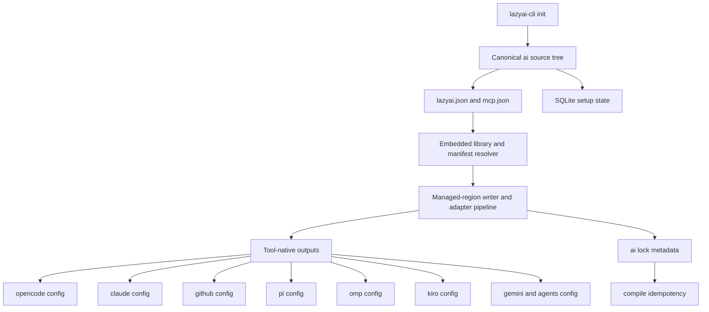
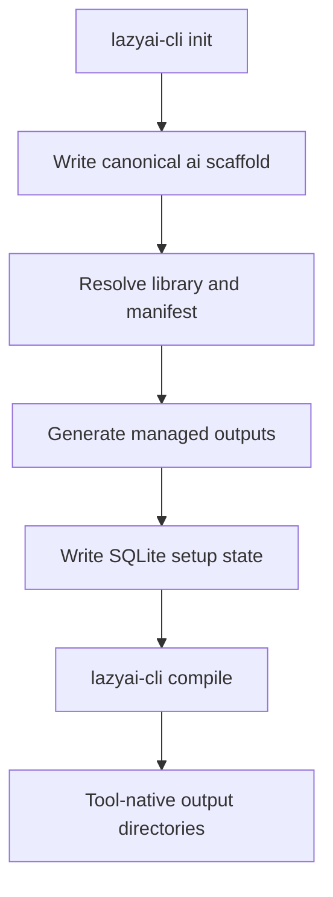
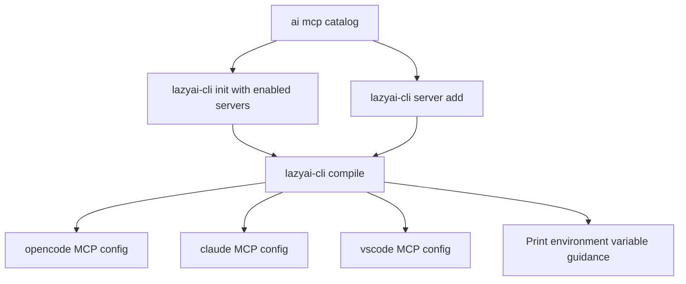
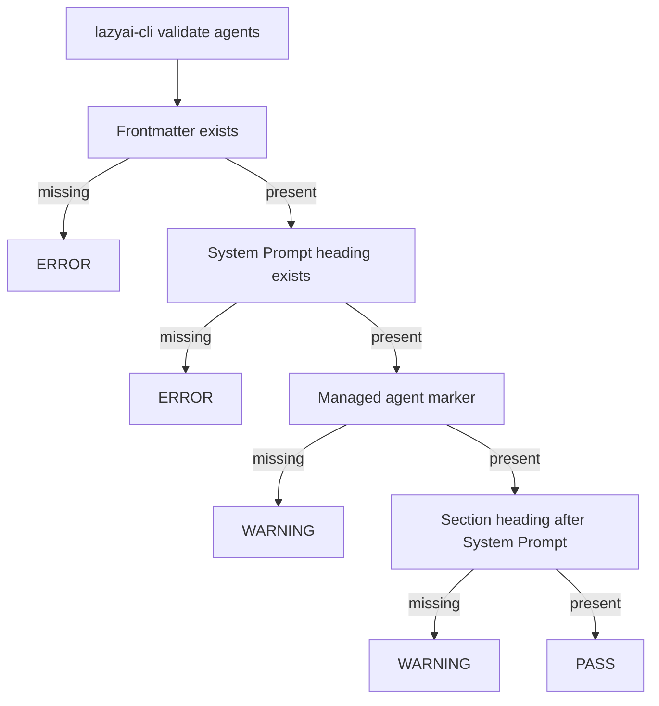

# LazyAI

LazyAI is a Go CLI for defining AI-tool setup once and compiling it to each supported AI
surface.  

Engineers use it to keep tool configuration consistent across projects and scopes.
Technical evaluators use it to review generated artifacts, check health diagnostics, and
verify adapter correctness.

`lazyai-cli` owns the canonical source workflow:

- `.ai/lazyai.json`, `.ai/mcp.json`, and canonical asset trees under `.ai/`
- `.ai/lock.json` compile metadata for idempotent managed outputs
- scoped installation state (`.ai-setup.db`; legacy `.ai-setup.json` auto-imported on first use)
- compiler/adapters that emit tool-native output for the 8 supported targets
- optional runtime-adjacent local state (sessions, metrics, ledger, memory, secrets)

It is Go-only (`go install`), with no npm or npx dependency for normal usage.
macOS users can also install via Homebrew.

## Architecture overview



## Quick start (project + full preset)

Copy-paste flow for a first-time setup on a local project with OpenCode and Claude Code:
```bash
go install github.com/rluisb/lazyai/packages/cli/cmd/lazyai-cli@latest

cd my-app
lazyai-cli init \
  --scope project \
  --tools opencode,claude-code \
  --preset full \
  --name my-app \
  --no-interactive

lazyai-cli compile
lazyai-cli status
```

Or on macOS via Homebrew:

```bash
brew install rluisb/lazyai/lazyai-cli

cd my-app
lazyai-cli init \
  --scope project \
  --tools opencode,claude-code \
  --preset full \
  --name my-app \
  --no-interactive

lazyai-cli compile
lazyai-cli status
```

Add MCP servers during init or later:

```bash
lazyai-cli init --scope project --tools opencode,claude-code --preset full --enable-servers filesystem,ai-memory,ripgrep --name my-app --no-interactive
lazyai-cli server add filesystem
lazyai-cli compile
```

### After `init`: filling AGENTS.md placeholders

`lazyai-cli init` writes a canonical `AGENTS.md` with `<!-- fill-in: ... -->` markers for project-specific sections. The CLI cannot run your AI tool, so it does not fill those markers itself. After init:

1. Open the project in your AI tool (Claude Code, OpenCode, etc.) and run `/init` or `/populate` so the tool fills the markers from code evidence.
2. Or edit `AGENTS.md` by hand and replace each `<!-- fill-in: ... -->` marker with a concrete value (or remove the marker if the section does not apply).
3. Validate the result:

   ```bash
   lazyai-cli validate agents
   lazyai-cli doctor
   ```

## Supported tools

| Tool | What it provides |
|---|---|
| `opencode` | Neutral OpenCode scaffold with tool-native config, hook plugin, agents, and skills. |
| `claude-code` | CLAUDE/Claude Code root config, hooks, commands, and settings output. |
| `copilot` | Copilot repo/user instruction surfaces and managed hook/assets. |
| `pi` | Pi-native `.pi/` surface: agents, skills, prompts, extensions, system prompts, and settings. |
| `omp` | OMP task-agent surface (`.omp/agents/*`) and skills (`.omp/skills/*`). |
| `kiro` | Kiro CLI agent profiles (`.kiro/agents/*`), skills, and `.kiro/settings/mcp.json`. |
| `antigravity` | `.gemini` configuration and hook surface (`.gemini/hooks/...`). |
| `codex` | OpenAI Codex CLI surface: `AGENTS.md` instructions, MCP servers in `.codex/config.toml`, subagents (`.codex/agents/*.toml`), hooks (`.codex/hooks.json`), and Agent Skills (`.agents/skills/*`). |

For tool-by-tool generated structure, LazyAI options, diagrams, and examples, see the MkDocs section `docs/ai-cli-tools/`.

## Command reference (all shipped commands)

The table below covers every active command category and command family in this build.
`completions` is kept only as a hidden retired alias.

Legacy `orchestrator`, `eval`, `task`, and `workflow` command surfaces are removed from active runtime and listed only in migration docs.

### setup-core (21 commands)

| Command | Description |
|---|---|
| `add` | Add artifacts to an existing setup (`--tools`, `--agents`, `--skills`). `--tools` accepts `opencode`, `claude-code`, `copilot`, `pi`, `omp`, `kiro`, `antigravity`, `codex`. |
| `build-plugin` | Generate plugin bundles from embedded library assets (`--target {claude,copilot-cli,omp,pi}`). |
| `compile` | Compile canonical `.ai/` sources (`lazyai.json`, `mcp.json`, agents/skills/hooks/prompts) into tool-native outputs and refresh `.ai/lock.json` (`--tool`, `--dry-run`, `--validate-contracts`). |
| `completion` | Generate shell completion scripts. |
| `config` | Configuration management (`get`, `set`, `list`, `init`). |
| `create` | Create setup artifacts (agent, skill, command, template, prompt, hook). |
| `doctor` | Setup health checks: manifest/file integrity, beta/sandbox advisories, and optional MCP/security reporting plus the current required local checks. |
| `eject` | Remove LazyAI library management while keeping files in place. |
| `import` | Import from another AI-tool setup into LazyAI format. |
| `info` | Show detailed artifact information. |
| `init` | Initialize AI environment and scaffold canonical `.ai/` sources (`lazyai.json`, `mcp.json`, assets) from selected tools/presets/policies. |
| `list` | List installed or available artifacts. |
| `migrate` | Migrate from prior setup format/version. |
| `server` | Manage MCP entries (`server list/add/remove/doctor`). |
| `setup` | Inspect setup inventory and planning output. |
| `sidecar` | Manage optional sidecar docs/specs/plans (`init`, `status`, `attach`, `detach`, `doctor`). |
| `status` | Show current setup state. |
| `update` | Update managed files from current embedded library versions. |
| `update-self` | Update `lazyai-cli` to latest GitHub Release. |
| `validate` | Validate setup artifacts (`validate agents`, `validate skills`, `validate --all`, `validate evals`). |
| `workspace` | Manage multi-project workspaces (`add`, `list`, `switch`, `status`). |

### ops-runtime-extra (12 commands)

| Command | Description |
|---|---|
| `auth` | Inspect authentication providers (`list`). |
| `backup` | Back up runtime state (`create`, `restore`). |
| `cost` | Cost analytics (`show`, `agent`, `budget`). |
| `git` | Git integration (`sync`, `log`, `status`). |
| `ledger` | Immutable audit trail (`init`, `append`, `verify`, `show`). |
| `memory` | Long-term memory vault (`save`, `list`, `search`). |
| `message` | Agent message bus (`send`, `recv`, `broadcast`). |
| `metrics` | Runtime metrics (`export`, `dashboard`, `list`). |
| `notify` | Notification support (`send`, `config`, `test`). |
| `restore-runtime-db` | Restore `.specify/session.db` from a backup file. |
| `secret` | Secret management (`set`, `get`, `list`, `remove`). |
| `session` | Session lifecycle (`start`, `list`, `show`, `end`). |

### dev-harness (1 command)

| Command | Description |
|---|---|
| `models` | Model catalog management (`models sync`), used to refresh generated catalog metadata. |

### retired/archived (1 command)

| Command | Description |
|---|---|
| `completions` | Hidden deprecated alias of `completion`. Not an active user-facing command. |

## Key workflows

### 1) Init → scaffold → compile



### 2) MCP registration flow



### 3) Validate flow (`validate agents`)



`validate skills` validates SKILL.md structure and required frontmatter fields (`name`, `description`), including quick-reference and script checks mirroring agent validation patterns.

## MCP servers

LazyAI uses `.ai/mcp.json` as the canonical MCP source and emits tool-native outputs on compile.

Available catalog examples:

- `filesystem`
- `ai-memory`
- `ripgrep`

Enable servers:

```bash
# During init
lazyai-cli init --tools opencode,claude-code --enable-servers filesystem,ai-memory,ripgrep

# After init
lazyai-cli server add filesystem
lazyai-cli server add ai-memory
lazyai-cli compile
```

### L1 vs L3 validation

`lazyai-cli server doctor` performs **L1 config checks** only: it verifies that the server entry exists in `.ai/mcp.json`, is enabled, and is present in each per-tool compiled MCP config file.

**L3 stdio handshake** (spawning the server process and performing a `tools/list` JSON-RPC exchange) is not performed. The Go binary does not bundle an MCP client library for the handshake protocol. A TypeScript wrapper using `@modelcontextprotocol/sdk` could perform L3 checks; this is future work.

The `server doctor` output includes a `stdio handshake` check that is always skipped, with a message explaining the limitation.

## Presets

| Preset | What it includes |
|---|---|
| `minimal` | `qualityGates` |
| `standard` | `rpiWorkflow`, `chainOfThought`, `qualityGates`, `bugResolution` |
| `full` | All built-in preset features |
| `custom` | Manually control feature set with `--features` and `--disable-features` |

```bash
lazyai-cli init --preset full --disable-features all --features rpiWorkflow,qualityGates,bugResolution
```

## Documentation (mkdocs)

- **Site:** <https://rluisb.github.io/lazyai/>
- **Getting started:** [Quick Start](docs/getting-started/quick-start.md), [Installation](docs/getting-started/installation.md)
- **Concepts:** [Harness Principles](docs/concepts/harness-principles.md), [How it Works](docs/concepts/how-it-works.md), [Product Boundaries](docs/concepts/product-boundaries.md), [Scopes](docs/concepts/scopes.md), [Presets](docs/concepts/presets.md), [Tools](docs/concepts/tools.md), [Skill Quality](docs/concepts/skill-quality.md), [Agent Contracts](docs/concepts/agent-contracts.md)
- **CLI reference:** [CLI commands](docs/cli/reference.md)
- **Integrations:** [MCP Integration](docs/integration/mcp.md), [Migration note](docs/migration/fortnite-orchestrator-removal.md)
- **Troubleshooting:** [FAQ](docs/troubleshooting/faq.md)
- **Contributing:** [Contributing](docs/development/contributing.md), [Release process](docs/development/release.md)

## Development

```bash
cd packages/cli && go build ./cmd/lazyai-cli
cd packages/cli && go test ./...
cd packages/diffviewer && go test ./...
```

For larger contribution guidance, see [Contributing](docs/development/contributing.md).

## License

MIT. See [LICENSE](LICENSE).
