# @ricardoborges-teachable/ai-setup

Scaffold a canonical, multi-tool AI development environment from one CLI, with optional orchestration scaffolding and MCP runtime integration.


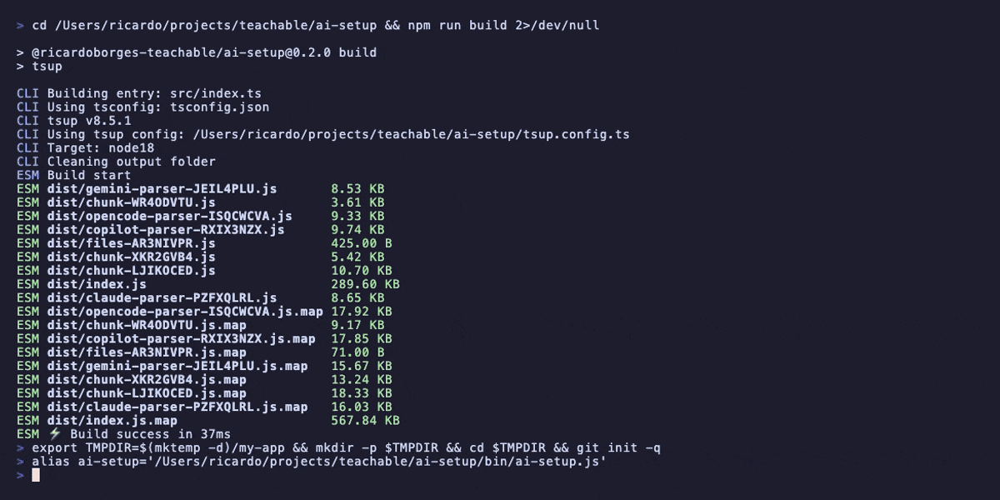

## Table of Contents

- [Quick Start](#quick-start)
- [Installation](#installation)
- [Optional Orchestration](#optional-orchestration)
- [How It Works](#how-it-works)
- [Scopes](#scopes)
  - [Project Scope](#51-project-scope)
  - [Global Scope](#52-global-scope)
  - [Workspace Scope](#53-workspace-scope)
- [Supported Tools](#supported-tools)
  - [OpenCode](#opencode) · [Claude Code](#claude-code) · [GitHub Copilot](#github-copilot)
- [Commands Reference](#commands-reference)
  - [`init`](#init) · [`compile`](#compile) · [`add`](#add) · [`update`](#update) · [`doctor`](#doctor) · [`status`](#status) · [`create`](#create) · [`import`](#import) · [`migrate`](#migrate) · [`eject`](#eject) · [`list`](#list) · [`info`](#info) · [`orchestration`](#orchestration) · [`completions`](#completions)
- [Library Content](#library-content)
- [Feature Presets](#feature-presets)
- [MCP Integration](#mcp-integration)
- [Migration](#migration)
- [Update & Conflict Behavior](#update--conflict-behavior)
- [Development](#development)
- [License](#license)

---

## Quick Start

> **Important:** this package is **not published to npm**. Install and run it directly from GitHub with `npx`.

### Install + run from GitHub

Both forms work:

```bash
npx @ricardoborges-teachable/ai-setup@github:ricardoborges-teachable/ai-setup init
# or shorter
npx github:ricardoborges-teachable/ai-setup init
```

### Interactive setup

```bash
npx github:ricardoborges-teachable/ai-setup init
```

This launches the setup wizard, where you choose:

- scope: `project`, `global`, or `workspace`
- AI tools: OpenCode, Claude Code, GitHub Copilot
- CLI tools: which locally installed CLI tools to use as execution surfaces
- optional MCP integrations
- optional orchestration scaffolding via `orchestrator`
- feature preset and git conventions

### Non-interactive setup

#### Project scope

```bash
npx github:ricardoborges-teachable/ai-setup init \
  --scope project \
  --tools opencode,claude-code,copilot \
  --enable-servers orchestrator \
  --name my-app \
  --preset standard \
  --no-interactive
```

#### Global scope

```bash
npx github:ricardoborges-teachable/ai-setup init \
  --scope global \
  --tools opencode,claude-code \
  --name global \
  --preset minimal \
  --no-interactive
```

#### Workspace scope

```bash
npx github:ricardoborges-teachable/ai-setup init \
  --scope workspace \
  --planning-repo ./planning-repo \
  --repos ../app-one,../app-two \
  --tools opencode,claude-code \
  --name team-workspace \
  --preset standard \
  --no-interactive
```

### What happens after `init`

`ai-setup init` will:

1. create canonical, tool-agnostic files under `.ai/`
2. scaffold specs/templates/rules/infra based on the selected preset
3. compile root instructions for each selected tool
4. generate tool-native directories such as `.opencode/`, `.claude/`, `.github/`, and `.vscode/`
5. write `.ai-setup.json` to track managed files, hashes, selections, and operations
6. generate `.env.example` when enabled MCP servers require environment variables
7. scaffold `.ai/orchestration/` when the optional `orchestrator` MCP server is enabled

---

## Installation

### Option 1: `npx github:...`

The shortest install path is the GitHub shortcut form:

```bash
npx github:ricardoborges-teachable/ai-setup init
```

Use this when you want the shortest command and are fine referencing the GitHub repo directly.

### Option 2: full scoped GitHub package reference

If you want the explicit package name:

```bash
npx @ricardoborges-teachable/ai-setup@github:ricardoborges-teachable/ai-setup init
```

Use this when you want the command to make the package identity obvious.

### Option 3: clone + link for development

If you are working on `ai-setup` itself:

```bash
git clone git@github.com:ricardoborges-teachable/ai-setup.git
cd ai-setup
npm install
npm run build
npm link
```

After linking, the binary is available as:

```bash
ai-setup --help
```

### Binary name

The executable name is always:

```bash
ai-setup
```

That means:

```bash
ai-setup init
ai-setup compile
ai-setup doctor
```

are the local-linked equivalents of the `npx github:...` commands.

---

## Optional Orchestration

`ai-setup` can optionally scaffold orchestration definitions and register the `@ai-setup/orchestrator` MCP server.

This is **opt-in**. If you never enable `orchestrator`, nothing about your existing `ai-setup` flow changes.

### Enable it during `init`

**Non-interactive**

```bash
ai-setup init \
  --scope project \
  --tools opencode,claude-code,copilot \
  --enable-servers orchestrator \
  --name my-app \
  --preset standard \
  --no-interactive
```

**Interactive wizard**

Run `ai-setup init`, then select `orchestrator` when the wizard asks which optional MCP integrations to enable.

### What gets scaffolded

When `orchestrator` is enabled, `ai-setup` copies the bundled orchestration library into your canonical source tree under:

- `.ai/orchestration/chains/`
- `.ai/orchestration/teams/`
- `.ai/orchestration/workflows/`
- `.ai/orchestration/skills/domains/`
- `.ai/orchestration/skills/modes/`

Those files are regular project files. You can inspect them, commit them, override built-in definitions, and generate new ones with the CLI.

### What commands you get

The current user-facing orchestration surface in `ai-setup` is:

- `ai-setup create domain <name>`
- `ai-setup create mode <name>`
- `ai-setup create workflow <name>`
- `ai-setup list workflows|chains|teams|domains|modes|orchestration`
- `ai-setup info <workflow|chain|team|domain|mode-name>`
- `ai-setup orchestration list [workflows|chains|teams|domains|modes]`
- `ai-setup orchestration create <workflow|domain|mode> <name>`
- `ai-setup orchestration status`

### What the orchestrator package does

`@ai-setup/orchestrator` is the runtime package in this repo's [`orchestrator/`](./orchestrator/) directory. At a high level it owns:

- catalog loading and project override resolution
- prompt composition from base agent + domain + mode layers
- runtime state, persistence, and handoff artifacts
- chain/team/workflow runtime machinery inside the MCP server package

`ai-setup` itself does **not** run workflows directly. It scaffolds definitions, compiles tool-specific guidance/config, and registers the MCP server entry so host tools can talk to the runtime.

### Tool integration notes

When `orchestrator` is enabled, `ai-setup` also generates tool-specific orchestrator guidance:

- OpenCode: `.opencode/agents/orchestrator.md`
- Claude Code: `.claude/agents/orchestrator.md`
- GitHub Copilot: `.github/prompts/orchestrator.prompt.md`

MCP server registration is compiled for supported tools that have project-local MCP config output.

### How to use the orchestrator MCP in your CLI tool

**General flow**

1. Enable orchestration during setup:
   ```bash
   ai-setup init --enable-servers orchestrator
   ```
2. Start your coding-agent CLI from the project root so it can see the generated MCP config and orchestration guidance files.
3. Ask the tool to use the orchestrator for a specific job, for example:
   - `Use the orchestrator and start the feature chain for auth middleware`
   - `Use the orchestrator to build a review team for this change`
   - `Use the orchestrator to show workflow status and budget`
4. The host CLI remains the execution surface. The MCP server manages chain/team/workflow state, while the CLI tool performs the actual reasoning and tool use.

**Per-tool notes**

- **Claude Code**
  - Reads: `.mcp.json` + `.claude/agents/orchestrator.md`
  - Best for: orchestrator agent + native subagent dispatch
  - Example request: `Use the orchestrator agent and start the feature chain for the payments refactor.`

- **OpenCode**
  - Reads: `.opencode/opencode.jsonc` + `.opencode/agents/orchestrator.md`
  - Best for: orchestrator agent + task-based coordination
  - Example request: `Use the orchestrator to start the bugfix chain for the login failure.`

- **GitHub Copilot**
  - Reads: `.vscode/mcp.json` + `.github/prompts/orchestrator.prompt.md`
  - Best for: prompt-driven orchestration guidance inside the workspace
  - Example request: `Use the orchestrator prompt and walk me through the code-review workflow.`

### Docs + demo

- Usage guide: [`docs/orchestration-usage.md`](docs/orchestration-usage.md)
- Reproducible demo tape: [`demo/13-orchestration.tape`](demo/13-orchestration.tape)

---

## How It Works

`ai-setup` uses a **canonical source → compile** model.

### Canonical source

The canonical, tool-agnostic layer lives in:

```text
.ai/
```

This is where `ai-setup` stores core setup data such as:

- constitution files in `.ai/constitution/`
- MCP server catalog in `.ai/mcp.json`
- orchestration definitions in `.ai/orchestration/` when `orchestrator` is enabled
- imported/migrated canonical data when using migration flows

### Compiled output

From that canonical layer, `ai-setup` compiles tool-native files into the formats each assistant expects:

- `AGENTS.md`
- `CLAUDE.md`
- `.github/copilot-instructions.md`
- `.opencode/`
- `.claude/`
- `.github/`
- `.vscode/`
- per-tool MCP config files
- tool-native orchestration guidance files when the optional `orchestrator` server is enabled

### `.ai/` is the source of truth

The intended workflow is:

1. initialize once with `ai-setup init`
2. edit the managed, tool-agnostic content and selected library artifacts
3. regenerate tool-native output with `ai-setup compile` or refresh managed files with `ai-setup update`

### `.ai-setup.json` manifest tracking

Every managed setup gets a manifest at the repo or planning-root level:

```text
.ai-setup.json
```

It tracks:

- setup scope and selected tools
- project/workspace metadata
- selected agents, skills, prompts, templates, and rules
- feature flags and git conventions
- managed file paths and content hashes
- operation history and sync metadata

This is what powers:

- `ai-setup status`
- `ai-setup doctor`
- `ai-setup update`
- conflict detection and drift checks

---

## Scopes

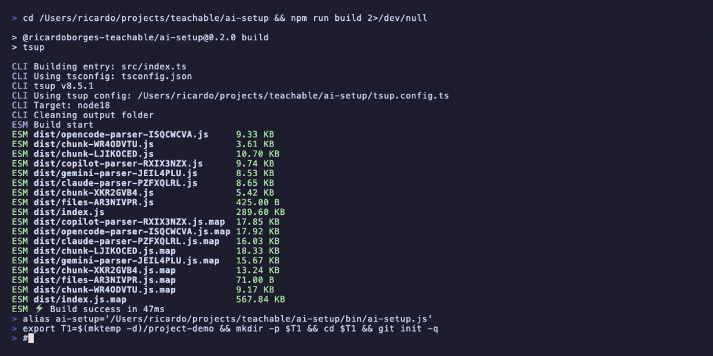

### Overview

| Scope | Best for | Canonical target | Notes |
|---|---|---|---|
| `project` | One repo, self-contained setup | `./.ai/` | Default day-to-day setup |
| `global` | Personal defaults across projects | `~/.ai/` | Only OpenCode + Claude Code are supported globally |
| `workspace` | Multi-repo team coordination | `planning-repo/.ai/` | Planning repo becomes the hub |

### 5.1 Project Scope

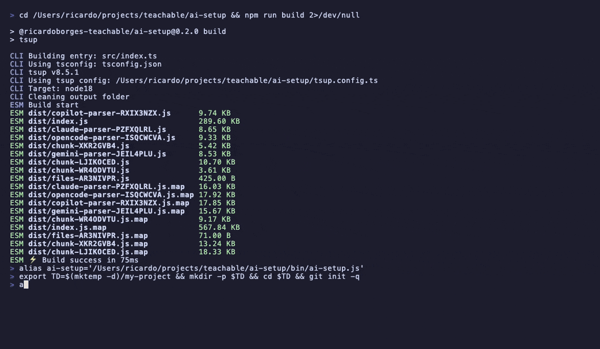

**What it is:** the default, self-contained setup in the current working directory.

**When to use it:**

- you want everything versioned with the repo
- you want generated instructions checked into source control
- you need all supported tools available side-by-side

**Directories created:**

- `.ai/`
- `specs/`
- tool-native directories for whichever tools you selected
- `.ai-setup.json`

**Supported tools:**

- OpenCode
- Claude Code
- GitHub Copilot

**Example command:**

```bash
npx github:ricardoborges-teachable/ai-setup init \
  --scope project \
  --tools opencode,claude-code,copilot \
  --name my-app \
  --preset standard \
  --enable-servers atlassian,orchestrator \
  --no-interactive
```

<details>
<summary>Example project-scope file tree</summary>

```text
my-app/
├── .ai/
│   ├── constitution/
│   │   ├── constitution.md
│   │   ├── constraints.md
│   │   ├── quality-gates.md
│   │   └── uncertainty.md
│   └── mcp.json
├── .ai-setup.json
├── .env.example                # only if enabled MCP servers require env vars
├── AGENTS.md
├── CLAUDE.md
├── .mcp.json
├── .vscode/
│   └── mcp.json
├── .opencode/
│   ├── opencode.json
│   ├── opencode.jsonc
│   ├── agents/
│   ├── skills/
│   └── commands/
├── .claude/
│   ├── settings.json
│   ├── rules/
│   ├── agents/
│   └── skills/
├── .github/
│   ├── copilot-instructions.md
│   ├── instructions/
│   └── prompts/
└── specs/
    ├── adrs/
    ├── bugfixes/
    ├── features/
    ├── memory/
    ├── prompts/
    ├── rules/
    ├── standards/
    └── templates/
```

_Trimmed for readability. Tool-context helper files such as `.opencode/AGENTS.md` and `.claude/CLAUDE.md` are also generated where applicable._
</details>

### 5.2 Global Scope

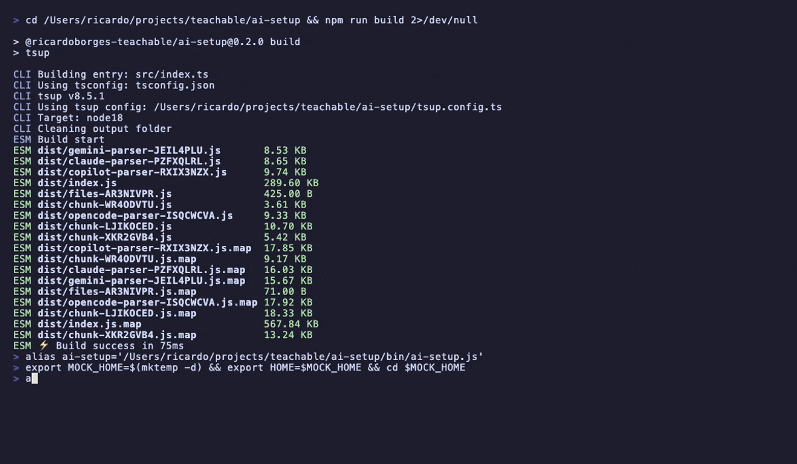

**What it is:** personal defaults shared across all projects on your machine.

**When to use it:**

- you want your own baseline AI operating system everywhere
- you use OpenCode or Claude Code across many repos
- you want project repos to layer on top of a personal default config

**Canonical target:**

- `~/.ai/`

**Tool-native targets:**

- `~/.config/opencode/`
- `~/.claude/`

**Supported tools in global scope:**

- ✅ OpenCode
- ✅ Claude Code
- ✅ GitHub Copilot

All currently supported tools can be selected for global compilation.

**Example command:**

```bash
npx github:ricardoborges-teachable/ai-setup init \
  --scope global \
  --tools opencode,claude-code \
  --name global \
  --preset minimal \
  --no-interactive
```

<details>
<summary>Example global-scope file tree</summary>

```text
~/.ai/
├── constitution/
│   ├── constitution.md
│   ├── constraints.md
│   ├── quality-gates.md
│   └── uncertainty.md
├── mcp.json
└── .ai-setup.json

~/.config/opencode/
├── AGENTS.md
├── agents/
├── skills/
├── commands/
└── opencode.jsonc

~/.claude/
├── CLAUDE.md
├── settings.json
├── rules/
├── skills/
├── .mcp.json
└── *.md                      # global Claude agent files live directly here
```
</details>

### 5.3 Workspace Scope

**Scenario 1: Separate planning repo**

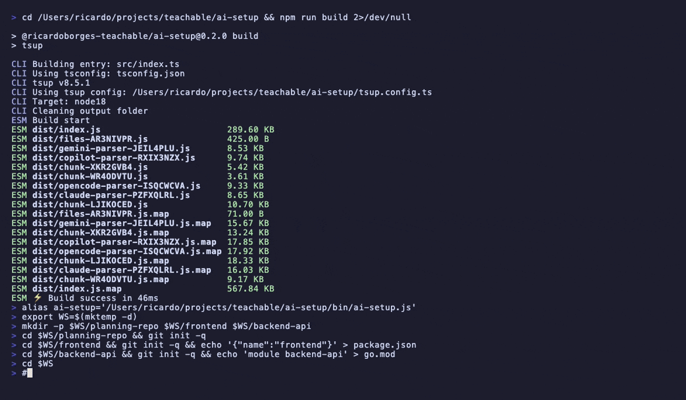

**Scenario 2: Planning repo is also a code repo**

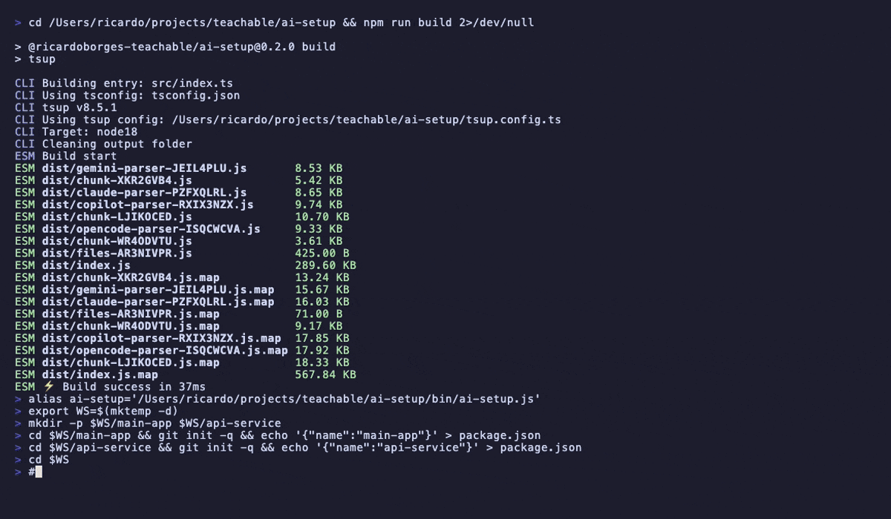

**What it is:** a multi-repo team setup with a dedicated planning repo as the central hub.

**When to use it:**

- your team coordinates work across multiple repositories
- you want one planning repo for specs, ADRs, memory, and ledgers
- you want a single place for all AI tool configuration

**How it works:**

- **everything lives in the workspace root** (the planning repo) — referenced repos are never touched
- the workspace root gets the full canonical setup: `.ai/`, specs, tool directories, MCP configs
- referenced repos are scanned for stack detection (language, framework, commands)
- detected repo info is included in the compiled root files (`AGENTS.md`, `CLAUDE.md`, etc.) so AI agents know what's in the workspace
- per-repo ledgers and state snapshots are written to the workspace root under `specs/memory/repos/`
- launch your AI tool from the workspace root — it reads config there and navigates into repos to edit code

**Supported tools:** OpenCode, Claude Code, and GitHub Copilot are supported for workspace root generation.

**Example command:**

```bash
npx github:ricardoborges-teachable/ai-setup init \
  --scope workspace \
  --planning-repo ./planning-repo \
  --repos ../api,../web,../worker \
  --tools opencode,claude-code,copilot \
  --name acme-workspace \
  --preset standard \
  --no-interactive
```

<details>
<summary>Example workspace file tree</summary>

```text
planning-repo/                          ← workspace root (everything lives here)
├── .ai/
│   ├── constitution/
│   └── mcp.json
├── .ai-setup.json
├── AGENTS.md                           ← includes "Workspace Repos" section with detected stacks
├── CLAUDE.md                           ← includes "Workspace Repos" section with detected stacks
├── .mcp.json
├── .opencode/
│   ├── opencode.json
│   ├── opencode.jsonc
│   ├── agents/
│   ├── skills/
│   └── commands/
├── .claude/
│   ├── settings.json
│   ├── rules/
│   ├── agents/
│   └── skills/
├── .github/
│   ├── copilot-instructions.md
│   └── prompts/
├── .vscode/
│   └── mcp.json
└── specs/
    ├── adrs/
    ├── features/
    ├── memory/
    │   ├── decisions/
    │   ├── handoffs/
    │   ├── patterns/
    │   ├── projects/
    │   └── repos/
    │       ├── api/
    │       │   ├── ledger.md
    │       │   └── last-known-state.md
    │       └── web/
    │           ├── ledger.md
    │           └── last-known-state.md
    └── ...

../api/                                 ← referenced repo (NOT touched by ai-setup)
├── .git/
└── src/

../web/                                 ← referenced repo (NOT touched by ai-setup)
├── .git/
└── src/
```

_Referenced repos are never modified. Their detected stack info (language, framework, commands) is included in the workspace root's compiled root files._
</details>

---

## Supported Tools

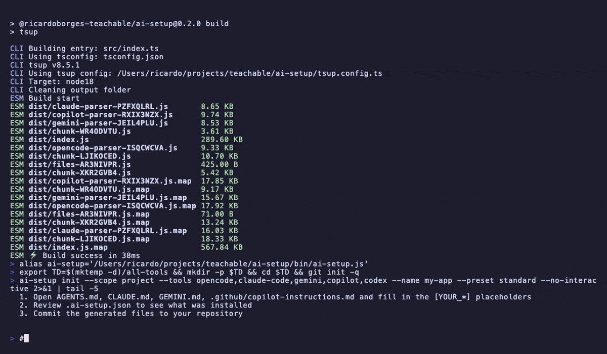

### OpenCode

- **Description:** project instructions for OpenCode plus agent, skill, and command directories
- **Root file:** `AGENTS.md`
- **Config directory:** `.opencode/`
- **Project config:** `.opencode/opencode.json`
- **Global scope support:** **Yes** — `~/.config/opencode/`
- **MCP config:** `.opencode/opencode.jsonc`
- **MCP format:** OpenCode `mcp` object with `local`/`remote` entries and `enabled` flags
- **Special behavior:** agent YAML frontmatter is stripped and a `<!-- Recommended model: ... -->` comment is injected when a `model:` frontmatter key exists

<details>
<summary>OpenCode file tree (project scope)</summary>

```text
AGENTS.md
.opencode/
├── opencode.json
├── opencode.jsonc
├── AGENTS.md
├── agents/
│   ├── AGENTS.md
│   ├── builder.md
│   ├── documenter.md
│   ├── planner.md
│   ├── red-team.md
│   ├── reviewer.md
│   └── scout.md
├── commands/
└── skills/
    ├── AGENTS.md
    ├── anti-speculation/SKILL.md
    ├── extract-standards/SKILL.md
    ├── implement/SKILL.md
    ├── iterate/SKILL.md
    ├── memory-write/SKILL.md
    ├── parallel-execution/SKILL.md
    ├── plan/SKILL.md
    ├── research/SKILL.md
    └── tdd-loop/SKILL.md
```
</details>

### Claude Code

- **Description:** Claude Code root instructions, agents, skills, and rules scaffold
- **Root file:** `CLAUDE.md`
- **Config directory:** `.claude/`
- **Global scope support:** **Yes** — `~/.claude/`
- **MCP config:** `.mcp.json`
- **MCP format:** standard `{"mcpServers": {...}}` JSON
- **Special behavior:** generates `.claude/settings.json` and a sample `.claude/rules/typescript.md` rule with `paths:` frontmatter

<details>
<summary>Claude Code file tree (project scope)</summary>

```text
CLAUDE.md
.mcp.json
.claude/
├── CLAUDE.md
├── settings.json
├── agents/
│   ├── CLAUDE.md
│   ├── builder.md
│   ├── documenter.md
│   ├── planner.md
│   ├── red-team.md
│   ├── reviewer.md
│   └── scout.md
├── rules/
│   └── typescript.md
└── skills/
    ├── CLAUDE.md
    ├── anti-speculation/SKILL.md
    ├── extract-standards/SKILL.md
    ├── implement/SKILL.md
    ├── iterate/SKILL.md
    ├── memory-write/SKILL.md
    ├── parallel-execution/SKILL.md
    ├── plan/SKILL.md
    ├── research/SKILL.md
    └── tdd-loop/SKILL.md
```
</details>

### GitHub Copilot

- **Description:** repo instructions and prompt files for GitHub Copilot workflows
- **Root files:** `.github/copilot-instructions.md` and `AGENTS.md`
- **Config directory:** `.github/`
- **Global scope support:** **No**
- **MCP config:** `.vscode/mcp.json`
- **MCP format:** VS Code-style JSON with `stdio` and `sse` server types
- **Special behavior:** skills are transformed into `.prompt.md` files with `mode: agent` frontmatter; prompt templates also compile to `.prompt.md`

<details>
<summary>GitHub Copilot file tree (project scope)</summary>

```text
AGENTS.md
.github/
├── copilot-instructions.md
├── instructions/
└── prompts/
    ├── anti-speculation.prompt.md
    ├── compact.prompt.md
    ├── extract-standards.prompt.md
    ├── implement.prompt.md
    ├── iterate.prompt.md
    ├── local-example.prompt.md
    ├── memory-write.prompt.md
    ├── parallel-execution.prompt.md
    ├── plan.prompt.md
    ├── research.prompt.md
    └── tdd-loop.prompt.md
.vscode/
└── mcp.json
```
</details>

---

## TOML Configuration

Optional `.ai-setup.toml` (project) and `~/.config/ai-setup/config.toml` (global) files provide defaults for CLI commands. CLI flags always override TOML values.

**Precedence**: `CLI flags > project TOML > global TOML > built-in defaults`

### Example `~/.config/ai-setup/config.toml`

```toml
# Global defaults for all projects
default_scope = "project"
default_tools = ["opencode", "claude-code"]
install_mode = "symlink"

[wizard]
preset = "recommended"
show_preview = true
```

### Example `.ai-setup.toml` (project)

```toml
# Project-specific overrides
default_tools = ["opencode"]
install_mode = "copy"
project_name = "my-api"
```

### Supported keys

| Key | Values | Description |
|---|---|---|
| `default_scope` | `project`, `workspace`, `global` | Default setup scope |
| `default_tools` | `["opencode", "claude-code", ...]` | Default AI tools |
| `install_mode` | `copy`, `symlink` | How files are installed (default: `copy`) |
| `project_name` | string | Default project name |
| `enabled_servers` | `["filesystem", "ripgrep", ...]` | Default MCP servers |
| `wizard.preset` | `minimal`, `recommended`, `full` | Wizard preset |
| `wizard.show_preview` | `true`, `false` | Show confirmation preview |

---

## Commands Reference

> Global flag available to all commands:
>
> ```bash
> ai-setup --verbose <command>
> ```
>
> Equivalent short form:
>
> ```bash
> ai-setup -v <command>
> ```

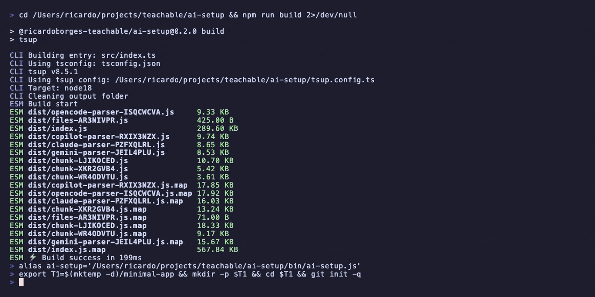

### `init`

**Syntax**

```bash
ai-setup init [options]
```

**What it does**

Initializes a new managed AI setup, creates canonical `.ai/` state, scaffolds library content, and compiles selected tools.

| Flag | Type | Default | Description |
|---|---|---:|---|
| `--scope <scope>` | `project \| global \| workspace` | prompt | Setup scope |
| `--type <type>` | deprecated alias | — | Deprecated alias for `--scope` |
| `--planning-repo <path>` | path | — | Planning repo location for workspace scope |
| `--repos <paths>` | comma-separated paths | — | Workspace repo references |
| `--tools <tools>` | comma-separated tool IDs | prompt | `opencode,claude-code,copilot` |
| `--cli-tools <tools>` | comma-separated names | — | Locally installed CLI tools / install-gated MCP helpers |
| `--name <name>` | string | dir-derived | Project or workspace name |
| `--force` | boolean | `false` | Overwrite managed files and create backups |
| `--no-interactive` | boolean | `false` | Disable prompts; all required flags must be provided |
| `--migrate` | boolean | `false` | Detect and import an existing AI setup before continuing |
| `--from <path>` | path | current directory | Source path for migration during `init --migrate` |
| `--absorb` | boolean | prompt/`false` | Absorb detected tool config into canonical `.ai/` |
| `--dry-run` | boolean | `false` | Preview file creation without writing |
| `--planning-dir <dir>` | string | `.planning` | Planning directory hint used in compiled instructions |
| `--preset <level>` | `minimal \| standard \| full \| custom` | wizard-selected | Feature preset |
| `--features <features>` | comma-separated names | — | Explicitly enable feature flags |
| `--disable-features <features>` | comma-separated names | — | Disable feature flags; use `all` to start from nothing |
| `--branch-pattern <pattern>` | string | `{type}/{ticket}-{description}` | Branch naming pattern |
| `--commit-pattern <pattern>` | string | `{type}({scope}): {description}` | Commit message pattern |
| `--enable-servers <servers>` | comma-separated names | — | Enable optional MCP servers |

**Examples**

```bash
# interactive project setup
ai-setup init

# explicit project setup
ai-setup init --scope project --tools opencode,claude-code --name my-repo --no-interactive

# workspace setup
ai-setup init --scope workspace --planning-repo ./planning --repos ../api,../web --tools opencode --name team --no-interactive

# migrate existing config, then continue setup
ai-setup init --migrate --from ../legacy-project

# start small and selectively re-enable features
ai-setup init --scope project --tools opencode --disable-features all --features rpiWorkflow,qualityGates --no-interactive

# use symlinks instead of copies (library stays in sync)
ai-setup init --scope project --tools opencode --install-mode symlink --no-interactive
```

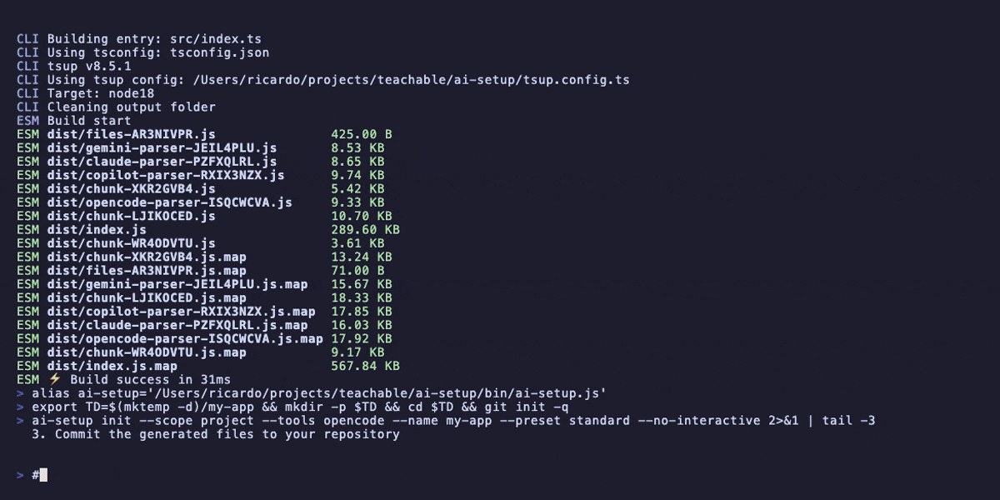

### `compile`

**Syntax**

```bash
ai-setup compile [options]
```

**What it does**

Recompiles canonical/setup-managed content into tool-native directories and per-tool MCP config files.

| Flag | Type | Default | Description |
|---|---|---:|---|
| `--scope <scope>` | `project \| global \| workspace` | manifest scope | Override compilation scope |
| `--tools <tools>` | comma-separated tool IDs | manifest tools | Compile only selected tools |
| `--force` | boolean | `false` | Overwrite existing files |
| `--dry-run` | boolean | `false` | Preview compilation without writing |
| `--planning-repo <path>` | path | manifest planning repo | Planning repo for workspace compile |

**Examples**

```bash
ai-setup compile
ai-setup compile --tools opencode,claude-code
ai-setup compile --tools opencode --force
ai-setup compile --scope global
ai-setup compile --scope workspace --planning-repo ./planning-repo
```

### `add`

**Syntax**

```bash
ai-setup add <tool>
```

**What it does**

Adds another tool adapter to an existing managed setup in the current directory.

| Argument | Type | Description |
|---|---|---|
| `<tool>` | tool ID | One of `opencode`, `claude-code`, `copilot` |

**Examples**

```bash
ai-setup add claude-code
ai-setup add copilot
```

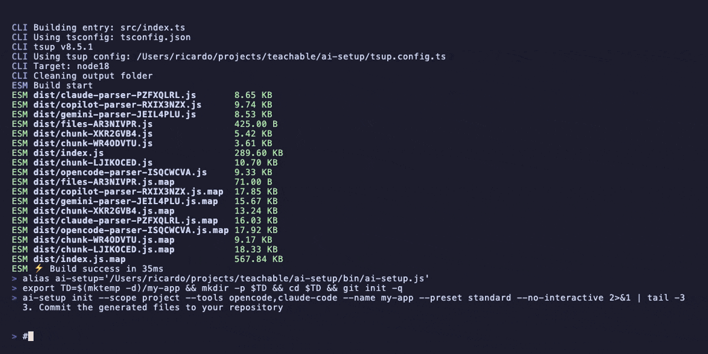

### `update`

**Syntax**

```bash
ai-setup update [options]
```

**What it does**

Refreshes tracked files from the current bundled library while preserving or backing up conflicts as needed.

| Flag | Type | Default | Description |
|---|---|---:|---|
| `--force` | boolean | `false` | Overwrite existing managed files and create backups |

**Examples**

```bash
ai-setup update
ai-setup update --force
```

### `doctor`

**Syntax**

```bash
ai-setup doctor [options]
```

**What it does**

Verifies the current setup against `.ai-setup.json`, or checks drift against a clean ai-setup-managed state.

| Flag | Type | Default | Description |
|---|---|---:|---|
| `--migration-check` | boolean | `false` | Compare current files to a clean ai-setup state |
| `--verbose` | boolean | `false` | Show detailed output |
| `--json` | boolean | `false` | Emit JSON instead of formatted output |

**Examples**

```bash
ai-setup doctor
ai-setup doctor --verbose
ai-setup doctor --json
ai-setup doctor --migration-check
```

### `status`

**Syntax**

```bash
ai-setup status [options]
```

**What it does**

Prints the current setup summary: scope, tools, enabled features, git conventions, and file health.

| Flag | Type | Default | Description |
|---|---|---:|---|
| `--json` | boolean | `false` | Emit JSON instead of formatted output |

**Examples**

```bash
ai-setup status
ai-setup status --json
```

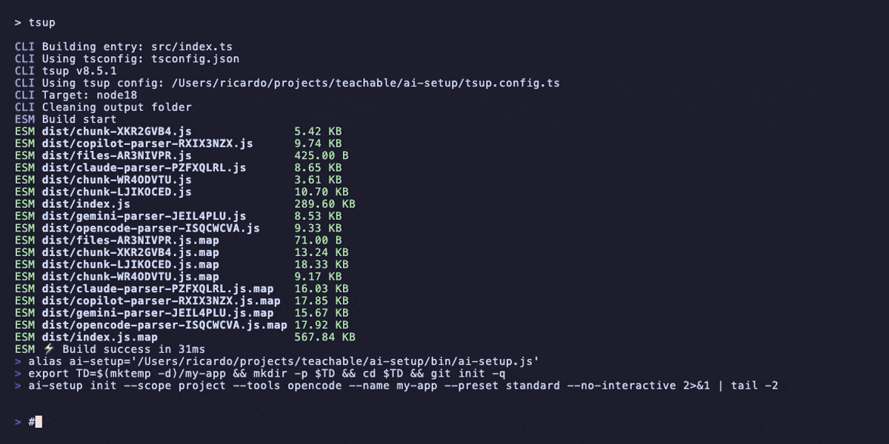

### `create`

**Syntax**

```bash
ai-setup create [options]
ai-setup create <type> [name] [options]
```

**What it does**

Scaffolds a new artifact in your repo: agent, skill, command, prompt, template, workflow, domain, or mode.

**Shared flags**

| Flag | Type | Default | Description |
|---|---|---:|---|
| `--type <type>` | artifact type | prompt | Required for bare `create` in non-interactive mode |
| `--name <name>` | string | prompt | Artifact name |
| `--description <description>` | string | — | Artifact description |
| `--force` | boolean | `false` | Overwrite existing files |
| `--no-interactive` | boolean | `false` | Disable prompts |

**Subcommand-specific flags**

| Subcommand | Flags |
|---|---|
| `create agent` | `--model`, `--mode`, `--tools` |
| `create skill` | `--command`, `--steps` |
| `create command` | `--arguments`, `--flags-description` |
| `create prompt` | `--task-context`, `--output-format` |
| `create template` | `--sections`, `--fields` |
| `create workflow` | `--chain`, `--team`, `--steps`, repeated `--step <step>` |
| `create domain` | no extra flags beyond shared flags |
| `create mode` | no extra flags beyond shared flags |

**Examples**

```bash
ai-setup create --type agent --name release-manager
ai-setup create skill deploy --command /deploy --steps "validate\nbuild\nship"
ai-setup create prompt handoff --task-context "handoff summary" --output-format markdown
ai-setup create workflow release --chain feature --team review-team --no-interactive
ai-setup create domain payments --description "Payments domain constraints" --no-interactive
ai-setup create mode strict-review --description "High-friction approval mode" --no-interactive
```

### `import`

**Syntax**

```bash
ai-setup import [path] [options]
```

**What it does**

Detects and imports an existing supported AI setup into `ai-setup`'s canonical format.

| Flag | Type | Default | Description |
|---|---|---:|---|
| `-p, --preview` | boolean | `false` | Show the migration plan without applying it |
| `-s, --strategy <strategy>` | `smart \| preserve \| replace \| append` | `smart` | Merge strategy |
| `-v, --verbose` | boolean | `false` | Detailed output |
| `-i, --interactive` | boolean | `false` | Resolve merge conflicts interactively |
| `--skip-backup` | boolean | `false` | Skip backup creation |
| `-y, --yes` | boolean | `false` | Auto-confirm execution |

**Examples**

```bash
ai-setup import --preview
ai-setup import ../legacy-project --strategy preserve
ai-setup import ../legacy-project --interactive
ai-setup import ../legacy-project --yes
```

### `migrate`

**Syntax**

```bash
ai-setup migrate [path] [options]
```

**What it does**

Alias for `import`, with one extra escape hatch for legacy output.

| Flag | Type | Default | Description |
|---|---|---:|---|
| `-p, --preview` | boolean | `false` | Show the migration plan without applying it |
| `-s, --strategy <strategy>` | `smart \| preserve \| replace \| append` | `smart` | Merge strategy |
| `-v, --verbose` | boolean | `false` | Detailed output |
| `-i, --interactive` | boolean | `false` | Resolve merge conflicts interactively |
| `--skip-backup` | boolean | `false` | Skip backup creation |
| `--no-canonical` | boolean | `false` | Use legacy output instead of canonical `.ai` output |
| `-y, --yes` | boolean | `false` | Auto-confirm execution |

**Examples**

```bash
ai-setup migrate --preview
ai-setup migrate ../legacy-project --strategy replace --yes
ai-setup migrate ../legacy-project --no-canonical
```

### `eject`

**Syntax**

```bash
ai-setup eject
```

**What it does**

Stops managing the current setup by removing `.ai-setup.json` while leaving generated files in place.

**Examples**

```bash
ai-setup eject
```

### `list`

**Syntax**

```bash
ai-setup list [category] [options]
```

**What it does**

Lists bundled library content, MCP catalog entries, and orchestration definitions.

**Categories**

- `agents`
- `skills`
- `templates`
- `rules`
- `servers` / `mcp`
- `tools` / `cli`
- `workflows`
- `chains`
- `teams`
- `domains`
- `modes`
- `orchestration` (aggregate orchestration view)
- `all` (default)

| Flag | Type | Default | Description |
|---|---|---:|---|
| `[category]` | string | `all` | Which library category to show |
| `--json` | boolean | `false` | Emit JSON |
| `--enabled` | boolean | `false` | Show only enabled servers/tools |

**Examples**

```bash
ai-setup list
ai-setup list agents
ai-setup list servers --enabled
ai-setup list tools --json
ai-setup list orchestration --json
ai-setup list workflows
```

### `info`

**Syntax**

```bash
ai-setup info <item> [options]
```

**What it does**

Shows detailed information about a bundled agent, skill, template, rule, MCP server, CLI tool, or orchestration artifact.

| Flag | Type | Default | Description |
|---|---|---:|---|
| `<item>` | string | — | Library item name |
| `--json` | boolean | `false` | Emit JSON |

**Examples**

```bash
ai-setup info builder
ai-setup info memory
ai-setup info code-style --json
ai-setup info review-team
ai-setup info backend --json
```

### `orchestration`

**Syntax**

```bash
ai-setup orchestration <subcommand> [options]
```

**What it does**

Provides an orchestration-focused namespace for listing catalog items, creating new orchestration artifacts, and checking whether `.ai/orchestration/` has been scaffolded.

**Subcommands**

| Subcommand | What it does |
|---|---|
| `orchestration list [kind]` | Lists orchestration items for `workflows`, `chains`, `teams`, `domains`, or `modes` |
| `orchestration create <type> <name>` | Creates a `workflow`, `domain`, or `mode` artifact |
| `orchestration status` | Reports whether orchestration has been scaffolded plus project/library item counts |

**Examples**

```bash
ai-setup orchestration list workflows --json
ai-setup orchestration create domain payments --description "Payments domain" --no-interactive
ai-setup orchestration create workflow payments-review --chain feature --team review-team --no-interactive
ai-setup orchestration status --json
```

### `completions`

**Syntax**

```bash
ai-setup completions [bash|zsh|fish]
```

**What it does**

Prints a shell completion script.

| Argument | Type | Default | Description |
|---|---|---:|---|
| `[shell]` | `bash \| zsh \| fish` | help output | Shell to generate completions for |

**Examples**

```bash
ai-setup completions bash
ai-setup completions zsh
ai-setup completions fish > ~/.config/fish/completions/ai-setup.fish
```

### `extensions` / `ext`

**Syntax**

```bash
ai-setup extensions [--json]
ai-setup ext [--json]
```

**What it does**

Lists discovered ai-setup extensions from TOML config and `.ai/extensions/`. Shows agent, skill, prompt, and rule counts per extension.

| Flag | Type | Default | Description |
|---|---|---:|---|
| `--json` | `boolean` | `false` | Output as JSON |

**Examples**

```bash
ai-setup extensions
ai-setup extensions --json
ai-setup ext
```

### `doctor --skills-check`

**What it does**

Compares installed skills against the current library source. Reports which skills are `current`, `drifted` (library updated, installed stale), `modified` (user changed), or `missing`.

**Examples**

```bash
ai-setup doctor --skills-check
ai-setup doctor --skills-check --verbose
ai-setup doctor --skills-check --json
```

### `update --check`

**What it does**

Previews which skills would be updated by `update --force` without applying changes. Shows drifted, modified, and missing skills.

**Examples**

```bash
ai-setup update --check
```

---

## Library Content

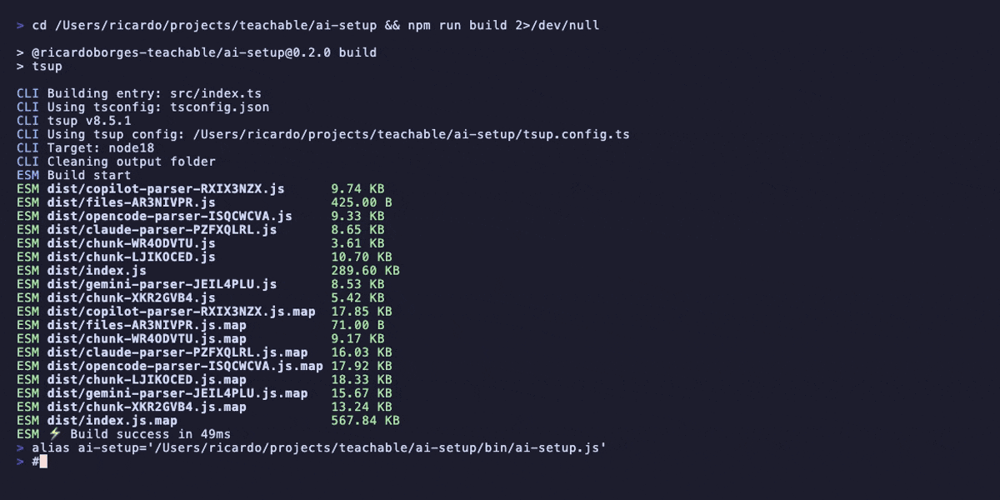

### Bundled agents (7)

| Agent | Brief description |
|---|---|
| `builder` | Disciplined implementer that follows a plan exactly and avoids unrequested changes. |
| `documenter` | Technical writer focused on concise docs grounded in real repo examples. |
| `orchestrator` | Task coordinator that dispatches agents in RPI order and tracks progress. |
| `planner` | Careful planner that turns research into phased implementation plans. |
| `red-team` | Adversarial tester focused on edge cases, security, and breakage. |
| `reviewer` | Code reviewer that reports findings without fixing them. |
| `scout` | Neutral researcher that maps the codebase without planning or implementing. |

### Bundled skills (9)

| Skill | Brief description |
|---|---|
| `anti-speculation` | Prevents scope creep and speculative implementation. |
| `extract-standards` | Turns observed codebase patterns into documented standards. |
| `implement` | Follows a task-driven implementation workflow with quality gates. |
| `iterate` | Runs a test → fix → verify loop for fast, controlled debugging. |
| `memory-write` | Captures durable lessons, gotchas, and patterns after work is done. |
| `parallel-execution` | Organizes independent work into safe parallel waves. |
| `plan` | Breaks research into goals, phases, risks, and actionable tasks. |
| `research` | Maps relevant files, patterns, and impact before planning. |
| `tdd-loop` | Enforces a red → green → refactor implementation cycle. |

### Bundled prompts (5)

| Prompt | Brief description |
|---|---|
| `compact` | Compresses active work into a clean handoff summary. |
| `implement` | Example-driven prompt for implementation planning and commit framing. |
| `local-example` | Builds and documents a verified local example of an existing pattern. |
| `plan` | Example-driven prompt for phased project planning. |
| `research` | Example-driven prompt for structured codebase research. |

### Bundled templates (10)

| Template | Brief description |
|---|---|
| `adr` | Architecture Decision Record template. |
| `bugfix-rca-template` | Root-cause-analysis template for bugfix planning. |
| `checklist-template` | Delivery checklist for requirements, quality, and docs. |
| `code-review-template` | Structured external PR review document. |
| `plan-template` | Phased implementation plan template. |
| `postmortem-template` | Incident postmortem template for hotfixes. |
| `spec-template` | Implementation contract/specification template. |
| `standard` | Standard/rule template with rationale and examples. |
| `task` | Single task template with subtasks and dependencies. |
| `tech-debt-template` | Technical debt assessment and remediation template. |

### Bundled rules (10)

| Rule | Brief description |
|---|---|
| `access` | Keeps agents inside explicit file and repo scope boundaries. |
| `agent-security` | Defends against prompt injection, escalation, and unsafe inputs. |
| `code-style` | Enforces established formatting and style conventions. |
| `cost` | Keeps model and API usage proportional to the task. |
| `review` | Requires review against both quality and spec compliance. |
| `security` | Prevents secret leakage and common AI-generated security mistakes. |
| `self-consistency` | Adds extra verification rounds for high-stakes decisions. |
| `testing` | Requires tests for all production code changes. |
| `tool-use` | Pushes agents toward narrow, correct, least-privilege tool usage. |
| `workflow` | Enforces the standard plan-first development workflow. |

> Note: the library currently contains 10 rule documents, while presets install a curated subset by default.

### Bundled orchestration definitions

These are copied into `.ai/orchestration/` when `orchestrator` is enabled during `init`.

| Kind | Count | Included examples |
|---|---:|---|
| Chains | 6 | `feature`, `bugfix`, `review`, `refactor`, `tdd`, `onboard` |
| Teams | 3 | `feature-team`, `review-team`, `assessment-team` |
| Workflows | 8 | `rpi`, `tdd`, `refactor`, `code-review`, `incident-response`, `system-design` |
| Domain skills | 5 | `backend`, `frontend`, `data`, `devops`, `security` |
| Mode skills | 3 | `autonomous`, `junior`, `senior` |

Project-local definitions with the same name take precedence over library defaults in `list` and `info` output.

### Bundled MCP servers (12)

| Server | Default status | Requires install | Notes |
|---|---|---:|---|
| `memory` | enabled | No | Knowledge graph memory server |
| `filesystem` | enabled | No | Local filesystem read/write access |
| `ripgrep` | enabled | No | Fast code search |
| `memoria` | enabled | No | Git history + code memory |
| `codegraph` | disabled | Yes | Semantic code graph (`bun install -g codegraph`) |
| `qmd` | disabled | Yes | Markdown knowledge search (`brew install qmd`) |
| `playwright` | disabled | No | Browser automation and testing |
| `context7` | disabled | No | Remote docs lookup; uses `CONTEXT7_API_KEY` header |
| `atlassian` | disabled | No | Jira/Confluence remote access |
| `brave-search` | disabled | No | Web search; needs `BRAVE_API_KEY` |
| `fetch` | disabled | No | General HTTP fetch MCP |
| `orchestrator` | disabled | No | Optional orchestration runtime via `npx -y @ai-setup/orchestrator` |


## Extensions

Extensions allow you to add custom agents, skills, prompts, rules, and templates beyond the built-in library. They're discovered from two sources:

### Local extensions (`.ai/extensions/`)

Place extension directories under `.ai/extensions/<name>/` with a structure mirroring the library:

```
.ai/extensions/team-toolkit/
├── agents/
│   └── security-reviewer/
│       ├── AGENT.md
│       └── mcp.json
├── skills/
│   └── deploy-check.md
├── prompts/
│   └── security-audit.md
└── rules/
    └── team-conventions.md
```

### TOML-configured extensions

Register extensions in `.ai-setup.toml`:

```toml
[extensions.team-toolkit]
path = "../shared-ai-config/toolkit"

[extensions.org-policies]
path = "~/org-ai-standards"
```

Extension content is merged with the built-in library during `compile`. Built-in content takes precedence when names collide.

**List extensions**: `ai-setup extensions` or `ai-setup ext --json`

---

## Feature Presets

### Preset levels

| Preset | What it enables | Typical use |
|---|---|---|
| `minimal` | `qualityGates` | Lightweight setup, global defaults, cheaper/faster workflows |
| `standard` | `rpiWorkflow`, `chainOfThought`, `qualityGates`, `bugResolution` | Recommended team baseline |
| `full` | All features | Maximum guidance and process structure |

### Feature meanings

| Feature | What it does |
|---|---|
| `contextEngineering` | Adds context discipline, file budget, and session hygiene guidance. |
| `rpiWorkflow` | Adds Research → Plan → Implement workflow structure. |
| `chainOfThought` | Adds structured reasoning protocol guidance. |
| `treeOfThoughts` | Encourages evaluating multiple approaches before choosing one. |
| `adrEnforcement` | Prompts ADR usage for significant architecture changes. |
| `qualityGates` | Adds lint, typecheck, test, and build verification expectations. |
| `agentHarness` | Adds multi-agent coordination and handoff patterns. |
| `bugResolution` | Adds reproduce → diagnose → fix → verify debugging structure. |
| `pivotHandling` | Adds guidance for requirement changes mid-implementation. |

### Customize presets

Disable features:

```bash
ai-setup init --preset full --disable-features treeOfThoughts,agentHarness
```

Start from nothing, then re-enable only what you want:

```bash
ai-setup init \
  --disable-features all \
  --features rpiWorkflow,qualityGates \
  --scope project \
  --tools opencode \
  --name minimal-custom \
  --no-interactive
```

Force a preset explicitly:

```bash
ai-setup init --preset standard
```

---

## MCP Integration

### Canonical MCP source

The canonical MCP catalog is written to:

```text
.ai/mcp.json
```

This file contains the full catalog of bundled servers, including:

- server definitions
- whether each server is enabled or disabled
- install requirements
- command/URL configuration
- environment variable placeholders

### Per-tool compilation

`ai-setup` compiles canonical MCP data into each tool's expected format:

| Tool | Compiled MCP output | Notes |
|---|---|---|
| OpenCode | `.opencode/opencode.jsonc` | Includes enabled + disabled servers with OpenCode-specific structure |
| Claude Code | `.mcp.json` | Includes only enabled servers |
| GitHub Copilot | `.vscode/mcp.json` | Includes only enabled servers |

### Enabling servers

You can enable optional servers during setup:

```bash
ai-setup init --enable-servers atlassian,playwright,orchestrator
```

When `orchestrator` is enabled, `ai-setup` also scaffolds `.ai/orchestration/` and generates the per-tool orchestrator guidance files listed in [Optional Orchestration](#optional-orchestration).

You can also edit `.ai/mcp.json` later, then recompile:

```bash
ai-setup compile
```

### Disabling servers

Edit `.ai/mcp.json` and set the server's `enabled` flag to `false`, then rerun:

```bash
ai-setup compile
```

### Environment variables

If any enabled MCP server declares env vars, `ai-setup` generates:

```text
.env.example
```

Example entries:

```dotenv
# Required by: brave-search
BRAVE_API_KEY=
```

`ai-setup` never writes real secrets into `.env.example`.

---

## Migration

### Supported source formats

Built-in migration detection/import currently supports:

- OpenCode
- Claude Code
- GitHub Copilot

Detection looks for markers such as:

- `AGENTS.md`
- `CLAUDE.md`
- `.opencode/`
- `.claude/`
- `.github/copilot-instructions.md`

### Merge strategies

| Strategy | Best when | Behavior |
|---|---|---|
| `smart` | You want help merging | Attempts a 3-way merge and stops if manual review is needed |
| `preserve` | You trust the current repo more | Keeps existing files where they overlap |
| `replace` | You want a clean ai-setup baseline | Overwrites overlapping files after creating backups |
| `append` | You want combined content where supported | Appends/combines content for parsers that support it |

### Example migration commands

```bash
# preview current repo
ai-setup import --preview

# import another repo conservatively
ai-setup import ../legacy-project --strategy preserve

# alias form
ai-setup migrate ../legacy-project --strategy smart

# force canonical migration with confirmation skipped
ai-setup import ../legacy-project --yes

# legacy output instead of canonical .ai output
ai-setup migrate ../legacy-project --no-canonical
```

---

## Update & Conflict Behavior

### How `update` works

`ai-setup update` rebuilds the expected managed file set from the current library and selected tools, then resolves each target file individually.

**Preview changes first**: `ai-setup update --check` shows which skills are drifted, modified, or missing without applying changes.

**Skill drift detection**: `ai-setup doctor --skills-check` compares installed skills against the current library source and reports `current`, `drifted`, `modified`, or `missing` status.

### Conflict behavior

| Situation | Behavior |
|---|---|
| Tracked + unchanged | Safely overwritten with latest managed content |
| Tracked + customized | Prompts/backs up before overwrite; `--force` auto-overwrites with backup |
| Existing untracked collision | Prompts before replacement; replacement creates backup |
| Newly expected file | Created and added to `.ai-setup.json` |
| Tracked but missing file | Reported as missing, not silently recreated by `update` |

### Backup behavior

Backups are written under:

```text
.ai-setup-backup/
```

with relative paths preserved.

`compile --force` and `update --force` are the main ways to intentionally replace generated output after review.

### Symlink installation mode

By default, `ai-setup` copies files from the library into tool directories. With `--install-mode=symlink` (or `install_mode = "symlink"` in TOML config), files are symlinked instead. This keeps all tools in sync when the library is updated.

```bash
ai-setup init --install-mode symlink --no-interactive
```

Symlinked files are tracked in `.ai-setup.json` with `kind: "symlink"` and `linkTarget` pointing to the library source.

---

## Development

### Requirements

- Node.js `>=20.12.0`
- npm

### Clone and run locally

```bash
git clone git@github.com:ricardoborges-teachable/ai-setup.git
cd ai-setup
npm install
npm run build
npm test
```

### Useful local commands

```bash
npm install        # install dependencies
npm run build      # build CLI with tsup
npm test           # run test suite with vitest
npm run typecheck  # TypeScript no-emit check
npm run lint       # biome checks
npm run dev        # watch-mode build
```

### Local linked CLI

```bash
npm link
ai-setup --help
```

---

## License

MIT. See [LICENSE](LICENSE).
