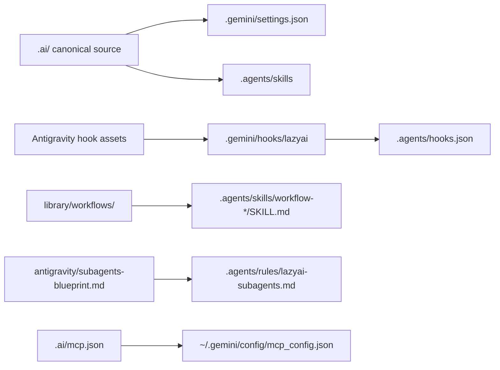

# Antigravity setup

Antigravity is a stable LazyAI target for Gemini/Antigravity settings, hook scripts, Agent Skills, and user-level MCP configuration.

## Generated structure

```text
.
├── AGENTS.md
├── .gemini/
│   ├── settings.json
│   └── hooks/lazyai/<hook>.sh
└── .agents/
    ├── hooks.json
    ├── rules/lazyai.md
    ├── rules/lazyai-subagents.md     ← subagent capability blueprint (#575)
    └── skills/
        ├── <skill>/SKILL.md
        └── workflow-<name>/SKILL.md  ← library workflows as orchestrator skills (#575)

~/.gemini/config/mcp_config.json
```



## Antigravity concepts LazyAI uses

| Antigravity/Gemini concept | LazyAI source |
|---|---|
| Root instructions | `AGENTS.md` |
| Settings | `.gemini/settings.json` merged from LazyAI defaults |
| Agent Skills | selected skills emitted to `.agents/skills/<name>/SKILL.md` |
| Workflow orchestrator skills | library workflows emitted to `.agents/skills/workflow-<name>/SKILL.md` |
| Hooks | scripts under `.gemini/hooks/lazyai/`, wired by `.agents/hooks.json` |
| Subagent blueprint | `.agents/rules/lazyai-subagents.md` — enable-flag table for canonical roles |
| MCP | `.ai/mcp.json` compiled to `~/.gemini/config/mcp_config.json` |

## LazyAI options

| Use case | Command |
|---|---|
| Add Antigravity during init | `lazyai-cli init --scope project --tools antigravity --preset standard --no-interactive` |
| Add Antigravity later | `lazyai-cli add --tools antigravity --no-interactive` |
| Compile only Antigravity MCP | `lazyai-cli compile --tool antigravity` |
| Preview Antigravity MCP | `lazyai-cli compile --tool antigravity --dry-run` |

## Example

```bash
lazyai-cli init \
  --scope project \
  --tools antigravity \
  --preset standard \
  --enable-servers filesystem \
  --name my-app \
  --no-interactive

lazyai-cli compile --tool antigravity
lazyai-cli doctor
```

## Readiness notes

- Support level: stable.
- Project, workspace, and global (`~/.gemini/`) scopes are supported.
- MCP compile is project/workspace-scoped even though the output file is the user-level Gemini config (`~/.gemini/config/mcp_config.json`).
- Subagent blueprint (`.agents/rules/lazyai-subagents.md`) and workflow skills (`workflow-*/SKILL.md`) are emitted at workspace/project scope; skipped at global scope where rules are user-managed.
- No commands surface — Antigravity does not support slash-commands or quickactions. The closest analog is orchestrator skills; load a workflow skill as a subagent's instructions instead of a slash command.
- No custom agent, command, prompt, chat-mode, template, or output-style files are emitted for Antigravity.
