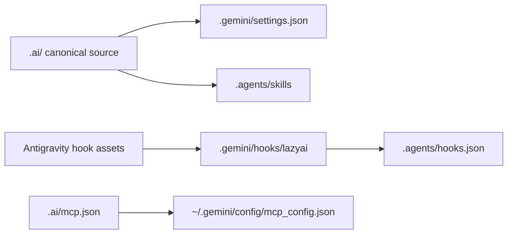

# Antigravity setup

Antigravity is a beta LazyAI target for Gemini/Antigravity settings, hook scripts, Agent Skills, and user-level MCP configuration.

## Generated structure

```text
.
├── AGENTS.md
├── .gemini/
│   ├── settings.json
│   └── hooks/lazyai/<hook>.sh
└── .agents/
    ├── hooks.json
    └── skills/<skill>/SKILL.md

~/.gemini/config/mcp_config.json
```



## Antigravity concepts LazyAI uses

| Antigravity/Gemini concept | LazyAI source |
|---|---|
| Root instructions | `AGENTS.md` |
| Settings | `.gemini/settings.json` merged from LazyAI defaults |
| Agent Skills | selected skills emitted to `.agents/skills/<name>/SKILL.md` |
| Hooks | scripts under `.gemini/hooks/lazyai/`, wired by `.agents/hooks.json` |
| MCP | `.ai/mcp.json` compiled to `~/.gemini/config/mcp_config.json` |

## LazyAI options

| Use case | Command |
|---|---|
| Add Antigravity during init | `lazyai-cli init --tools antigravity --preset standard --no-interactive` |
| Add Antigravity later | `lazyai-cli add --tools antigravity --no-interactive` |
| Compile only Antigravity MCP | `lazyai-cli compile --tool antigravity` |
| Preview Antigravity MCP | `lazyai-cli compile --tool antigravity --dry-run` |

## Example

```bash
lazyai-cli init \
  --scope project \
  --tools antigravity \
  --preset standard \
  --enable-servers filesystem \
  --name my-app \
  --no-interactive

lazyai-cli compile --tool antigravity
lazyai-cli doctor
```

## Readiness notes

- Support level: beta.
- Project and workspace scopes are supported; global scope is intentionally unsupported for setup files.
- MCP compilation writes user config under `~/.gemini/config/` because the host MCP surface is user-level.
- No custom agent, command, prompt, chat-mode, template, or output-style files are emitted for Antigravity.
