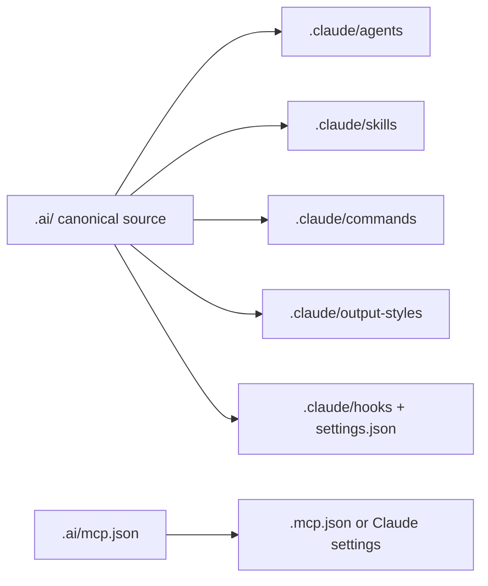

# Claude Code setup

Claude Code is a stable LazyAI target for Claude-native agents, skills, slash commands, output styles, hooks, permissions, and MCP.

## Generated structure

```text
.
├── AGENTS.md
├── .mcp.json
└── .claude/
    ├── agents/<agent>.md
    ├── skills/<skill>/SKILL.md
    ├── commands/<command>.md
    ├── output-styles/<style>.md
    ├── hooks/<hook>.sh
    ├── rules/typescript.md
    └── settings.json
```



## Claude Code concepts LazyAI uses

| Claude Code concept | LazyAI source |
|---|---|
| Root instructions | `AGENTS.md`; existing `CLAUDE.md` compatibility is preserved |
| Agents/subagents | canonical agent markdown rewritten to Claude Code frontmatter |
| Skills | Agent Skills-compatible `SKILL.md` directories |
| Slash commands | Claude Code command markdown |
| Output styles | files under `.claude/output-styles/` |
| Hooks | shell hooks wired through `.claude/settings.json` |
| MCP | `.ai/mcp.json` compiled to `.mcp.json` or Claude settings |

## LazyAI options

| Use case | Command |
|---|---|
| Add Claude Code during init | `lazyai-cli init --scope project --tools claude-code --preset standard --no-interactive` |
| Let Claude CLI register MCP when available | `lazyai-cli init --scope project --tools claude-code --drive-cli --no-interactive` |
| Keep secrets out of committed MCP files | `lazyai-cli compile --tool claude-code --local-secrets` |
| Compile from manifest token | `lazyai-cli compile --tool claude-code` |

## Example

```bash
lazyai-cli init \
  --scope project \
  --tools claude-code \
  --preset full \
  --enable-servers filesystem,ripgrep \
  --local-secrets \
  --no-interactive

lazyai-cli compile --tool claude-code --local-secrets
lazyai-cli validate agents
```

## Readiness notes

- Support level: stable.
- Project, workspace, and global scopes are supported.
- Claude Code has no chat-mode surface; LazyAI emits reusable prompts as commands.
- `--local-secrets` routes Claude MCP/settings writes to gitignored local settings where supported.
