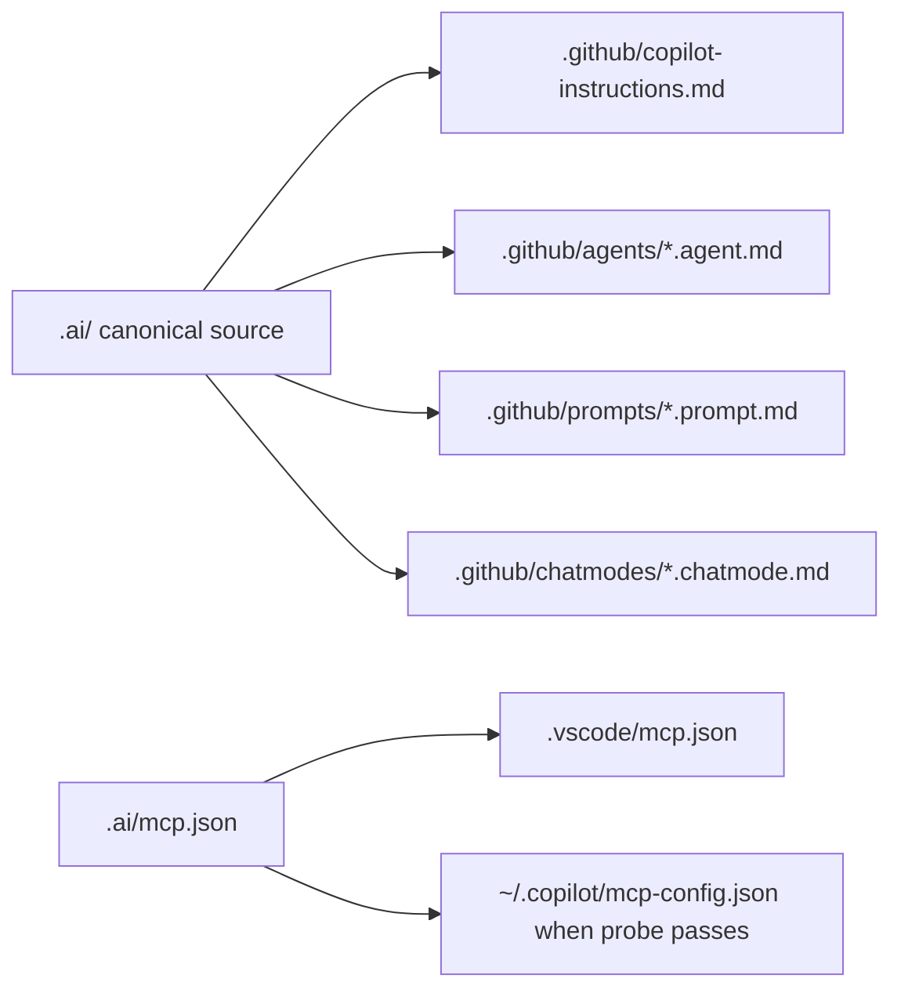

# GitHub Copilot setup

GitHub Copilot is a stable LazyAI target for repository instructions, Copilot agent markdown, Agent Skills, prompts, chat modes, hooks, and MCP for VS Code or Copilot CLI.

## Generated structure

```text
.
├── .github/
│   ├── copilot-instructions.md
│   ├── agents/<agent>.agent.md
│   ├── skills/<skill>/SKILL.md
│   ├── instructions/<instruction>.instructions.md
│   ├── prompts/<prompt>.prompt.md
│   ├── chatmodes/<mode>.chatmode.md
│   └── hooks/<hook>.{json,sh}
└── .vscode/mcp.json
```



## Copilot concepts LazyAI uses

| Copilot concept | LazyAI source |
|---|---|
| Repository instructions | canonical root/context instructions |
| Path-specific instructions | template assets emitted to `.github/instructions/` |
| Agents | canonical agents rendered as `.agent.md` |
| Skills | Agent Skills-compatible `SKILL.md` directories |
| Prompts | prompts rewritten with `.prompt.md` suffix |
| Chat modes | chat mode markdown under `.github/chatmodes/` |
| MCP | `.vscode/mcp.json`; optional `~/.copilot/mcp-config.json` for CLI |

## LazyAI options

| Use case | Command |
|---|---|
| Add Copilot during init | `lazyai-cli init --scope project --tools copilot --preset standard --no-interactive` |
| Add Copilot later | `lazyai-cli add --tools copilot --no-interactive` |
| Compile only Copilot MCP | `lazyai-cli compile --tool copilot` |
| Build a Copilot CLI bundle | `lazyai-cli build-plugin --target copilot-cli --out ./dist/copilot` |

## Example

```bash
lazyai-cli init \
  --scope project \
  --tools copilot \
  --preset standard \
  --enable-servers filesystem \
  --no-interactive

lazyai-cli server add ai-memory --no-interactive
lazyai-cli compile --tool copilot
```

## Readiness notes

- Support level: stable.
- Project, workspace, and global scopes are supported; global Copilot MCP is probe-gated on a Copilot CLI/home directory.
- Copilot has no slash-command surface; use prompts and chat modes instead.
- Project/workspace hook assets are emitted under `.github/hooks/`; no verified global hook surface is emitted.
