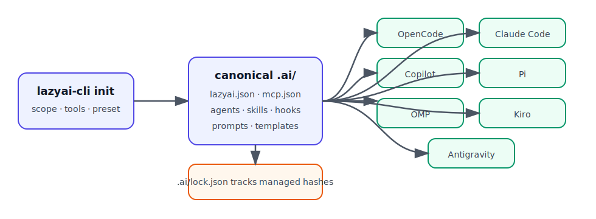

# AI CLI Tool Setups

LazyAI compiles one canonical `.ai/` setup into seven AI CLI tool surfaces. Use this section when you need to choose a target, understand the generated structure, or copy a tool-specific setup command.



## Common LazyAI flow

```bash
lazyai-cli init --scope project --tools opencode,claude-code,copilot --preset standard --no-interactive
lazyai-cli server add filesystem --no-interactive
lazyai-cli compile
lazyai-cli doctor
```

## Target tokens

Two command surfaces use slightly different names:

| Context | Claude token | Other target tokens |
|---|---|---|
| `lazyai-cli init --tools` / `lazyai-cli add --tools` | `claude-code` | `opencode`, `copilot`, `pi`, `omp`, `kiro`, `antigravity` |
| `.ai/lazyai.json` / `lazyai-cli compile --tool` | `claude` or `claude-code` | `opencode`, `copilot`, `pi`, `omp`, `kiro`, `antigravity` |

Codex is intentionally not a LazyAI V2 target.

## Common options

| Command | Options most relevant to AI CLI outputs |
|---|---|
| `lazyai-cli init` | `--scope`, `--tools`, `--preset`, `--enable-servers`, `--drive-cli`, `--local-secrets`, `--force`, `--dry-run`, `--no-interactive` |
| `lazyai-cli add` | `--tools`, `--agents`, `--skills`, `--no-interactive` |
| `lazyai-cli compile` | `--tool`, `--dry-run`, `--local-secrets`, `--validate-contracts`, `--strict-contracts` |
| `lazyai-cli server` | `list`, `add <name>`, `remove <name>`, `doctor [name]` |
| `lazyai-cli build-plugin` | `--target claude`, `--target copilot-cli`, `--target omp`, `--target pi`, `--out`, `--force` |

## Tool pages

| Tool | Support | Best fit | Generated root |
|---|---|---|---|
| [OpenCode](opencode.md) | stable | OpenCode-native agents, skills, commands, modes, plugins, MCP | `.opencode/` + `opencode.json` |
| [Claude Code](claude-code.md) | stable | Claude agents, skills, slash commands, output styles, hooks, MCP | `.claude/` + `.mcp.json` |
| [GitHub Copilot](copilot.md) | stable | repo instructions, Copilot agents, prompts, chat modes, VS Code MCP | `.github/` + `.vscode/mcp.json` |
| [Pi](pi.md) | stable | Pi skills, prompts, extension-backed hooks | `.pi/` |
| [OMP](omp.md) | stable | OMP agents, skills, commands, hooks, MCP | `.omp/` |
| [Kiro](kiro.md) | stable | Kiro agents, skills, prompts, MCP | `.kiro/` |
| [Antigravity](antigravity.md) | stable | Gemini/Antigravity settings, hooks, Agent Skills, user MCP config | `.gemini/` + `.agents/` |

## Production-readiness notes

- The adapter registry contains exactly seven built-in targets.
- OpenCode, Claude Code, Copilot, Pi, and Kiro are marked stable.
- OMP and Antigravity are stable; their host documentation surfaces have been snapshot-verified.
- Workflows are canonical source material, not a universal output directory. LazyAI only emits workflow-like behavior through verified host-tool surfaces such as commands, skills, prompts, hooks, modes, or plugins.

See [Adapter Capability Matrix](../adapters/capability-matrix.md) for the exhaustive capability table and [Production Readiness](../development/production-readiness.md) for the structure/stale-artifact audit.
