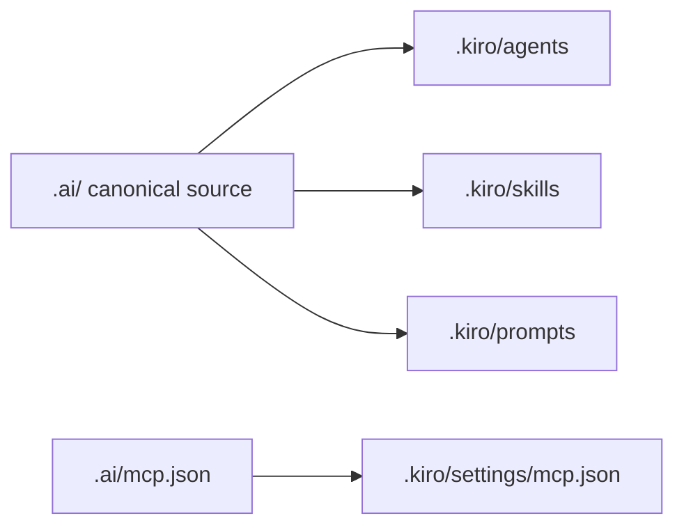

# Kiro setup

Kiro is a stable LazyAI target for Kiro agent profiles, skills, prompt templates, permissions/global configuration metadata, and MCP.

## Generated structure

```text
.
├── AGENTS.md
└── .kiro/
    ├── agents/<agent>.md
    ├── skills/<skill>/SKILL.md
    ├── prompts/<prompt>.md
    └── settings/mcp.json
```



## Kiro concepts LazyAI uses

| Kiro concept | LazyAI source |
|---|---|
| Root instructions | `AGENTS.md` |
| Custom agent profiles | canonical agent markdown under `.kiro/agents/` |
| Skills | Agent Skills-compatible `SKILL.md` directories |
| Prompts | prompt markdown under `.kiro/prompts/` |
| MCP | `.ai/mcp.json` compiled to `.kiro/settings/mcp.json` |

## LazyAI options

| Use case | Command |
|---|---|
| Add Kiro during init | `lazyai-cli init --scope project --tools kiro --preset standard --no-interactive` |
| Add Kiro later | `lazyai-cli add --tools kiro --no-interactive` |
| Compile only Kiro MCP | `lazyai-cli compile --tool kiro` |
| Preview Kiro MCP output | `lazyai-cli compile --tool kiro --dry-run` |

## Example

```bash
lazyai-cli init \
  --scope project \
  --tools kiro \
  --preset standard \
  --enable-servers filesystem \
  --no-interactive

lazyai-cli compile --tool kiro
lazyai-cli status
```

## Readiness notes

- Support level: stable.
- Project, workspace, and global scopes are supported.
- LazyAI intentionally emits no `.kiro/workflows`, specs, steering, commands, chat modes, templates, or output styles.
- Hooks are instruction-only in LazyAI's Kiro output; the adapter does not emit `.kiro/hooks` runtime files.
