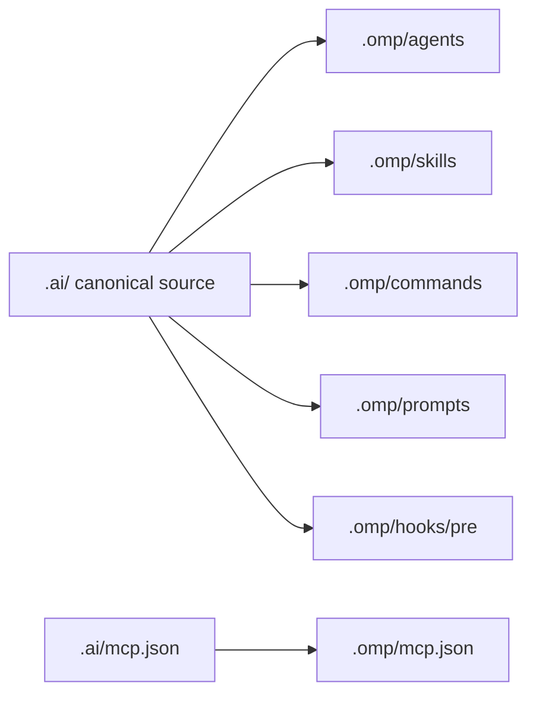

# OMP setup

OMP is a stable LazyAI target for OMP task agents, skills, commands, prompts, hook factories, MCP, compaction/session-oriented surfaces, and global OMP agent configuration.

## Generated structure

```text
.
├── AGENTS.md
└── .omp/
    ├── agents/<agent>.md
    ├── skills/<skill>/SKILL.md
    ├── commands/<command>.md
    ├── prompts/<prompt>.md
    ├── hooks/pre/<hook>.ts
    └── mcp.json
```



## OMP concepts LazyAI uses

| OMP concept | LazyAI source |
|---|---|
| Root instructions/context | `AGENTS.md` |
| Task agents | canonical agent markdown under `.omp/agents/` |
| Skills | Agent Skills-compatible `SKILL.md` directories |
| Commands | canonical command markdown under `.omp/commands/` |
| Prompts | prompt markdown under `.omp/prompts/` |
| Hooks | TypeScript pre-hook factories under `.omp/hooks/pre/` |
| MCP | `.ai/mcp.json` compiled to `.omp/mcp.json` |

## LazyAI options

| Use case | Command |
|---|---|
| Add OMP during init | `lazyai-cli init --scope project --tools omp --preset standard --no-interactive` |
| Add OMP later | `lazyai-cli add --tools omp --no-interactive` |
| Compile only OMP MCP | `lazyai-cli compile --tool omp` |
| Build an OMP bundle | `lazyai-cli build-plugin --target omp --out ./dist/omp` |

## Example

```bash
lazyai-cli init \
  --scope project \
  --tools omp \
  --preset standard \
  --enable-servers filesystem,ripgrep \
  --no-interactive

lazyai-cli compile --tool omp
lazyai-cli server doctor filesystem
```

## Readiness notes

- Support level: stable.
- Project, workspace, and global scopes are supported.
- OMP has no chat-mode, template, or output-style surface in LazyAI output.
