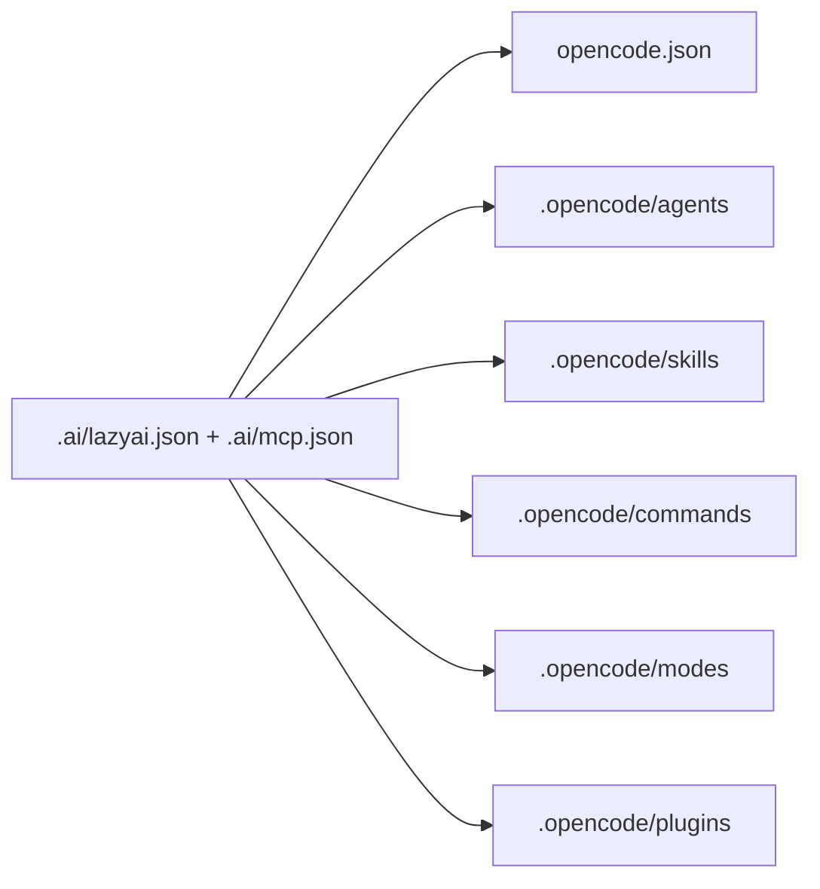

# OpenCode setup

OpenCode is a stable LazyAI target for teams that want native OpenCode agents, skills, commands, chat modes, plugins, permissions, and MCP in one generated surface.

## Generated structure

```text
.
├── AGENTS.md
├── opencode.json
└── .opencode/
    ├── agents/<agent>.md
    ├── skills/<skill>/SKILL.md
    ├── commands/<command>.md
    ├── modes/<mode>.md
    ├── plugins/<plugin>.js
    └── mcp.json
```



## OpenCode concepts LazyAI uses

| OpenCode concept | LazyAI source |
|---|---|
| Root instructions | `AGENTS.md` |
| Agents and subagents | canonical agents under `.ai/` / embedded library |
| Skills | Agent Skills-compatible `SKILL.md` directories |
| Commands | OpenCode-native command markdown |
| Chat modes | OpenCode mode markdown |
| Plugins/hooks | managed plugin files under `.opencode/plugins/` |
| MCP | canonical `.ai/mcp.json`, merged into `opencode.json` |

## LazyAI options

| Use case | Command |
|---|---|
| Add OpenCode during init | `lazyai-cli init --tools opencode --preset standard --no-interactive` |
| Add OpenCode later | `lazyai-cli add --tools opencode --no-interactive` |
| Compile only OpenCode MCP | `lazyai-cli compile --tool opencode` |
| Preview changes | `lazyai-cli compile --tool opencode --dry-run` |

## Example

```bash
lazyai-cli init \
  --scope project \
  --tools opencode \
  --preset full \
  --enable-servers filesystem,ai-memory \
  --name my-app \
  --no-interactive

lazyai-cli compile --tool opencode
lazyai-cli doctor
```

## Readiness notes

- Support level: stable.
- Global scope is supported.
- OpenCode has no prompt or output-style surface; LazyAI emits prompt-like workflows as commands and modes.
- Legacy `.opencode/lazyai.mcp.jsonc` entries are migration input; current MCP output is `opencode.json`.
