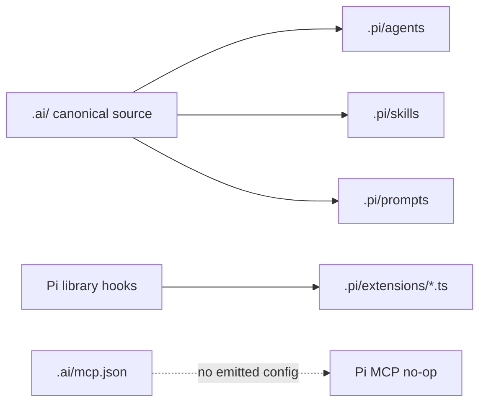

# Pi setup

Pi is a stable LazyAI target for Pi skills, prompt templates, markdown agent profiles consumed by Pi extensions, and extension-backed safety hooks.

## Generated structure

```text
.
├── AGENTS.md
└── .pi/
    ├── agents/<agent>.md
    ├── skills/<skill>/SKILL.md
    ├── prompts/<prompt>.md
    └── extensions/<extension>.ts
```



## Pi concepts LazyAI uses

| Pi concept | LazyAI source |
|---|---|
| Root instructions | `AGENTS.md` |
| Agent profiles | canonical agent markdown under `.pi/agents/` |
| Skills | Agent Skills-compatible `SKILL.md` directories |
| Prompts | prompt markdown under `.pi/prompts/` |
| Extensions | TypeScript extension files under `.pi/extensions/` |
| MCP | declared capability only; no Pi MCP config is emitted today |

## LazyAI options

| Use case | Command |
|---|---|
| Add Pi during init | `lazyai-cli init --tools pi --preset standard --no-interactive` |
| Add Pi later | `lazyai-cli add --tools pi --no-interactive` |
| Include prompts/skills from full preset | `lazyai-cli init --tools pi --preset full --no-interactive` |
| Build a Pi bundle | `lazyai-cli build-plugin --target pi --out ./dist/pi` |

## Example

```bash
lazyai-cli init \
  --scope project \
  --tools pi \
  --preset full \
  --name my-app \
  --no-interactive

lazyai-cli doctor
```

## Readiness notes

- Support level: stable.
- Project and workspace scopes are supported; global scope is intentionally unsupported.
- Pi has no `.pi/hooks` directory; LazyAI emits safety behavior as `.pi/extensions/*.ts`.
- `lazyai-cli compile --tool pi` reads canonical MCP state but emits no MCP file for Pi.
