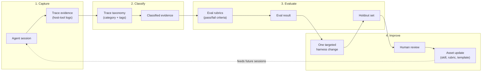

# Trace, Eval, and Improvement Loop

## Overview

The trace/eval/improvement loop is the mechanism by which LazyAI and vibe-lab assets improve over time. Every agent session produces evidence traces; those traces feed eval cases; eval failures drive targeted asset updates. This document describes the loop's architecture, boundaries, and the role each component plays.

This is a **conceptual and asset-level** description. The loop is executed by human reviewers and host-tool agents using inspectable file assets — not by a runtime engine, daemon, or judge service.

---

## Architecture

---

## Phase 1: Capture

The host tool (OpenCode, Claude Code, Copilot, Pi, OMP, etc.) records the agent session natively. This includes:

- Tool invocations and results
- File reads and writes
- Agent reasoning steps
- Phase transitions and lifecycle labels
- Test, lint, and build outcomes

**No additional capture infrastructure is required.** The host tool's own session log is the trace source. LazyAI does not run a background daemon, inject instrumentation, or intercept tool calls.

---

## Phase 2: Classify

Trace evidence is classified using the [trace taxonomy](../templates/trace-taxonomy.md) — a structured vocabulary of categories (`context`, `tooling`, `workflow`, `quality`, `adapter`) and granular tags.

Classification is performed by:

- **Human reviewers** during post-session audits
- **Host-tool agents** during handoff or status reporting (using the minimal form)
- **Process audits** that review ledger entries against the taxonomy

The taxonomy is an inspectable file asset, not a runtime schema. It lives in the embedded library and is available to any agent that reads it.

---

## Phase 3: Evaluate

Classified evidence is evaluated against eval rubrics (see `packages/cli/library/rubrics/` in the repository). Each rubric defines:

- **Trigger condition:** What pattern of classified evidence activates this rubric
- **Pass/fail criteria:** Observable conditions that determine the outcome
- **Evidence requirements:** What must be present for a valid evaluation

The eval phase does **not** use a judge LLM, scoring model, or automated grader. Evaluation is a structured comparison of evidence against criteria, performed by human reviewers or by host-tool agents following rubric instructions.

### Holdout set

A holdout set is a collection of known-pass and known-fail trace scenarios used to validate that a harness change actually improves outcomes. Holdout sets are:

- Stored as inspectable file assets (not a database)
- Updated when new failure patterns are discovered
- Used to prevent regression when promoting asset updates

---

## Phase 4: Improve

When evaluation reveals a failure pattern, the improvement loop prescribes **one targeted harness change** per failure:

1. **Identify the root cause** from the classified evidence
2. **Make one change** to a single asset (skill, rubric, template, or invariant)
3. **Run against the holdout set** to verify the change improves the targeted pattern without regressing others
4. **Human review** of the change and holdout results
5. **Promote** the asset update into the canonical library

### What counts as a harness change

- A skill instruction that prevents a recurring mistake
- A rubric criterion that catches a missed failure mode
- A template section that guides the agent through a previously skipped step
- An invariant in a spec that encodes a discovered constraint

### What does NOT count as a harness change

- A code change in the project being built (that is the agent's job, not the loop's)
- A configuration change to the host tool
- A new daemon, service, or runtime component

---

## Product Boundary

The trace/eval/improvement loop is a **vibe-lab process concept** with **inspectable file assets** in the LazyAI embedded library. It is explicitly **not**:

| Not this | Because |
|---|---|
| A trace daemon | No background process, no automatic capture, no runtime overhead |
| A scoring/judge runtime | No judge LLM, no numeric scores, no automated grader |
| An orchestration engine | No workflow engine, no subagent spawning, no state machine |
| A replacement for host-tool logs | It classifies what the host tool already records |
| A CI/CD pipeline | No automated promotion, no deployment gate |

The loop's assets (taxonomy, rubrics, holdout sets) are:

- **Inspectable** — plain markdown and JSON files, readable by any agent or human
- **Version-controlled** — part of the repository, subject to normal PR review
- **Composable** — each asset can be used independently (e.g., taxonomy for handoffs, rubrics for audits)
- **Opt-in** — teams adopt the loop by including the assets in their setup, not by installing a runtime

---

## Relationship to Other Concepts

| Concept | Relationship |
|---|---|
| [Harness Principles](harness-principles.md) | The "Trace evidence over vibes" and "Trace/eval improvement thinking" principles motivate this loop |
| [Product Boundaries](product-boundaries.md) | The loop's assets are `setup-core` library content; no runtime-adjacent state is required |
| [Skill Quality](skill-quality.md) | Improvement-loop asset updates must meet skill quality guidelines |
| [Agent Contracts](agent-contracts.md) | Trace evidence verifies that agents honored their contracts |
| [Trace Taxonomy](../templates/trace-taxonomy.md) | The classification vocabulary used in Phase 2 |
| Eval Rubrics (`packages/cli/library/rubrics/`) | The pass/fail criteria used in Phase 3 |
