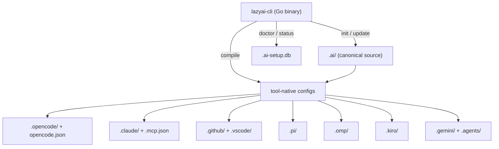

# LazyAI

Scaffold a canonical, multi-tool AI development environment from one CLI.

`lazyai-cli` initializes and maintains a tool-agnostic canonical layer under `.ai/`, then compiles it into native formats for OpenCode, Claude Code, GitHub Copilot, Pi, OMP, Kiro, and Antigravity. It ships with bundled agents, skills, templates, rules, hook runtimes, a workflow catalog, and an MCP catalog so teams can keep one managed source of truth. LazyAI owns this runtime/product surface; host AI CLIs execute the generated assets.

## What it does

- **One-time setup**: `lazyai-cli init` scaffolds canonical files, tool-native directories, and an MCP catalog.
- **Compile**: `lazyai-cli compile` regenerates per-tool configs from the canonical source of truth.
- **Update**: `lazyai-cli update` refreshes library content while preserving customizations.
- **Doctor**: `lazyai-cli doctor` checks drift, missing files, metadata gaps, and environment health.

## Product boundary

- **Shipped CLI:** `lazyai-cli` commands registered in `packages/cli/cmd/`.
- **Active embedded library:** canonical and adapter-selected assets embedded under `packages/cli/library/`.
- **Repository harness:** maintainer scripts such as `bin/doctor`, `bin/inject`, and `bin/startup-self-heal`; these are not shipped CLI commands.
- **Retired/archived:** Fortnite defaults, the old orchestrator runtime, obsolete eval/task/workflow surfaces, and `archive/` material are historical or migration references only.

See [Product Boundaries](concepts/product-boundaries.md) for the command and internal-package inventory.

## Where to start

- [Quick Start](getting-started/quick-start.md) — run your first setup in minutes
- [Installation](getting-started/installation.md) — install options and prerequisites
- [How It Works](concepts/how-it-works.md) — canonical source, compile model, manifest tracking, and runtime boundary
- [Product Boundaries](concepts/product-boundaries.md) — supported CLI, embedded library, repository harness, and archived surfaces
- [AI CLI Tool Setups](ai-cli-tools/index.md) — one page per supported AI CLI target with structure, options, diagrams, and examples
- [Production Readiness](development/production-readiness.md) — current quality posture and stale artifact inventory
- [CLI Reference](cli/reference.md) — full command and flag documentation
- [GitHub Wiki](https://github.com/rluisb/lazyai/wiki) — short-form operational notes and release/install references

## Architecture at a glance

The execution path uses local native agents directly. A2A remains a config seam only; remote/network execution is not the default, and retired Fortnite/orchestrator/eval surfaces are not part of the active runtime.

## Status

- CLI: Go module at `github.com/rluisb/lazyai/packages/cli`
- Platforms: macOS, Linux
- License: MIT
