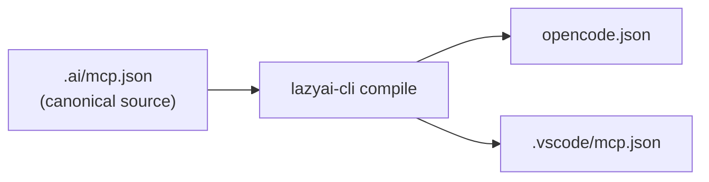

# MCP Integration

`lazyai-cli` maintains a canonical MCP catalog under `.ai/mcp.json` and compiles it into each tool's native config format.

## Canonical source

The canonical catalog is written to:

```text
.ai/mcp.json
```

It contains managed server definitions, install hints, and environment-variable placeholders.

## Per-tool compilation

| Tool | Compiled MCP output | Notes |
|---|---|---|
| OpenCode | `opencode.json` | Managed MCP entries are merged into top-level `mcp` on OpenCode config |
| Copilot | `.vscode/mcp.json` and optional `~/.copilot/mcp-config.json` | CLI probe decides whether the home config is emitted |
| Claude Code | `.mcp.json` or `.claude/settings.local.json` | Depends on scope and `--local-secrets` |

## Enabling servers

During setup:

```bash
lazyai-cli init --enable-servers filesystem,ai-memory
```

Or edit `.ai/mcp.json` later, then recompile:

```bash
lazyai-cli compile
```



Remote (URL-based) MCP servers include `"type":"http"` in the compiled payload so that `claude mcp add-json` accepts them. stdio servers (command-based) do not carry a type field.


## Cataloged MCP servers

| Server | Requires install | Notes |
|---|---|---|
| `ai-memory` | Yes | Shared project memory, handoffs, and durable annotations via a local or remote ai-memory server |
| `filesystem` | No | Local filesystem read/write access |
| `ripgrep` | No | Fast code search |
| `codegraph` | Yes | Repository graph exploration |
| `obsidian` | Yes | Obsidian vault integration |

## Token-efficient usage

Many cataloged servers have equivalent CLI tools. For bulk or deterministic work, prefer the CLI to avoid MCP JSON-RPC overhead and keep agent context windows small. See [MCP vs CLI](../concepts/mcp-vs-cli.md) for the broader comparison.

## Environment variables

If any enabled MCP server declares env vars, `lazyai-cli` generates:

```text
.env.example
```

`lazyai-cli` never writes real secrets into `.env.example`.

## Removed runtime note

The old orchestration runtime and its MCP server were removed from the active product surface during the runtime refactor. Use [the migration note](../migration/fortnite-orchestrator-removal.md) for compatibility and rollback guidance.
