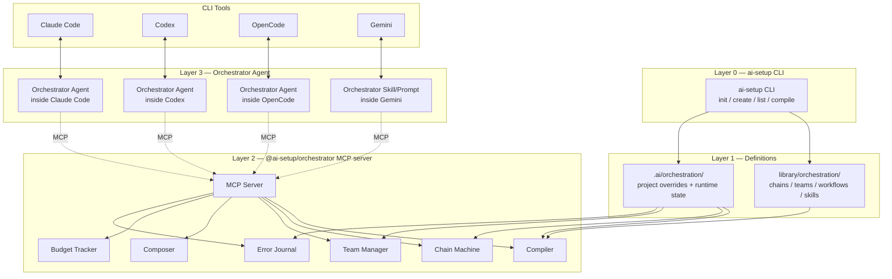
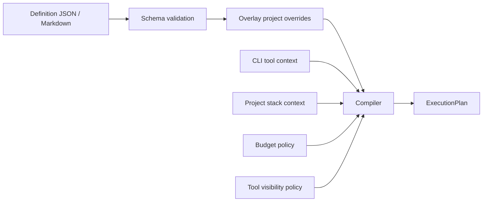
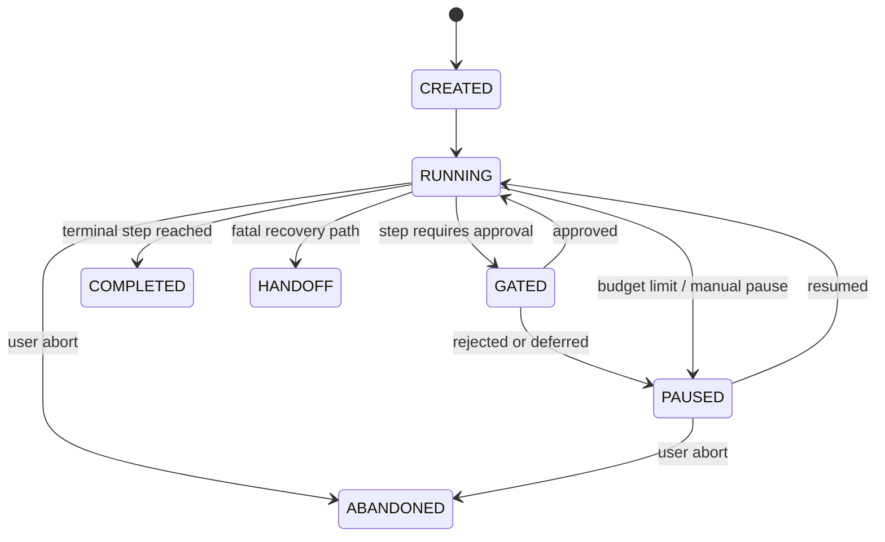
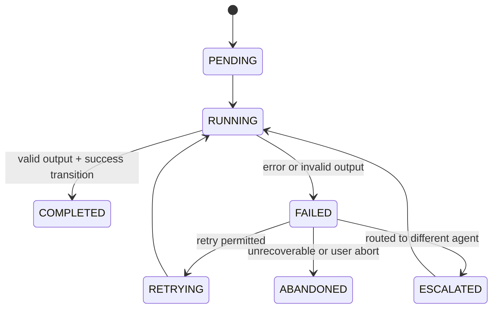
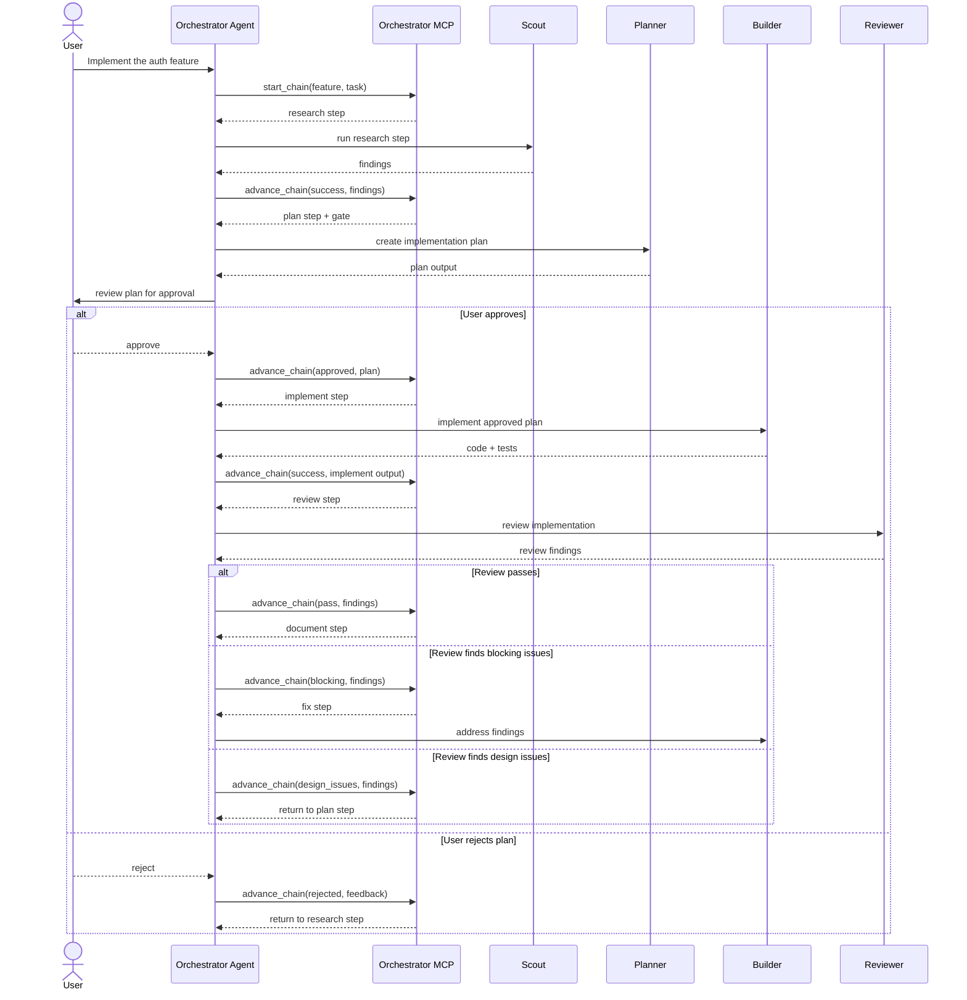
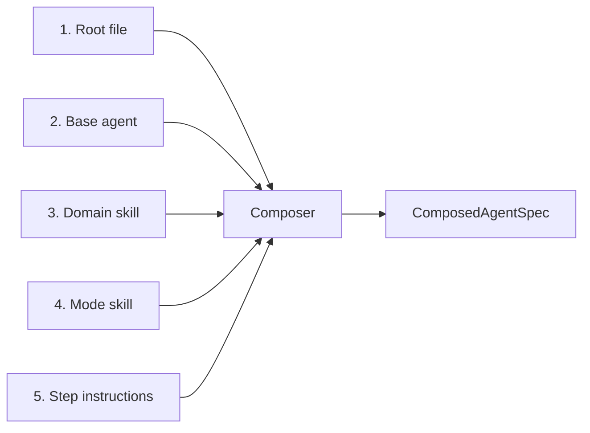
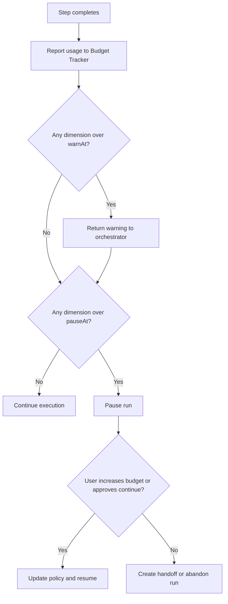
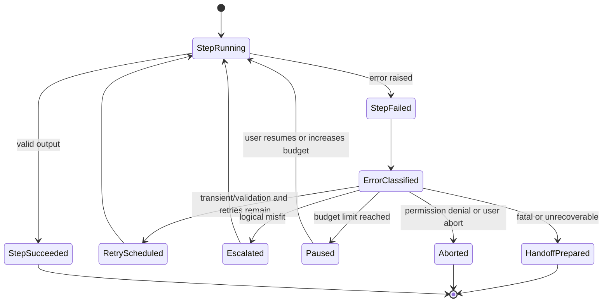
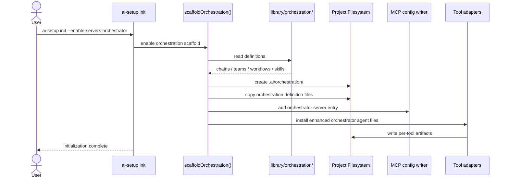
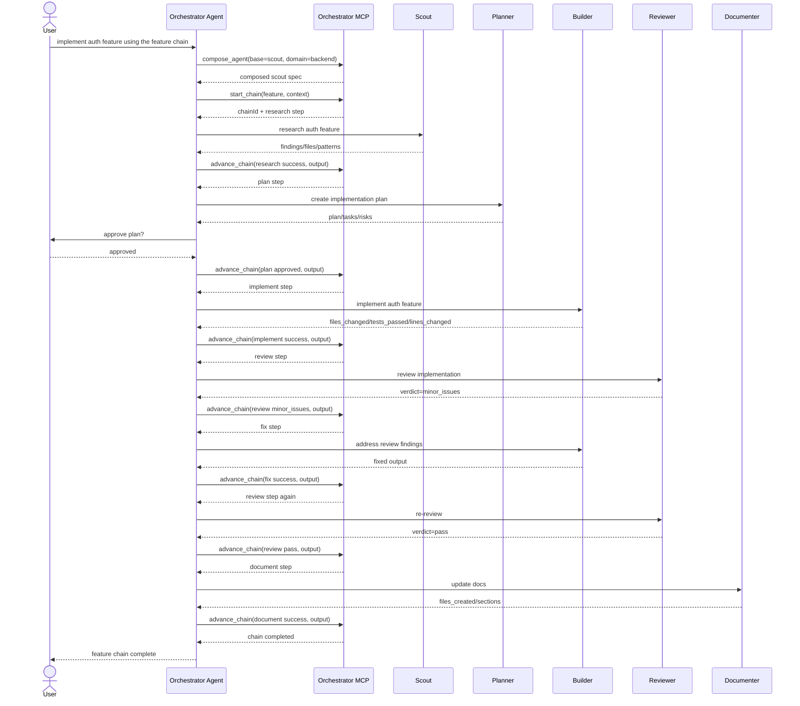

# Retired Orchestrator Technical Design

This historical document describes the optional orchestration layer from the former ai-setup design. Spec 025 removed that runtime from the active LazyAI product surface; current setup guidance lives in [`docs/integration/orchestration.md`](./integration/orchestration.md) and [`docs/migration/fortnite-orchestrator-removal.md`](./migration/fortnite-orchestrator-removal.md).

> Preserve this document as design history only. Do not use it as a command, package, or MCP catalog contract.

---

## 1. Executive Summary

The orchestration layer adds optional agent coordination to ai-setup: composable agents, sequential chains, parallel teams, and high-level workflows. It runs as an MCP server that any coding-agent CLI can connect to. ai-setup scaffolds the definition files; the MCP server provides runtime state management. Zero existing behavior changes for users who do not opt in.

MCP is the integration boundary because it is the one protocol already adopted across Claude Code, Codex, OpenCode, Gemini, and the broader next generation of coding-agent tools. Any future tool that implements MCP inherits orchestration support without tool-specific runtime adapters.

This extends ai-setup rather than replacing it because ai-setup is a scaffolding tool at setup-time, while orchestration is a runtime concern at session-time. The two systems have different lifecycles, different responsibilities, and different failure modes, but they belong in the same ecosystem:

- **ai-setup** creates canonical definitions, installs tool-specific agent files, and configures MCP connectivity.
- **@ai-setup/orchestrator** reads those definitions at runtime and manages execution state, budgets, handoffs, and recovery.
- **CLI-native orchestrator agents** translate user intent into MCP tool calls and agent dispatches inside the host coding tool.

The result is a strictly additive architecture:

- Users who never enable orchestration see no behavior changes.
- Users who do enable it get reusable, inspectable, version-controlled orchestration definitions.
- The system avoids framework lock-in by using declarative files plus a pure TypeScript MCP server instead of a proprietary orchestration runtime.

---

## 2. Product Goals and Non-Goals

### 2.1 Goals

| Goal | Why it matters | Design consequence |
|---|---|---|
| Enable structured multi-agent workflows through chains and teams | Real software work is multi-phase and often benefits from parallelism | The system must support sequential state machines and parallel task graphs as first-class concepts |
| Provide composable agent specialization | A role-only agent is too generic for complex tasks | Prompt composition must combine base role + domain + mode deterministically |
| Track state, budgets, errors, and recovery | Long-running agent work needs resumability and operational visibility | The MCP server must maintain durable run state and structured error records |
| Work with any MCP-capable CLI tool | The value of ai-setup is cross-tool interoperability | MCP is the runtime boundary; no tool-specific orchestration logic is embedded in server behavior |
| Remain purely opt-in with zero impact on existing users | ai-setup already has users who only want scaffolding | The feature must be additive, guarded by config and scaffold flags |
| Ship predefined workflows for common engineering processes | Users need useful defaults on day one | The library includes curated chains, teams, and workflows aligned to existing ai-setup fragments |
| Give users CLI commands to create custom chains, teams, domains, and modes | Defaults are not enough for all teams | Definition formats must be declarative, validated, and project-overridable |

### 2.2 Non-Goals

| Non-goal | Why it is out of scope |
|---|---|
| Build an LLM orchestration framework dependency on LangChain, CrewAI, or similar | The runtime should be minimal, auditable, and tool-agnostic |
| Replace each tool's native subagent or team features | Claude Code, Codex, and OpenCode already know how to run subagents; the orchestrator coordinates, not replaces |
| Add LLM inference to the MCP server | The server should remain deterministic TypeScript logic with no provider credentials or hidden reasoning |
| Require users to change their existing ai-setup workflow | Existing workflows must continue to function unchanged |
| Support tools with no MCP capability | MCP is the compatibility contract; non-MCP tools are outside the primary runtime boundary |
| Manage API keys or LLM authentication | Provider auth belongs to the host CLI tool or user environment, not the orchestrator |

### 2.3 Product Boundary

The orchestration feature is intentionally narrow:

- It **does** manage definitions, plans, state transitions, handoffs, and budget accounting.
- It **does** expose runtime control through MCP tools.
- It **does not** execute shell commands itself, call models, or own any provider-specific auth.
- It **does not** force a single workflow style on users; chains, teams, and workflows are independent building blocks.

---

## 3. Design Principles

### 3.1 Opt-in only
Orchestration must never affect users who do not enable it. This means no default MCP server registration, no hidden prompt modifications, and no changes to existing compile behavior unless the feature is explicitly enabled.

### 3.2 Definitions are data
Chains, teams, workflows, domains, and modes are declarative JSON or Markdown files, not executable code. This keeps them inspectable, version-controlled, portable, and easy to validate.

### 3.3 Compile before execute
The runtime never executes raw definitions directly. Definitions are first validated, normalized, and compiled into an execution plan that injects runtime context such as host CLI capabilities, project stack, and budget policy.

### 3.4 State machine, not pipeline
A chain is not a fixed list of steps. It is a directed state machine whose next step depends on the current output and declared transitions. This allows review findings to send execution back to planning, or implementation failures to escalate.

### 3.5 Declare, do not enforce
The MCP server declares the intended prompt, tool allowlist, model hints, and transition semantics. The host CLI tool enforces sandboxing, tool permissions, and subagent isolation. This keeps trust boundaries clean.

### 3.6 Budget over estimate
The orchestrator tracks actual observed usage against configured ceilings rather than pretending it can accurately predict costs beforehand. Budgets are operational guardrails, not forecasting tools.

### 3.7 Composition is deterministic
The same root file, base agent, domain skill, mode skill, and step instructions must always produce the same composed agent specification. Determinism matters for debugging, reproducibility, and testing.

### 3.8 Errors are structured
Every runtime error must carry a category, code, human-readable summary, causal context, and a suggested recovery path. This is necessary for automated retries, escalation, and handoff.

### 3.9 Separate concerns
Chains, teams, and workflows remain separate concepts:

- **Chains** solve sequential orchestration.
- **Teams** solve parallel orchestration.
- **Workflows** package chains, teams, gates, and recovery into reusable presets.

That separation keeps the primitives small, composable, and reusable.

---

## 4. System Architecture Overview

The orchestration system is a four-layer architecture with a clean setup/runtime split.

### 4.1 Layer responsibilities

#### Layer 0 — ai-setup CLI
Layer 0 exists today. It scaffolds project files, compiles root instructions, configures MCP servers, and installs per-tool agent artifacts. For orchestration, it gains the ability to scaffold orchestration definitions and register the orchestrator MCP server, but it does not become a runtime coordinator.

#### Layer 1 — Definition files
Layer 1 is the declarative source of truth. It includes:

- built-in library definitions under `library/orchestration/`
- project-local copies and overrides under `.ai/orchestration/`
- domain and mode skills written as Markdown with frontmatter
- chain, team, and workflow definitions written as JSON

These files are static and user-editable.

#### Layer 2 — `@ai-setup/orchestrator` MCP server
Layer 2 is the runtime control plane. It:

- loads and validates definitions
- compiles them into execution plans
- tracks chain, team, and workflow state
- composes agent instructions deterministically
- records structured errors and lessons
- tracks usage against budget policy
- exposes all control through MCP tools

It contains no LLM logic.

#### Layer 3 — Orchestrator Agent in each CLI tool
Layer 3 is a host-tool-native agent definition. It runs inside Claude Code, Codex, OpenCode, or another MCP-capable CLI, interprets user requests, calls MCP tools, and dispatches subagents using that tool's native mechanisms.

### 4.2 Component architecture



### 4.3 Request flow

A typical feature request flows like this:

1. User asks the host CLI tool to implement a feature.
2. The orchestrator agent interprets the task and decides to start a chain or workflow.
3. The agent calls the MCP server, which compiles the requested definition into an execution plan.
4. The MCP server returns the next actionable step, including composed agent configuration and output contract.
5. The orchestrator agent dispatches the relevant subagent.
6. When that subagent finishes, the orchestrator reports the outcome back to the MCP server.
7. The server advances the state machine, checks budgets, applies transitions, and returns the next action.

### 4.4 Why the architecture is layered this way

This design deliberately separates:

- **static authoring** from **runtime control**
- **deterministic orchestration logic** from **LLM reasoning**
- **definition ownership** from **execution ownership**
- **tool-specific dispatch** from **tool-agnostic state management**

That separation is what makes the system portable, inspectable, and easy to evolve.

---

## 5. File and Package Layout

### 5.1 Legend

- ✅ existing and unchanged
- 🟡 existing and modified for orchestration support
- 🔴 new

### 5.2 Repository layout

```text
ai-setup/
├── src/                                                            🟡
│   ├── cli.ts                                                      ✅
│   ├── index.ts                                                    ✅
│   ├── presets.ts                                                  🟡 add orchestration feature flag
│   ├── prompts.ts                                                  ✅
│   ├── types.ts                                                    🟡 add orchestration types
│   │
│   ├── __tests__/                                                  🟡
│   │   ├── adapters-files.test.ts                                  🟡 add orchestration cases
│   │   ├── canonical-writer.test.ts                                ✅
│   │   ├── cli.e2e.test.ts                                         ✅
│   │   ├── cli.test.ts                                             ✅
│   │   ├── compiled-root.test.ts                                   ✅
│   │   ├── compiler.test.ts                                        ✅
│   │   ├── conflict-strategy.test.ts                               ✅
│   │   ├── diff.test.ts                                            ✅
│   │   ├── e2e.test.ts                                             ✅
│   │   ├── error-boundary.test.ts                                  ✅
│   │   ├── frontmatter.test.ts                                     ✅
│   │   ├── generators.test.ts                                      ✅
│   │   ├── gitignore-guidance.test.ts                              ✅
│   │   ├── manifest.test.ts                                        ✅
│   │   ├── mcp.test.ts                                             ✅
│   │   ├── migration.test.ts                                       ✅
│   │   ├── parsers.test.ts                                         ✅
│   │   ├── phase2-features.test.ts                                 ✅
│   │   ├── presets.test.ts                                         ✅
│   │   ├── repo-detection.test.ts                                  ✅
│   │   ├── repo-roots.test.ts                                      ✅
│   │   ├── scaffold-modules.test.ts                                ✅
│   │   ├── store.test.ts                                           ✅
│   │   ├── update-doctor.test.ts                                   ✅
│   │   ├── wizard-integration.test.ts                              ✅
│   │   ├── wizard-phases.test.ts                                   ✅
│   │   └── orchestration.test.ts                                   🔴
│   │
│   ├── adapters/                                                   🟡
│   │   ├── claude-code.ts                                          🟡
│   │   ├── codex.ts                                                🟡
│   │   ├── copilot.ts                                              🟡
│   │   ├── gemini.ts                                               🟡
│   │   ├── mcp-compiler.ts                                         🟡 add orchestrator server entry handling
│   │   ├── opencode.ts                                             🟡
│   │   ├── pi.ts                                                   ✅
│   │   ├── registry.ts                                             ✅
│   │   ├── shared.ts                                               ✅
│   │   └── types.ts                                                ✅
│   │
│   ├── commands/                                                   🟡
│   │   ├── add.ts                                                  ✅
│   │   ├── compile.ts                                              ✅
│   │   ├── completions.ts                                          🟡 add orchestration categories
│   │   ├── create.ts                                               🟡 extend artifact types
│   │   ├── doctor.ts                                               ✅
│   │   ├── eject.ts                                                ✅
│   │   ├── import.ts                                               ✅
│   │   ├── info.ts                                                 🟡 show chain/team/workflow/domain/mode details
│   │   ├── init.ts                                                 🟡 add orchestration enablement
│   │   ├── list.ts                                                 🟡 list chains/teams/workflows/domains/modes
│   │   ├── migrate.ts                                              ✅
│   │   ├── migration-shared.ts                                     ✅
│   │   ├── status.ts                                               ✅
│   │   └── update.ts                                               ✅
│   │
│   ├── compiler/                                                   ✅
│   │   ├── fragment-resolver.ts                                    ✅
│   │   ├── index.ts                                                ✅
│   │   └── template-compiler.ts                                    ✅
│   │
│   ├── errors/                                                     ✅
│   │   ├── boundary.ts                                             ✅
│   │   ├── index.ts                                                ✅
│   │   ├── operation.ts                                            ✅
│   │   └── types.ts                                                ✅
│   │
│   ├── generators/                                                 🟡
│   │   ├── agent.ts                                                ✅
│   │   ├── command.ts                                              ✅
│   │   ├── prompt.ts                                               ✅
│   │   ├── registry.ts                                             ✅
│   │   ├── skill.ts                                                ✅
│   │   ├── template.ts                                             ✅
│   │   ├── types.ts                                                ✅
│   │   └── workflow.ts                                             🟡 extend for orchestration workflow JSON generation
│   │
│   ├── migration/                                                  ✅
│   │   ├── canonical-writer.ts                                     ✅
│   │   ├── detector.ts                                             ✅
│   │   ├── doctor.ts                                               ✅
│   │   ├── executor.ts                                             ✅
│   │   ├── index.ts                                                ✅
│   │   ├── plan.ts                                                 ✅
│   │   ├── types.ts                                                ✅
│   │   ├── diff/diff3.ts                                           ✅
│   │   ├── parsers/                                                ✅
│   │   │   ├── base-parser.ts                                      ✅
│   │   │   ├── claude-parser.ts                                    ✅
│   │   │   ├── copilot-parser.ts                                   ✅
│   │   │   ├── gemini-parser.ts                                    ✅
│   │   │   ├── opencode-parser.ts                                  ✅
│   │   │   └── pi-parser.ts                                        ✅
│   │   ├── registry/discovery.ts                                   ✅
│   │   └── __tests__/                                              ✅
│   │
│   ├── scaffold/                                                   🟡
│   │   ├── agents-skills-prompts.ts                                ✅
│   │   ├── compiled-root.ts                                        ✅
│   │   ├── constitution.ts                                         ✅
│   │   ├── env-example.ts                                          ✅
│   │   ├── gitignore.ts                                            ✅
│   │   ├── infra.ts                                                ✅
│   │   ├── mcp.ts                                                  ✅
│   │   ├── orchestration.ts                                        🔴
│   │   ├── repo-roots.ts                                           ✅
│   │   ├── root-file-map.ts                                        ✅
│   │   ├── root-files.ts                                           ✅
│   │   ├── specs.ts                                                ✅
│   │   └── templates-rules.ts                                      ✅
│   │
│   ├── store/                                                      🟡
│   │   ├── index.ts                                                ✅
│   │   ├── migrations.ts                                           ✅
│   │   └── schema.ts                                               🟡 add orchestration config
│   │
│   ├── utils/                                                      ✅
│   │   ├── conflict-strategy.ts                                    ✅
│   │   ├── conflicts.ts                                            ✅
│   │   ├── diff.ts                                                 ✅
│   │   ├── files.ts                                                ✅
│   │   ├── frontmatter.ts                                          ✅
│   │   ├── global-paths.ts                                         ✅
│   │   ├── manifest.ts                                             ✅
│   │   ├── repo-detection.ts                                       ✅
│   │   ├── ui.ts                                                   ✅
│   │   └── validation.ts                                           ✅
│   │
│   └── wizard/                                                     🟡
│       ├── index.ts                                                🟡 call scaffoldOrchestration()
│       ├── outro.ts                                                ✅
│       ├── phase1-context.ts                                       🟡 add orchestration question
│       ├── phase2-features.ts                                      ✅
│       ├── phase3-conflicts.ts                                     ✅
│       ├── phase4-confirm.ts                                       ✅
│       └── planner.ts                                              ✅
│
├── library/                                                        🟡
│   ├── agents/                                                     🟡
│   │   ├── builder.md                                              ✅
│   │   ├── documenter.md                                           ✅
│   │   ├── orchestrator.md                                         🟡 enhance with MCP tool instructions
│   │   ├── planner.md                                              ✅
│   │   ├── red-team.md                                             ✅
│   │   ├── reviewer.md                                             ✅
│   │   └── scout.md                                                ✅
│   ├── constitution/                                               ✅
│   ├── fragments/                                                  ✅
│   ├── infra/                                                      ✅
│   ├── mcp/catalog.json                                            🟡 add orchestrator server entry
│   ├── prompts/                                                    ✅
│   ├── root/                                                       ✅
│   ├── rules/                                                      ✅
│   ├── skills/                                                     ✅
│   │   ├── anti-speculation.md                                     ✅
│   │   ├── extract-standards.md                                    ✅
│   │   ├── implement.md                                            ✅
│   │   ├── iterate.md                                              ✅
│   │   ├── memory-write.md                                         ✅
│   │   ├── parallel-execution.md                                   ✅
│   │   ├── plan.md                                                 ✅
│   │   ├── research.md                                             ✅
│   │   └── tdd-loop.md                                             ✅
│   ├── specs-agents/                                               ✅
│   ├── templates/                                                  ✅
│   ├── tool-agents/                                                ✅
│   ├── tool-templates/                                             ✅
│   └── orchestration/                                              🔴
│       ├── chains/                                                 🔴
│       │   ├── feature.json                                        🔴
│       │   ├── bugfix.json                                         🔴
│       │   ├── review.json                                         🔴
│       │   ├── refactor.json                                       🔴
│       │   ├── onboard.json                                        🔴
│       │   ├── tdd.json                                            🔴
│       │   ├── research-plan.json                                  🔴
│       │   ├── implement-review.json                               🔴
│       │   ├── tdd-cycle.json                                      🔴
│       │   └── investigate-fix.json                                🔴
│       ├── teams/                                                  🔴
│       │   ├── review-team.json                                    🔴
│       │   ├── feature-team.json                                   🔴
│       │   └── assessment-team.json                                🔴
│       ├── workflows/                                              🔴
│       │   ├── rpi.json                                            🔴
│       │   ├── code-review.json                                    🔴
│       │   ├── bug-investigation.json                              🔴
│       │   ├── system-design.json                                  🔴
│       │   ├── refactor.json                                       🔴
│       │   ├── onboard.json                                        🔴
│       │   ├── tdd.json                                            🔴
│       │   └── incident-response.json                              🔴
│       └── skills/                                                 🔴
│           ├── domains/                                            🔴
│           │   ├── backend.md                                      🔴
│           │   ├── frontend.md                                     🔴
│           │   ├── devops.md                                       🔴
│           │   ├── data.md                                         🔴
│           │   └── security.md                                     🔴
│           └── modes/                                              🔴
│               ├── senior.md                                       🔴
│               ├── junior.md                                       🔴
│               └── autonomous.md                                   🔴
│
├── orchestrator/                                                   🔴 separate npm package
│   ├── package.json                                                🔴 @ai-setup/orchestrator
│   ├── tsconfig.json                                               🔴
│   ├── tsup.config.ts                                              🔴
│   └── src/                                                        🔴
│       ├── index.ts                                                🔴 MCP server entrypoint
│       ├── server.ts                                               🔴 tool + resource registration
│       ├── tools/                                                  🔴
│       │   ├── compose-agent.ts                                    🔴
│       │   ├── start-chain.ts                                      🔴
│       │   ├── advance-chain.ts                                    🔴
│       │   ├── start-workflow.ts                                   🔴
│       │   ├── advance-workflow.ts                                 🔴
│       │   ├── build-team.ts                                       🔴
│       │   ├── assign-task.ts                                      🔴
│       │   ├── complete-task.ts                                    🔴
│       │   ├── get-status.ts                                       🔴
│       │   ├── list-catalog.ts                                     🔴
│       │   ├── budget.ts                                           🔴
│       │   └── recovery.ts                                         🔴
│       ├── state/                                                  🔴
│       │   ├── chain-machine.ts                                    🔴
│       │   ├── team-state.ts                                       🔴
│       │   ├── workflow-state.ts                                   🔴
│       │   ├── budget-tracker.ts                                   🔴
│       │   ├── error-journal.ts                                    🔴
│       │   └── persistence.ts                                      🔴
│       ├── composer/                                               🔴
│       │   ├── compose.ts                                          🔴
│       │   ├── loader.ts                                           🔴
│       │   └── validator.ts                                        🔴
│       └── __tests__/                                              🔴
│           ├── chain-machine.test.ts                               🔴
│           ├── compose.test.ts                                     🔴
│           ├── team-state.test.ts                                  🔴
│           └── server.test.ts                                      🔴
│
├── demo/                                                           ✅
├── docs/                                                           🟡 add orchestrator-design.md
├── scripts/                                                        ✅
├── specs/                                                          ✅
├── bin/                                                            ✅
├── package.json                                                    ✅
├── tsconfig.json                                                   ✅
├── tsup.config.ts                                                  ✅
└── README.md                                                       🟡 document orchestration feature
```

### 5.3 Generated project-local layout when enabled

The repository ships the library definitions above. When a user enables orchestration in a project, ai-setup scaffolds project-local copies under `.ai/orchestration/` and registers the orchestrator server in per-tool MCP config files. That gives users safe local customization without editing the library package.

---

## 6. Definition Model and Schemas

The orchestration layer is built from separate but composable definition types:

- **Chain**: a sequential state machine definition
- **Team**: a parallel task topology plus synthesis rule
- **Workflow**: a preset that composes chains, teams, gates, and recovery
- **Domain skill**: knowledge injection for a role
- **Mode skill**: behavioral modifier for a role

A workflow references chains and teams by name rather than redefining them inline. That separation is what makes the pieces reusable.

### 6.1 Chain definition schema

```json
{
  "$schema": "https://json-schema.org/draft/2020-12/schema",
  "$id": "https://ai-setup.dev/schemas/orchestration/chain.schema.json",
  "title": "ChainDefinition",
  "type": "object",
  "additionalProperties": false,
  "required": ["kind", "name", "description", "version", "entry", "steps"],
  "properties": {
    "kind": { "const": "chain" },
    "name": { "type": "string", "pattern": "^[a-z][a-z0-9-]*$" },
    "description": { "type": "string", "minLength": 1 },
    "version": { "type": "string" },
    "entry": { "type": "string" },
    "domain_skill_injection": {
      "type": "string",
      "enum": ["none", "all_steps", "builder_steps_only", "matching_steps_only"]
    },
    "mode_skill_injection": {
      "type": "string",
      "enum": ["none", "all_steps", "builder_steps_only", "matching_steps_only"]
    },
    "steps": {
      "type": "array",
      "minItems": 1,
      "items": { "$ref": "#/$defs/step" }
    }
  },
  "$defs": {
    "transitionAction": {
      "oneOf": [
        { "type": "string" },
        {
          "type": "object",
          "additionalProperties": false,
          "required": ["retry", "then"],
          "properties": {
            "retry": { "type": "integer", "minimum": 0 },
            "then": { "type": "string" }
          }
        }
      ]
    },
    "step": {
      "type": "object",
      "additionalProperties": false,
      "required": ["id", "agent", "skills", "description", "transitions"],
      "properties": {
        "id": { "type": "string", "pattern": "^[a-z][a-z0-9_-]*$" },
        "agent": { "type": "string" },
        "skills": {
          "type": "array",
          "items": { "type": "string" },
          "uniqueItems": true
        },
        "description": { "type": "string" },
        "output": { "type": "string" },
        "gate": { "type": "string", "enum": ["user_approval", "severity_confirmation", "cost_confirmation"] },
        "output_contract": {
          "type": "object",
          "description": "JSON Schema describing the required step output"
        },
        "transitions": {
          "type": "object",
          "minProperties": 1,
          "additionalProperties": { "$ref": "#/$defs/transitionAction" }
        }
      }
    }
  }
}
```

### 6.2 Chain example — `feature.json`

```json
{
  "kind": "chain",
  "name": "feature",
  "description": "New feature delivery from research through documentation",
  "version": "1.0.0",
  "entry": "research",
  "domain_skill_injection": "all_steps",
  "mode_skill_injection": "builder_steps_only",
  "steps": [
    {
      "id": "research",
      "agent": "scout",
      "skills": ["research"],
      "description": "Map affected code, patterns, and dependencies",
      "output": "Research findings document",
      "output_contract": {
        "type": "object",
        "required": ["findings", "files_examined", "patterns"],
        "properties": {
          "findings": { "type": "array", "items": { "type": "string" } },
          "files_examined": { "type": "array", "items": { "type": "string" } },
          "patterns": { "type": "array", "items": { "type": "string" } }
        }
      },
      "transitions": {
        "success": "plan",
        "failure": { "retry": 1, "then": "escalate_to:planner" }
      }
    },
    {
      "id": "plan",
      "agent": "planner",
      "skills": ["plan"],
      "description": "Create a phased implementation plan",
      "output": "Approved plan",
      "gate": "user_approval",
      "output_contract": {
        "type": "object",
        "required": ["plan", "tasks", "risks"],
        "properties": {
          "plan": { "type": "string" },
          "tasks": { "type": "array", "items": { "type": "string" } },
          "risks": { "type": "array", "items": { "type": "string" } }
        }
      },
      "transitions": {
        "approved": "implement",
        "rejected": "research"
      }
    },
    {
      "id": "implement",
      "agent": "builder",
      "skills": ["implement", "anti-speculation"],
      "description": "Execute approved tasks and run quality gates",
      "output": "Code changes with passing tests",
      "output_contract": {
        "type": "object",
        "required": ["files_changed", "tests_passed", "lines_changed"],
        "properties": {
          "files_changed": { "type": "array", "items": { "type": "string" } },
          "tests_passed": { "type": "boolean" },
          "lines_changed": { "type": "integer" }
        }
      },
      "transitions": {
        "success": "review",
        "failure": { "retry": 2, "then": "escalate_to:planner" }
      }
    },
    {
      "id": "review",
      "agent": "reviewer",
      "skills": ["extract-standards"],
      "description": "Evaluate correctness, quality, and standards alignment",
      "output": "Review findings",
      "output_contract": {
        "type": "object",
        "required": ["verdict", "findings"],
        "properties": {
          "verdict": { "type": "string", "enum": ["pass", "minor_issues", "blocking", "design_issues"] },
          "findings": { "type": "array", "items": { "type": "string" } }
        }
      },
      "transitions": {
        "pass": "document",
        "minor_issues": "fix",
        "blocking": "fix",
        "design_issues": "plan"
      }
    },
    {
      "id": "fix",
      "agent": "builder",
      "skills": ["iterate"],
      "description": "Address review findings and rerun gates",
      "transitions": {
        "success": "review",
        "failure": { "retry": 1, "then": "handoff" }
      }
    },
    {
      "id": "document",
      "agent": "documenter",
      "skills": [],
      "description": "Update docs for changed behavior",
      "transitions": {
        "success": "done"
      }
    }
  ]
}
```

### 6.3 Team definition schema

```json
{
  "$schema": "https://json-schema.org/draft/2020-12/schema",
  "$id": "https://ai-setup.dev/schemas/orchestration/team.schema.json",
  "title": "TeamDefinition",
  "type": "object",
  "additionalProperties": false,
  "required": ["kind", "name", "description", "version", "parallel", "synthesize"],
  "properties": {
    "kind": { "const": "team" },
    "name": { "type": "string", "pattern": "^[a-z][a-z0-9-]*$" },
    "description": { "type": "string" },
    "version": { "type": "string" },
    "budget_multiplier": { "type": "number", "minimum": 1 },
    "user_confirmation_required": { "type": "boolean" },
    "parallel": {
      "type": "array",
      "minItems": 1,
      "items": { "$ref": "#/$defs/member" }
    },
    "synthesize": { "$ref": "#/$defs/synthesizer" }
  },
  "$defs": {
    "member": {
      "type": "object",
      "additionalProperties": false,
      "required": ["role", "agent", "skills", "focus"],
      "properties": {
        "role": { "type": "string" },
        "agent": { "type": "string" },
        "skills": { "type": "array", "items": { "type": "string" }, "uniqueItems": true },
        "focus": { "type": "string" },
        "output_contract": { "type": "object" }
      }
    },
    "synthesizer": {
      "type": "object",
      "additionalProperties": false,
      "required": ["agent", "description"],
      "properties": {
        "agent": { "type": "string" },
        "description": { "type": "string" },
        "output_contract": { "type": "object" }
      }
    }
  }
}
```

### 6.4 Team example — `review-team.json`

```json
{
  "kind": "team",
  "name": "review-team",
  "description": "Parallel code review from correctness, security, and maintainability perspectives",
  "version": "1.0.0",
  "budget_multiplier": 3,
  "user_confirmation_required": true,
  "parallel": [
    {
      "role": "correctness-reviewer",
      "agent": "reviewer",
      "skills": [],
      "focus": "Logic errors, missing cases, incorrect behavior"
    },
    {
      "role": "security-reviewer",
      "agent": "red-team",
      "skills": [],
      "focus": "Security vulnerabilities, auth bypass, injection, data leaks"
    },
    {
      "role": "quality-reviewer",
      "agent": "reviewer",
      "skills": ["extract-standards"],
      "focus": "Patterns, maintainability, test coverage, readability"
    }
  ],
  "synthesize": {
    "agent": "orchestrator",
    "description": "Merge findings, deduplicate overlap, prioritize by severity",
    "output_contract": {
      "type": "object",
      "required": ["summary", "findings", "verdict"],
      "properties": {
        "summary": { "type": "string" },
        "findings": { "type": "array", "items": { "type": "string" } },
        "verdict": { "type": "string", "enum": ["pass", "minor", "blocking"] }
      }
    }
  }
}
```

### 6.5 Workflow definition schema

```json
{
  "$schema": "https://json-schema.org/draft/2020-12/schema",
  "$id": "https://ai-setup.dev/schemas/orchestration/workflow.schema.json",
  "title": "WorkflowDefinition",
  "type": "object",
  "additionalProperties": false,
  "required": ["kind", "name", "description", "version", "entry", "phases"],
  "properties": {
    "kind": { "const": "workflow" },
    "name": { "type": "string", "pattern": "^[a-z][a-z0-9-]*$" },
    "description": { "type": "string" },
    "version": { "type": "string" },
    "entry": { "type": "string" },
    "phases": {
      "type": "array",
      "minItems": 1,
      "items": { "$ref": "#/$defs/phase" }
    }
  },
  "$defs": {
    "phase": {
      "type": "object",
      "additionalProperties": false,
      "required": ["id", "kind"],
      "properties": {
        "id": { "type": "string" },
        "kind": { "type": "string", "enum": ["chain", "team", "gate", "terminal"] },
        "ref": { "type": "string" },
        "gate": { "type": "string", "enum": ["user_approval", "severity_confirmation", "cost_confirmation"] },
        "prompt": { "type": "string" },
        "when": { "type": "string" },
        "on": {
          "type": "object",
          "additionalProperties": { "type": "string" }
        }
      },
      "allOf": [
        {
          "if": { "properties": { "kind": { "const": "chain" } } },
          "then": { "required": ["ref", "on"] }
        },
        {
          "if": { "properties": { "kind": { "const": "team" } } },
          "then": { "required": ["ref", "on"] }
        },
        {
          "if": { "properties": { "kind": { "const": "gate" } } },
          "then": { "required": ["gate", "prompt", "on"] }
        }
      ]
    }
  }
}
```

### 6.6 Workflow example — `rpi.json`

```json
{
  "kind": "workflow",
  "name": "rpi",
  "description": "Research, plan, implement workflow composed from reusable chains and gates",
  "version": "1.0.0",
  "entry": "research_and_plan",
  "phases": [
    {
      "id": "research_and_plan",
      "kind": "chain",
      "ref": "research-plan",
      "on": {
        "success": "approve_plan",
        "failure": "handoff"
      }
    },
    {
      "id": "approve_plan",
      "kind": "gate",
      "gate": "user_approval",
      "prompt": "Review the generated plan and approve before implementation starts.",
      "on": {
        "approved": "implement_and_review",
        "rejected": "research_and_plan"
      }
    },
    {
      "id": "implement_and_review",
      "kind": "chain",
      "ref": "implement-review",
      "on": {
        "success": "complete",
        "failure": "reassess"
      }
    },
    {
      "id": "reassess",
      "kind": "team",
      "ref": "review-team",
      "when": "implement_and_review.verdict == 'blocking'",
      "on": {
        "success": "implement_and_review",
        "failure": "handoff"
      }
    },
    {
      "id": "handoff",
      "kind": "terminal"
    },
    {
      "id": "complete",
      "kind": "terminal"
    }
  ]
}
```

### 6.7 Domain skill frontmatter schema

```json
{
  "$schema": "https://json-schema.org/draft/2020-12/schema",
  "$id": "https://ai-setup.dev/schemas/orchestration/domain-skill-frontmatter.schema.json",
  "title": "DomainSkillFrontmatter",
  "type": "object",
  "additionalProperties": false,
  "required": ["kind", "name", "description", "applies_to", "knowledge_areas", "allowed_tools"],
  "properties": {
    "kind": { "const": "domain-skill" },
    "name": { "type": "string" },
    "description": { "type": "string" },
    "applies_to": { "type": "array", "items": { "type": "string" }, "minItems": 1 },
    "knowledge_areas": { "type": "array", "items": { "type": "string" }, "minItems": 1 },
    "allowed_tools": { "type": "array", "items": { "type": "string" } },
    "model_hint": { "type": "string" }
  }
}
```

### 6.8 Domain skill example — `backend.md`

```markdown
---
kind: domain-skill
name: backend
description: Backend systems knowledge for APIs, data access, queues, and service boundaries
applies_to:
  - scout
  - planner
  - builder
  - reviewer
knowledge_areas:
  - api-design
  - auth-and-authorization
  - database-access
  - caching
  - background-jobs
  - observability
allowed_tools:
  - Read
  - Grep
  - Glob
  - Edit
  - Write
  - Bash
model_hint: sonnet
---

# Backend Domain Skill

Focus on service boundaries, transport contracts, data ownership, failure modes, idempotency,
authentication and authorization, persistence semantics, and operational concerns such as metrics,
logging, and retries.

When reviewing or implementing backend changes:
- trace request flow end-to-end
- identify schema and migration impact
- prefer explicit contracts over implicit coupling
- flag security, tenancy, and data consistency risks early
```

### 6.9 Mode skill frontmatter schema

```json
{
  "$schema": "https://json-schema.org/draft/2020-12/schema",
  "$id": "https://ai-setup.dev/schemas/orchestration/mode-skill-frontmatter.schema.json",
  "title": "ModeSkillFrontmatter",
  "type": "object",
  "additionalProperties": false,
  "required": ["kind", "name", "description", "behavior", "allowed_tools"],
  "properties": {
    "kind": { "const": "mode-skill" },
    "name": { "type": "string" },
    "description": { "type": "string" },
    "behavior": { "type": "array", "items": { "type": "string" }, "minItems": 1 },
    "allowed_tools": { "type": "array", "items": { "type": "string" } },
    "approval_policy": {
      "type": "string",
      "enum": ["strict", "normal", "minimal"]
    },
    "model_hint": { "type": "string" }
  }
}
```

### 6.10 Mode skill example — `senior.md`

```markdown
---
kind: mode-skill
name: senior
description: Autonomous and opinionated execution with proactive risk identification
behavior:
  - make reasonable decisions without asking for trivial confirmation
  - challenge weak assumptions and surface better alternatives
  - prioritize correctness, maintainability, and operational safety
allowed_tools:
  - Read
  - Grep
  - Glob
  - Edit
  - Write
  - Bash
approval_policy: normal
model_hint: opus
---

# Senior Mode Skill

Operate with experienced engineering judgment.

You should:
- detect hidden complexity before implementation starts
- suggest simpler or safer approaches when requirements appear risky
- escalate only for material product, security, architecture, or budget decisions
- leave a clear trail of assumptions, trade-offs, and why the chosen path is appropriate
```

### 6.11 Separation and composition summary

These definitions remain intentionally decoupled:

- The **feature chain** can run alone.
- The **review-team** can run alone.
- The **rpi workflow** composes reusable pieces rather than duplicating them.
- The **backend domain skill** and **senior mode skill** can be injected into any compatible step regardless of whether that step lives in a chain, team, or workflow.

---

## 7. Compilation Model

Definitions are not executed directly. They are compiled into an execution plan at run start.

### 7.1 Why compilation exists

Compilation gives the runtime a clean boundary between:

- static authored definitions
- project-local overrides
- runtime environment data
- host-tool capability data
- budget and policy injection

Without compilation, every runtime step would need to repeatedly resolve inheritance, merge project overrides, infer tool capabilities, and normalize transitions. That creates complexity, inconsistency, and harder debugging.

### 7.2 What the compiler injects

At `start_chain`, `build_team`, or `start_workflow` time, the compiler injects:

1. **CLI tool context**
   - host tool identity (`claude-code`, `codex`, `opencode`, `gemini`)
   - dispatch mechanism (`task-tool`, `native-subagent`, `instruction-only`)
   - tool visibility rules and MCP capabilities

2. **Project stack context**
   - detected language, framework, package manager, test commands
   - root-file path and compiled root instruction source
   - repository path and project-local `.ai/orchestration` overrides

3. **Budget policy**
   - tokens, cost, retries, and time ceilings
   - warn/pause/hard-stop thresholds
   - team multiplier warnings

4. **Output contracts**
   - normalized per-step JSON Schema output requirements
   - synthesized default contracts where the definition only provided a step type template

5. **Tool policy**
   - role-based allowlists
   - domain- and mode-based narrowing
   - step-specific restrictions

### 7.3 Execution plan interfaces

```ts
export type PlanKind = 'chain' | 'team' | 'workflow';
export type HostCli = 'claude-code' | 'codex' | 'opencode' | 'gemini' | 'copilot';
export type DispatchMode = 'task-tool' | 'native-subagent' | 'sdk-session' | 'instruction-only';

export interface CliContext {
  host: HostCli;
  dispatchMode: DispatchMode;
  supportsSubagents: boolean;
  supportsParallelTeams: boolean;
  supportsStructuredOutput: boolean;
  mcpServerName: string;
}

export interface ProjectStackContext {
  rootPath: string;
  rootInstructionFile: string;
  language?: string;
  framework?: string;
  database?: string;
  packageManager?: string;
  testCommand?: string;
  buildCommand?: string;
}

export interface DefinitionRef {
  kind: PlanKind;
  name: string;
  version: string;
  source: 'library' | 'project';
  path: string;
}

export interface CompiledStepPlan {
  id: string;
  kind: 'step';
  agent: string;
  domainSkill?: string;
  modeSkill?: string;
  instructions: string;
  allowedTools: string[];
  model: string;
  outputContract?: Record<string, unknown>;
  transitions: Record<string, string | { retry: number; then: string }>;
  gate?: 'user_approval' | 'severity_confirmation' | 'cost_confirmation';
}

export interface CompiledTaskPlan {
  id: string;
  kind: 'task';
  role: string;
  agent: string;
  focus: string;
  allowedTools: string[];
  model: string;
  outputContract?: Record<string, unknown>;
}

export interface CompiledPhasePlan {
  id: string;
  kind: 'chain' | 'team' | 'gate' | 'terminal';
  ref?: string;
  gate?: 'user_approval' | 'severity_confirmation' | 'cost_confirmation';
  prompt?: string;
  when?: string;
  transitions: Record<string, string>;
}

export interface ExecutionPlan {
  id: string;
  kind: PlanKind;
  definition: DefinitionRef;
  cli: CliContext;
  project: ProjectStackContext;
  budgetPolicy: BudgetPolicy;
  entrypoint: string;
  compiledSteps?: CompiledStepPlan[];
  compiledTasks?: CompiledTaskPlan[];
  compiledPhases?: CompiledPhasePlan[];
  createdAt: string;
}
```

### 7.4 Compilation flow



### 7.5 Compiler invariants

The compiler must guarantee:

- all references are resolved before execution begins
- all transitions point to valid nodes or terminal actions
- entrypoints exist
- output contracts are valid JSON schemas
- tool allowlists are non-empty for executable steps
- budget policy is attached to the plan even if all dimensions are disabled

Compilation is where invalid definitions fail fast.

---

## 8. Runtime State Model

The runtime persists chain, team, workflow, and budget state separately from static definitions. State is mutable, definitions are not.

### 8.1 Lifecycle enums

```ts
export type ChainLifecycleState = 'CREATED' | 'RUNNING' | 'GATED' | 'PAUSED' | 'COMPLETED' | 'ABANDONED' | 'HANDOFF';
export type StepLifecycleState = 'PENDING' | 'RUNNING' | 'COMPLETED' | 'FAILED' | 'RETRYING' | 'ESCALATED' | 'ABANDONED';
export type TeamLifecycleState = 'CREATED' | 'RUNNING' | 'SYNTHESIZING' | 'PAUSED' | 'COMPLETED' | 'ABANDONED' | 'HANDOFF';
export type TaskLifecycleState = 'PENDING' | 'ASSIGNED' | 'RUNNING' | 'COMPLETED' | 'FAILED' | 'BLOCKED' | 'ABANDONED';
export type WorkflowLifecycleState = 'CREATED' | 'RUNNING' | 'GATED' | 'PAUSED' | 'COMPLETED' | 'ABANDONED' | 'HANDOFF';
export type ErrorCategory = 'transient' | 'logical' | 'budget' | 'permission' | 'validation' | 'fatal';
```

### 8.2 Supporting interfaces

```ts
export interface StructuredError {
  category: ErrorCategory;
  code: string;
  message: string;
  cause?: string;
  suggestedRecovery?: 'retry' | 'fix_and_resume' | 'escalate' | 'handoff';
  occurredAt: string;
}

export interface StepUsage {
  inputTokens?: number;
  outputTokens?: number;
  totalTokens?: number;
  costUsd?: number;
  wallClockMs?: number;
}

export interface GateState {
  type: 'user_approval' | 'severity_confirmation' | 'cost_confirmation';
  prompt: string;
  status: 'pending' | 'approved' | 'rejected';
  decidedAt?: string;
}
```

### 8.3 Chain state and step state

```ts
export interface StepState {
  stepId: string;
  order: number;
  agent: string;
  domainSkill?: string;
  modeSkill?: string;
  state: StepLifecycleState;
  attempts: number;
  maxRetries: number;
  startedAt?: string;
  completedAt?: string;
  output?: Record<string, unknown>;
  outputValid?: boolean;
  usage: StepUsage;
  gate?: GateState;
  lastOutcome?: string;
  error?: StructuredError;
  nextStepId?: string;
}

export interface ChainState {
  chainId: string;
  definitionName: string;
  definitionVersion: string;
  executionPlanId: string;
  state: ChainLifecycleState;
  task: string;
  currentStepId?: string;
  entryStepId: string;
  steps: StepState[];
  completedStepIds: string[];
  budget: BudgetState;
  createdAt: string;
  updatedAt: string;
  handoffPath?: string;
}
```

### 8.4 Team state and task state

```ts
export interface TaskState {
  taskId: string;
  role: string;
  agent: string;
  focus: string;
  state: TaskLifecycleState;
  assignedTo?: string;
  claimedAt?: string;
  startedAt?: string;
  completedAt?: string;
  result?: Record<string, unknown>;
  usage: StepUsage;
  error?: StructuredError;
}

export interface TeamState {
  teamId: string;
  definitionName: string;
  definitionVersion: string;
  executionPlanId: string;
  state: TeamLifecycleState;
  task: string;
  tasks: TaskState[];
  synthesizerAgent: string;
  synthesisResult?: Record<string, unknown>;
  budget: BudgetState;
  createdAt: string;
  updatedAt: string;
  handoffPath?: string;
}
```

### 8.5 Workflow state

```ts
export interface WorkflowPhaseState {
  phaseId: string;
  kind: 'chain' | 'team' | 'gate' | 'terminal';
  ref?: string;
  state: 'PENDING' | 'RUNNING' | 'COMPLETED' | 'SKIPPED' | 'FAILED';
  nestedRunId?: string;
  gate?: GateState;
  output?: Record<string, unknown>;
  error?: StructuredError;
}

export interface WorkflowState {
  workflowId: string;
  definitionName: string;
  definitionVersion: string;
  executionPlanId: string;
  state: WorkflowLifecycleState;
  task: string;
  entryPhaseId: string;
  currentPhaseId?: string;
  phases: WorkflowPhaseState[];
  budget: BudgetState;
  createdAt: string;
  updatedAt: string;
  handoffPath?: string;
}
```

### 8.6 Budget state

```ts
export interface BudgetDimensionState {
  limit?: number;
  consumed: number;
  remaining?: number;
  warningTriggered: boolean;
  pausedAtLimit: boolean;
}

export interface BudgetState {
  policyId: string;
  scope: 'chain' | 'team' | 'workflow';
  tokens: BudgetDimensionState;
  costUsd: BudgetDimensionState;
  wallClockMs: BudgetDimensionState;
  retries: BudgetDimensionState;
  byStep: Record<string, StepUsage>;
  lastUpdatedAt: string;
}
```

### 8.7 Chain lifecycle diagram



### 8.8 Step lifecycle diagram



### 8.9 Persistence model

State is persisted under `.ai/orchestration/state/` so that chains, teams, and workflows can survive restarts. Definitions remain source-controlled artifacts; state files are runtime data and may be ignored by default in some projects depending on policy.

---

## 9. Chain Orchestration Design

Chains are the default orchestration primitive because most engineering work is fundamentally sequential even when multiple roles are involved.

### 9.1 Predefined chains

#### Core predefined chains

| Chain | Purpose | Canonical flow |
|---|---|---|
| `feature` | Build a new feature end-to-end | research → plan → implement → review → fix/document |
| `bugfix` | Reproduce, fix, verify, and document a bug | reproduce → diagnose → fix → verify |
| `review` | Review a code change with focused sequential passes | map changes → review → red-team → synthesize |
| `refactor` | Plan and execute a safe refactor | map state → refactor plan → implement → verify → document |
| `onboard` | Learn a codebase or subsystem | architecture → conventions → tests → onboarding guide |
| `tdd` | Run explicit red-green-refactor loops | test plan → red → green → review → refactor |

#### Standalone reusable chains

| Chain | Purpose | Flow |
|---|---|---|
| `research-plan` | Ad-hoc discovery followed by implementation planning | scout → planner |
| `implement-review` | Ad-hoc implementation followed by quality review | builder → reviewer |
| `tdd-cycle` | Single reusable TDD loop | red → green → refactor |
| `investigate-fix` | Fast bug triage and repair | scout → builder → reviewer |

### 9.2 Dynamic transitions

Chains are state machines, so transitions depend on outcomes rather than position only.

Examples:

- `plan.rejected -> research`
- `implement.failure after retries -> escalate_to:planner`
- `review.minor_issues -> fix`
- `review.blocking -> fix`
- `review.design_issues -> plan`

This dynamic routing is essential. The orchestrator does not assume that progress is always forward. If review reveals a design flaw, the chain can move back to planning instead of pretending the current implementation is salvageable.

### 9.3 User gates

A chain step may introduce a gate before execution continues. Common gates include:

- **user approval** after planning
- **severity confirmation** during incident or bug investigation
- **cost confirmation** before spawning an expensive team

The chain enters `GATED` state until the orchestrator reports the user decision.

### 9.4 Why chains are the default

Chains are lower cost than teams, map naturally to engineering phases, and are easier to reason about for both users and the runtime. Teams are an escalation mechanism for parallel value, not the default execution path.

### 9.5 Feature chain sequence



### 9.6 Chain output contracts

Each step carries a typed output contract. The orchestrator must validate output before advancing the chain. A builder result that omits `tests_passed`, or a reviewer result that omits `verdict`, is a validation error rather than an implicit success.

---

## 10. Team Orchestration Design

Teams are the parallel orchestration primitive. They are useful when multiple independent perspectives or decomposable research tracks provide clear value.

### 10.1 Shipped teams

| Team | Purpose | Parallel members | Synthesis |
|---|---|---|---|
| `review-team` | Multi-angle code review | correctness reviewer, security reviewer, quality reviewer | orchestrator merges and ranks findings |
| `feature-team` | Parallel discovery for a complex feature before build | backend scout, frontend scout, data/security scout as needed | planner or orchestrator synthesizes into a delivery brief |
| `assessment-team` | Broad codebase assessment | architecture scout, quality scout, test scout, security scout | planner produces prioritized assessment report |

### 10.2 Parallel execution model

A team definition describes:

- a set of parallel roles
- the agent and skills assigned to each role
- the focus for each role
- a synthesizer that combines outputs into a single result
- an optional cost confirmation requirement and budget multiplier

The orchestrator can implement the team using:

- native host-tool team support when available
- host-tool subagents plus MCP-managed task state
- instruction-only sequential simulation in tools without subagent support

### 10.3 Task management model

Tasks are explicit runtime units.

- A task can be **assigned** by the orchestrator.
- A task can be **claimed** by a role when the host tool supports it.
- A task is **completed** when the result passes output validation.
- A task may become **blocked** or **failed**, in which case the team can pause, retry, or hand off.

Task state is important because the synthesizer should only run when required tasks are complete.

### 10.4 Cost warning policy

Teams are expensive because multiple agents carry separate contexts. Therefore:

- teams should not be the default
- user confirmation is required when `budget_multiplier > 1` or when the definition explicitly requires confirmation
- the MCP server must return a warning object before execution starts so the orchestrator can surface expected cost amplification clearly

### 10.5 Team execution diagram

```mermaid
flowchart LR
  START[build_team()] --> BOARD[Team Manager creates task board]
  BOARD --> T1[Task: correctness review]
  BOARD --> T2[Task: security review]
  BOARD --> T3[Task: quality review]

  T1 --> A1[Reviewer]
  T2 --> A2[Red-Team]
  T3 --> A3[Reviewer + extract-standards]

  A1 --> R1[Findings]
  A2 --> R2[Findings]
  A3 --> R3[Findings]

  R1 --> SYN[Synthesis step]
  R2 --> SYN
  R3 --> SYN
  SYN --> OUT[Single prioritized review report]
```

### 10.6 Team design constraints

To avoid chaos, the initial design intentionally limits team behavior:

- no arbitrary peer-to-peer negotiation protocol in v1
- no dynamic task spawning by subagents in v1
- synthesis always happens through the orchestrator or declared synthesizer
- teams are designed for parallel analysis, not concurrent editing of the same files

That keeps runtime coordination understandable and reduces merge conflict risk.

---

## 11. MCP Tool Surface

The orchestrator server exposes a compact but complete MCP tool surface. Tools are split into composition, execution, coordination, status, budget, and recovery.

### 11.1 `compose_agent`

**Input schema**

```json
{
  "type": "object",
  "additionalProperties": false,
  "required": ["base"],
  "properties": {
    "base": { "type": "string" },
    "domainSkill": { "type": "string" },
    "modeSkill": { "type": "string" },
    "stepInstructions": { "type": "string" },
    "cliTool": { "type": "string", "enum": ["claude-code", "codex", "opencode", "gemini", "copilot"] },
    "outputContract": { "type": "object" }
  }
}
```

**Output schema**

```json
{
  "type": "object",
  "additionalProperties": false,
  "required": ["agentId", "prompt", "tools", "model", "mergedFrom"],
  "properties": {
    "agentId": { "type": "string" },
    "prompt": { "type": "string" },
    "tools": { "type": "array", "items": { "type": "string" } },
    "model": { "type": "string" },
    "mergedFrom": { "type": "array", "items": { "type": "string" } },
    "outputContract": { "type": "object" }
  }
}
```

### 11.2 `start_chain`

**Input schema**

```json
{
  "type": "object",
  "additionalProperties": false,
  "required": ["chain", "task"],
  "properties": {
    "chain": { "type": "string" },
    "task": { "type": "string" },
    "domainSkill": { "type": "string" },
    "modeSkill": { "type": "string" },
    "budget": { "type": "object" },
    "context": { "type": "object" }
  }
}
```

**Output schema**

```json
{
  "type": "object",
  "additionalProperties": false,
  "required": ["chainId", "state", "currentStep", "budget"],
  "properties": {
    "chainId": { "type": "string" },
    "state": { "type": "string" },
    "currentStep": { "type": "object" },
    "budget": { "type": "object" },
    "executionPlanId": { "type": "string" }
  }
}
```

### 11.3 `advance_chain`

**Input schema**

```json
{
  "type": "object",
  "additionalProperties": false,
  "required": ["chainId", "stepId", "outcome"],
  "properties": {
    "chainId": { "type": "string" },
    "stepId": { "type": "string" },
    "outcome": { "type": "string" },
    "output": { "type": "object" },
    "usage": { "type": "object" }
  }
}
```

**Output schema**

```json
{
  "type": "object",
  "additionalProperties": false,
  "required": ["state"],
  "properties": {
    "state": { "type": "string" },
    "nextStep": { "type": ["object", "null"] },
    "gate": { "type": ["object", "null"] },
    "recovery": { "type": ["object", "null"] },
    "budget": { "type": "object" }
  }
}
```

### 11.4 `start_workflow`

**Input schema**

```json
{
  "type": "object",
  "additionalProperties": false,
  "required": ["workflow", "task"],
  "properties": {
    "workflow": { "type": "string" },
    "task": { "type": "string" },
    "domainSkill": { "type": "string" },
    "modeSkill": { "type": "string" },
    "budget": { "type": "object" },
    "context": { "type": "object" }
  }
}
```

**Output schema**

```json
{
  "type": "object",
  "additionalProperties": false,
  "required": ["workflowId", "state", "currentPhase", "budget"],
  "properties": {
    "workflowId": { "type": "string" },
    "state": { "type": "string" },
    "currentPhase": { "type": "object" },
    "activeRun": { "type": ["object", "null"] },
    "budget": { "type": "object" },
    "executionPlanId": { "type": "string" }
  }
}
```

### 11.5 `advance_workflow`

**Input schema**

```json
{
  "type": "object",
  "additionalProperties": false,
  "required": ["workflowId", "phaseId", "outcome"],
  "properties": {
    "workflowId": { "type": "string" },
    "phaseId": { "type": "string" },
    "outcome": { "type": "string" },
    "output": { "type": "object" },
    "usage": { "type": "object" }
  }
}
```

**Output schema**

```json
{
  "type": "object",
  "additionalProperties": false,
  "required": ["state"],
  "properties": {
    "state": { "type": "string" },
    "currentPhase": { "type": ["object", "null"] },
    "activeRun": { "type": ["object", "null"] },
    "gate": { "type": ["object", "null"] },
    "recovery": { "type": ["object", "null"] },
    "budget": { "type": "object" }
  }
}
```

### 11.6 `build_team`

**Input schema**

```json
{
  "type": "object",
  "additionalProperties": false,
  "required": ["team", "task"],
  "properties": {
    "team": { "type": "string" },
    "task": { "type": "string" },
    "domainSkill": { "type": "string" },
    "modeSkill": { "type": "string" },
    "budget": { "type": "object" },
    "context": { "type": "object" },
    "autoAssign": { "type": "boolean" }
  }
}
```

**Output schema**

```json
{
  "type": "object",
  "additionalProperties": false,
  "required": ["teamId", "state", "tasks", "synthesis"],
  "properties": {
    "teamId": { "type": "string" },
    "state": { "type": "string" },
    "tasks": { "type": "array", "items": { "type": "object" } },
    "synthesis": { "type": "object" },
    "warning": { "type": ["string", "null"] },
    "budget": { "type": "object" }
  }
}
```

### 11.7 `assign_task`

**Input schema**

```json
{
  "type": "object",
  "additionalProperties": false,
  "required": ["teamId", "taskId"],
  "properties": {
    "teamId": { "type": "string" },
    "taskId": { "type": "string" },
    "memberRole": { "type": "string" },
    "assigneeAgent": { "type": "string" }
  }
}
```

**Output schema**

```json
{
  "type": "object",
  "additionalProperties": false,
  "required": ["teamId", "task"],
  "properties": {
    "teamId": { "type": "string" },
    "task": { "type": "object" }
  }
}
```

### 11.8 `complete_task`

**Input schema**

```json
{
  "type": "object",
  "additionalProperties": false,
  "required": ["teamId", "taskId", "result"],
  "properties": {
    "teamId": { "type": "string" },
    "taskId": { "type": "string" },
    "result": { "type": "object" },
    "usage": { "type": "object" }
  }
}
```

**Output schema**

```json
{
  "type": "object",
  "additionalProperties": false,
  "required": ["teamId", "state", "synthesisReady"],
  "properties": {
    "teamId": { "type": "string" },
    "state": { "type": "string" },
    "completedCount": { "type": "integer" },
    "synthesisReady": { "type": "boolean" },
    "budget": { "type": "object" }
  }
}
```

### 11.9 `get_status`

**Input schema**

```json
{
  "type": "object",
  "additionalProperties": false,
  "required": ["runId"],
  "properties": {
    "runId": { "type": "string" },
    "kind": { "type": "string", "enum": ["chain", "team", "workflow"] }
  }
}
```

**Output schema**

```json
{
  "type": "object",
  "additionalProperties": false,
  "required": ["kind", "state", "summary", "budget"],
  "properties": {
    "kind": { "type": "string" },
    "state": { "type": "string" },
    "summary": { "type": "object" },
    "current": { "type": ["object", "null"] },
    "budget": { "type": "object" }
  }
}
```

### 11.10 `list_catalog`

**Input schema**

```json
{
  "type": "object",
  "additionalProperties": false,
  "properties": {
    "kinds": {
      "type": "array",
      "items": {
        "type": "string",
        "enum": ["agent", "skill", "domain", "mode", "chain", "team", "workflow"]
      }
    },
    "includeProjectOverrides": { "type": "boolean" },
    "query": { "type": "string" }
  }
}
```

**Output schema**

```json
{
  "type": "object",
  "additionalProperties": false,
  "required": ["items"],
  "properties": {
    "items": {
      "type": "array",
      "items": {
        "type": "object",
        "required": ["kind", "name", "source", "description"],
        "properties": {
          "kind": { "type": "string" },
          "name": { "type": "string" },
          "source": { "type": "string" },
          "description": { "type": "string" },
          "version": { "type": "string" }
        }
      }
    }
  }
}
```

### 11.11 `get_budget`

**Input schema**

```json
{
  "type": "object",
  "additionalProperties": false,
  "required": ["runId", "kind"],
  "properties": {
    "runId": { "type": "string" },
    "kind": { "type": "string", "enum": ["chain", "team", "workflow"] }
  }
}
```

**Output schema**

```json
{
  "type": "object",
  "additionalProperties": false,
  "required": ["policyId", "scope", "tokens", "costUsd", "wallClockMs", "retries"],
  "properties": {
    "policyId": { "type": "string" },
    "scope": { "type": "string" },
    "tokens": { "type": "object" },
    "costUsd": { "type": "object" },
    "wallClockMs": { "type": "object" },
    "retries": { "type": "object" }
  }
}
```

### 11.12 `update_budget`

**Input schema**

```json
{
  "type": "object",
  "additionalProperties": false,
  "required": ["runId", "kind", "patch"],
  "properties": {
    "runId": { "type": "string" },
    "kind": { "type": "string", "enum": ["chain", "team", "workflow"] },
    "patch": { "type": "object" }
  }
}
```

**Output schema**

```json
{
  "type": "object",
  "additionalProperties": false,
  "required": ["budget", "action"],
  "properties": {
    "budget": { "type": "object" },
    "action": { "type": "string", "enum": ["updated", "warning", "paused"] }
  }
}
```

### 11.13 `retry_step`

**Input schema**

```json
{
  "type": "object",
  "additionalProperties": false,
  "required": ["runId", "kind", "stepId"],
  "properties": {
    "runId": { "type": "string" },
    "kind": { "type": "string", "enum": ["chain", "workflow"] },
    "stepId": { "type": "string" },
    "reason": { "type": "string" }
  }
}
```

**Output schema**

```json
{
  "type": "object",
  "additionalProperties": false,
  "required": ["runId", "stepId", "state", "attemptsRemaining"],
  "properties": {
    "runId": { "type": "string" },
    "stepId": { "type": "string" },
    "state": { "type": "string" },
    "attemptsRemaining": { "type": "integer" }
  }
}
```

### 11.14 `escalate_step`

**Input schema**

```json
{
  "type": "object",
  "additionalProperties": false,
  "required": ["runId", "kind", "stepId", "targetAgent"],
  "properties": {
    "runId": { "type": "string" },
    "kind": { "type": "string", "enum": ["chain", "workflow"] },
    "stepId": { "type": "string" },
    "targetAgent": { "type": "string" },
    "domainSkill": { "type": "string" },
    "modeSkill": { "type": "string" },
    "reason": { "type": "string" }
  }
}
```

**Output schema**

```json
{
  "type": "object",
  "additionalProperties": false,
  "required": ["runId", "stepId", "state", "newAssignment"],
  "properties": {
    "runId": { "type": "string" },
    "stepId": { "type": "string" },
    "state": { "type": "string" },
    "newAssignment": { "type": "object" }
  }
}
```

### 11.15 `handoff`

**Input schema**

```json
{
  "type": "object",
  "additionalProperties": false,
  "required": ["runId", "kind"],
  "properties": {
    "runId": { "type": "string" },
    "kind": { "type": "string", "enum": ["chain", "team", "workflow"] },
    "summary": { "type": "string" },
    "recipient": { "type": "string" },
    "includeArtifacts": { "type": "boolean" }
  }
}
```

**Output schema**

```json
{
  "type": "object",
  "additionalProperties": false,
  "required": ["handoffId", "path", "summary", "resumable"],
  "properties": {
    "handoffId": { "type": "string" },
    "path": { "type": "string" },
    "summary": { "type": "string" },
    "resumable": { "type": "boolean" }
  }
}
```

### 11.16 Tool surface design notes

- The tool surface is intentionally small and orthogonal.
- All write operations return updated state so the orchestrator agent does not need a second read unless it wants a fresh status snapshot.
- Output schemas are structured for both direct UI rendering and machine interpretation by the orchestrator agent.

---

## 12. Prompt and Agent Composition Model

Prompt composition is deterministic and layered. The runtime composes a specialized agent from five ordered sources.

### 12.1 The five layers

1. **Root file** — inherited project-wide rules, workflows, quality gates, and constraints
2. **Base agent** — role identity and default tool/model settings
3. **Domain skill** — knowledge injection for a problem domain
4. **Mode skill** — behavioral modifier for autonomy and decision style
5. **Step instructions** — the specific assignment, output contract, and success criteria for the current step

### 12.2 Merge algorithm

The merge algorithm is strict and deterministic:

1. Load root instructions exactly as compiled by ai-setup.
2. Load the selected base agent definition.
3. Optionally load a domain skill and append its knowledge instructions.
4. Optionally load a mode skill and append its behavioral instructions.
5. Append step instructions last, because they are the most specific.
6. Intersect tool allowlists from all applicable layers.
7. Select the most specific non-null model hint using precedence `step > mode > domain > base`.
8. Union constraints from all layers, keeping a stable order and removing duplicates.
9. Set the output contract from the step layer if present; otherwise inherit from the compiled step default.

### 12.3 Merge rules table

| Concern | Rule | Result |
|---|---|---|
| Prompt body | Concatenate in fixed layer order | Deterministic prompt text |
| Tool allowlist | Set intersection only | A later layer can narrow tools, never add tools not already allowed by the base role |
| Model | Most specific non-null wins | Step can override mode; mode can override base |
| Constraints | Ordered union with dedupe | All applicable constraints remain active |
| Output contract | Step is authoritative | Runtime validates result against the step contract |
| Approval policy | Most restrictive wins | `strict` beats `normal`, `normal` beats `minimal` |

### 12.4 Composition diagram



### 12.5 Composition interfaces

```ts
export interface PromptLayer {
  source: 'root' | 'base' | 'domain' | 'mode' | 'step';
  name: string;
  prompt: string;
  allowedTools?: string[];
  modelHint?: string;
  constraints?: string[];
  approvalPolicy?: 'strict' | 'normal' | 'minimal';
}

export interface ComposedAgentSpec {
  id: string;
  base: string;
  domainSkill?: string;
  modeSkill?: string;
  model: string;
  tools: string[];
  approvalPolicy: 'strict' | 'normal' | 'minimal';
  constraints: string[];
  prompt: string;
  outputContract?: Record<string, unknown>;
  mergedFrom: PromptLayer[];
}
```

### 12.6 Full example — `builder + backend + senior`

#### Source layers

**Root file excerpt**

- follow project quality gates
- use research → plan → implement discipline where relevant
- do not speculate beyond observed evidence

**Base agent: `builder`**

- role: implement approved changes
- default model: `sonnet`
- tools: `Read, Grep, Glob, Edit, Write, Bash`

**Domain skill: `backend`**

- focus on API contracts, database impact, auth, caching, and failure modes
- tools remain `Read, Grep, Glob, Edit, Write, Bash`

**Mode skill: `senior`**

- be proactive, question risky assumptions, escalate only for material blockers
- model hint: `opus`
- approval policy: `normal`

**Step instructions**

- implement auth middleware for expired, malformed, and missing tokens
- run test suite for auth module
- return `files_changed`, `tests_passed`, `lines_changed`
- allowed tools narrowed to `Read, Grep, Edit, Bash`

#### Resulting composed agent

```ts
const composed: ComposedAgentSpec = {
  id: 'builder:backend:senior:implement-auth-middleware',
  base: 'builder',
  domainSkill: 'backend',
  modeSkill: 'senior',
  model: 'opus',
  tools: ['Bash', 'Edit', 'Grep', 'Read'],
  approvalPolicy: 'normal',
  constraints: [
    'obey project quality gates',
    'avoid unsupported speculation',
    'respect approved plan unless a blocking issue is found',
    'surface backend risks explicitly',
    'act with experienced judgment and proactive risk identification'
  ],
  prompt: [
    'ROOT: project-wide rules and quality gates',
    'BASE: you are the Builder; implement approved changes and verify them',
    'DOMAIN: apply backend engineering judgment for auth, persistence, and request flow',
    'MODE: act as a senior engineer with proactive risk identification',
    'STEP: implement auth middleware and return the required structured output'
  ].join('\n\n'),
  outputContract: {
    type: 'object',
    required: ['files_changed', 'tests_passed', 'lines_changed']
  },
  mergedFrom: []
};
```

This example demonstrates the core rules:

- the **model** becomes `opus` because the mode layer overrides the base layer
- the **tool set** becomes `Read, Grep, Edit, Bash` because the step narrows the broader builder toolset
- the **prompt** remains additive and ordered
- the **output contract** comes from the step, not from the base or domain layers

### 12.7 Why this model is deterministic

The system never asks the LLM to decide how to merge instructions. All merges are done in TypeScript using a stable algorithm. That means composition behavior can be unit-tested and reproduced exactly from the same inputs.

---

## 13. Budget and Control Policies

The orchestration layer enforces budgets across four dimensions:

- **tokens**
- **cost**
- **retries**
- **time**

Budgets are not predictions. They are explicit operational limits.

### 13.1 Multi-dimensional budgeting model

Different users care about different constraints:

- a solo developer may care most about **cost**
- an enterprise user may care most about **time**
- a CI-like workflow may care most about **retries** and **determinism**
- a tool with weak price visibility may rely on **token** limits instead of cost limits

Therefore each budget dimension is optional and independently enforceable.

### 13.2 Budget policy interface

```ts
export interface BudgetThreshold {
  limit?: number;
  warnAt?: number;
  pauseAt?: number;
  hardStop?: boolean;
}

export interface BudgetPolicy {
  id: string;
  scope: 'chain' | 'team' | 'workflow';
  tokens?: BudgetThreshold;
  costUsd?: BudgetThreshold;
  wallClockMs?: BudgetThreshold;
  retries?: BudgetThreshold;
  requireUserApprovalForTeamMultiplier?: number;
  defaultActionOnLimit: 'warn' | 'pause' | 'abort';
}
```

### 13.3 Per-step tracking

Budget accounting happens per step or per task completion event:

1. a subagent finishes work
2. the orchestrator reports observed usage in `advance_chain`, `advance_workflow`, or `complete_task`
3. the budget tracker updates cumulative totals and per-step usage
4. thresholds are evaluated
5. the state machine either continues, warns, pauses, or aborts

Per-step accounting matters because a single chain may spend most of its budget in implementation while research and review remain cheap.

### 13.4 Control policy behavior

#### Warn threshold
When a dimension crosses `warnAt`, the MCP server returns a warning object but allows execution to continue.

#### Pause threshold
When a dimension crosses `pauseAt`, the run moves to `PAUSED` and the orchestrator must ask the user whether to continue or adjust the budget.

#### Hard stop
If `hardStop` is true for a dimension and the limit is exceeded, the current step is marked failed with a `budget` error and recovery options are limited to increasing the budget or handing off.

### 13.5 Team cost policy

Teams multiply context consumption. The server therefore supports `requireUserApprovalForTeamMultiplier` so that a team definition with `budget_multiplier: 3` can require explicit confirmation before execution begins.

### 13.6 Pause-at-limit flow



### 13.7 Budget data source policy

The budget tracker should prefer observed usage from the host tool. When a tool can report tokens but not price, the server still enforces token, retry, and time limits and treats cost as disabled unless a pricing map is configured.

### 13.8 Why budgets belong in the runtime

Budgets are session-time concerns, not scaffold-time concerns. ai-setup can define defaults, but only the runtime can see actual consumption and react to it. That is why budget tracking is a Layer 2 responsibility inside the MCP server.

---

---

## 14. Error Handling and Recovery

The orchestrator must treat failures as first-class runtime events rather than incidental strings in logs. A failed step is not just "something went wrong"; it is a typed event that determines how the state machine proceeds, what the user sees, what gets persisted, and what future runs can learn.

### 14.1 Error categories

The runtime standardizes on six error categories.

| Category | Meaning | Typical example | Default recovery bias |
|---|---|---|---|
| `transient` | Temporary environmental or external failure | rate limit, network timeout, MCP transport interruption | retry |
| `logical` | The agent took the wrong approach or missed a requirement | implementation fails tests due to incomplete handling | escalate or fix-and-resume |
| `budget` | A configured token/cost/time/retry limit was reached | team run exceeds pause threshold | pause and ask user |
| `permission` | Required tool or action was denied by the host CLI or sandbox | subagent cannot use Bash or Edit | abort current step and report |
| `validation` | Step output failed contract validation | reviewer returned free text but omitted verdict | retry with stronger instructions |
| `fatal` | The system cannot safely continue in the current session | corrupted persisted state, unresolved cyclic transition, unsupported host capability | handoff or abandon |

### 14.2 Structured error shape

```ts
export type RecoveryAction =
  | { type: 'retry'; maxAttempts?: number; guidance?: string }
  | { type: 'fix_and_resume'; instructions: string }
  | { type: 'escalate'; targetAgent: string; reason: string }
  | { type: 'pause'; reason: string }
  | { type: 'handoff'; recipient?: string; summary?: string }
  | { type: 'abort'; reason: string };

export interface StructuredError {
  category: 'transient' | 'logical' | 'budget' | 'permission' | 'validation' | 'fatal';
  code: string;
  message: string;
  stepId: string;
  agent: string;
  skills: string[];
  context: {
    runId: string;
    runKind: 'chain' | 'team' | 'workflow';
    task: string;
    attempt: number;
    hostCli: 'claude-code' | 'codex' | 'opencode' | 'gemini' | 'copilot';
    budgetSnapshot?: BudgetState;
    rawOutput?: Record<string, unknown>;
    notes?: string[];
  };
  suggestedRecovery: RecoveryAction;
  timestamp: string;
}
```

### 14.3 Error-to-recovery mapping

| Error category | Typical trigger | Preferred recovery | Notes |
|---|---|---|---|
| `transient` | timeout, intermittent MCP disconnect, upstream throttling | `retry` | Retry count is bounded by policy and step retries |
| `logical` | incorrect fix, incomplete implementation, wrong chain transition choice | `escalate` or `fix_and_resume` | Often routes Builder back to Planner or back to Builder with clarified instructions |
| `budget` | token/cost/time threshold reached | `pause` | User can update budget or terminate run |
| `permission` | sandbox denied file edit or shell execution | `abort` or `handoff` | Retry is usually useless unless permissions change |
| `validation` | missing required output fields, malformed structured result | `retry` | Retry should include contract reminder and invalid fields summary |
| `fatal` | unrecoverable state corruption, invalid persisted snapshot, unsupported host-tool path | `handoff` or `abort` | Session should stop trying to self-heal blindly |

### 14.4 Recovery flow semantics

The runtime applies recovery in this order:

1. classify the error
2. attach a structured recovery recommendation
3. persist the error to the run state and error journal
4. update the step state to `FAILED`, `RETRYING`, `ESCALATED`, `PAUSED`, `HANDOFF`, or `ABANDONED`
5. return a structured tool result so the orchestrator agent can explain the next action clearly

This means the orchestrator agent does not need to invent recovery semantics from scratch. It interprets policy; it does not define policy ad hoc.

### 14.5 Error journal design

Every failure writes a journal record to `.ai/orchestration/state/error-journal.jsonl` or an equivalent persisted store. The journal serves three purposes:

1. **Operational traceability** — users can inspect what failed and why.
2. **Recovery context** — handoffs can reference the exact failure record.
3. **Learning loop** — repeated failures can surface patterns and future guidance.

```ts
export interface ErrorJournalEntry {
  id: string;
  runId: string;
  runKind: 'chain' | 'team' | 'workflow';
  definitionName: string;
  stepId?: string;
  taskId?: string;
  error: StructuredError;
  resolution?: {
    action: RecoveryAction;
    resolvedAt?: string;
    notes?: string;
  };
  lesson?: {
    summary: string;
    prevention: string[];
    tags: string[];
  };
}
```

### 14.6 Writing lessons after each failure

After a failed step is resolved or handed off, the runtime should synthesize a lesson entry with:

- what failed
- why it failed
- what fixed it, if known
- what future chains or teams should do differently

Example lesson:

```json
{
  "summary": "Auth middleware steps must validate expired, malformed, and missing tokens before review can pass.",
  "prevention": [
    "Require explicit auth edge-case checklist in implement step instructions.",
    "Keep auth-related implement output contracts paired with test evidence."
  ],
  "tags": ["auth", "middleware", "review-loop", "builder"]
}
```

These lessons are not used as hidden model memory by the server. Instead, they become retrievable structured artifacts that the orchestrator agent may surface or future tooling may index.

### 14.7 Error flow diagram



### 14.8 Design constraints

- The MCP server owns error classification and persistence.
- The host CLI owns user-facing rendering and tool-denial enforcement.
- Recovery recommendations are structured, but the orchestrator agent can still choose to ask the user before acting on them.

---

## 15. Output Contracts and Validation

The orchestrator depends on structured outputs to make correct transition decisions. Without output contracts, a step may return vague prose and the runtime would be forced to guess whether the step succeeded, what artifacts were produced, and how to continue.

### 15.1 Step output contract interface

```ts
export interface StepOutputContract {
  stepType: 'research' | 'plan' | 'implement' | 'review' | 'document' | 'custom';
  schema: Record<string, unknown>;
  requiredFields: string[];
  allowAdditionalProperties: boolean;
  exampleValidOutput?: Record<string, unknown>;
  exampleInvalidOutput?: Record<string, unknown>;
  onValidationFailure: {
    category: 'validation';
    defaultRecovery: RecoveryAction;
  };
}
```

### 15.2 Standard contracts by step type

#### Research step

```ts
const researchContract: StepOutputContract = {
  stepType: 'research',
  requiredFields: ['findings', 'files_examined', 'patterns'],
  allowAdditionalProperties: true,
  schema: {
    type: 'object',
    required: ['findings', 'files_examined', 'patterns'],
    properties: {
      findings: { type: 'array', items: { type: 'string' } },
      files_examined: { type: 'array', items: { type: 'string' } },
      patterns: { type: 'array', items: { type: 'string' } }
    }
  },
  onValidationFailure: {
    category: 'validation',
    defaultRecovery: { type: 'retry', guidance: 'Return structured findings, files_examined, and patterns arrays.' }
  }
};
```

#### Plan step

```ts
const planContract: StepOutputContract = {
  stepType: 'plan',
  requiredFields: ['plan', 'tasks', 'risks'],
  allowAdditionalProperties: true,
  schema: {
    type: 'object',
    required: ['plan', 'tasks', 'risks'],
    properties: {
      plan: { type: 'string' },
      tasks: { type: 'array', items: { type: 'string' } },
      risks: { type: 'array', items: { type: 'string' } }
    }
  },
  onValidationFailure: {
    category: 'validation',
    defaultRecovery: { type: 'retry', guidance: 'Return a summary plan plus explicit tasks and risks.' }
  }
};
```

#### Implement step

```ts
const implementContract: StepOutputContract = {
  stepType: 'implement',
  requiredFields: ['files_changed', 'tests_passed', 'lines_changed'],
  allowAdditionalProperties: true,
  schema: {
    type: 'object',
    required: ['files_changed', 'tests_passed', 'lines_changed'],
    properties: {
      files_changed: { type: 'array', items: { type: 'string' } },
      tests_passed: { type: 'boolean' },
      lines_changed: { type: 'integer' },
      notes: { type: 'array', items: { type: 'string' } }
    }
  },
  onValidationFailure: {
    category: 'validation',
    defaultRecovery: { type: 'retry', guidance: 'Return changed files, whether tests passed, and line-count summary.' }
  }
};
```

#### Review step

```ts
const reviewContract: StepOutputContract = {
  stepType: 'review',
  requiredFields: ['verdict', 'findings'],
  allowAdditionalProperties: true,
  schema: {
    type: 'object',
    required: ['verdict', 'findings'],
    properties: {
      verdict: { type: 'string', enum: ['pass', 'minor_issues', 'blocking', 'design_issues'] },
      findings: { type: 'array', items: { type: 'string' } },
      severity: { type: 'string', enum: ['low', 'medium', 'high', 'critical'] }
    }
  },
  onValidationFailure: {
    category: 'validation',
    defaultRecovery: { type: 'retry', guidance: 'Return explicit verdict and findings list.' }
  }
};
```

#### Document step

```ts
const documentContract: StepOutputContract = {
  stepType: 'document',
  requiredFields: ['files_created', 'sections'],
  allowAdditionalProperties: true,
  schema: {
    type: 'object',
    required: ['files_created', 'sections'],
    properties: {
      files_created: { type: 'array', items: { type: 'string' } },
      sections: { type: 'array', items: { type: 'string' } },
      notes: { type: 'string' }
    }
  },
  onValidationFailure: {
    category: 'validation',
    defaultRecovery: { type: 'retry', guidance: 'Return created documentation files and updated sections.' }
  }
};
```

### 15.3 Validation logic

Validation occurs immediately before a step transitions to `COMPLETED`.

1. Orchestrator agent submits `output` with `advance_chain`, `advance_workflow`, or `complete_task`.
2. Runtime loads the compiled `StepOutputContract` for that step.
3. Runtime validates the payload against the JSON Schema.
4. If validation succeeds:
   - mark `outputValid = true`
   - persist the payload
   - apply transitions normally
5. If validation fails:
   - create a `validation` `StructuredError`
   - mark the step as `FAILED`
   - attach invalid fields and schema mismatch details
   - apply the default validation recovery, usually a targeted retry

Validation errors are intentionally distinct from logical errors. An incorrect implementation that nevertheless reports a structurally valid payload is a logical failure. A missing `tests_passed` field is a validation failure.

### 15.4 Example — valid vs invalid implement output

#### Valid implement output

```json
{
  "files_changed": [
    "src/auth/middleware.ts",
    "src/auth/__tests__/middleware.test.ts"
  ],
  "tests_passed": true,
  "lines_changed": 87,
  "notes": [
    "Added expired token handling.",
    "Added malformed token test coverage."
  ]
}
```

#### Invalid implement output

```json
{
  "files_changed": "src/auth/middleware.ts",
  "status": "done",
  "notes": "Looks good"
}
```

Why invalid:

- `files_changed` must be an array, not a string
- `tests_passed` is missing
- `lines_changed` is missing
- `status` is not part of the required contract

### 15.5 Validation failure response example

```json
{
  "state": "FAILED",
  "recovery": {
    "type": "retry",
    "guidance": "Implement step output must include files_changed[], tests_passed:boolean, and lines_changed:number. The submitted payload was missing tests_passed and lines_changed."
  },
  "error": {
    "category": "validation",
    "code": "STEP_OUTPUT_SCHEMA_MISMATCH",
    "message": "Implement step output did not match its contract."
  }
}
```

### 15.6 Contract evolution

Contracts should be versioned with definitions. When a chain definition changes, its output contract version changes with it, allowing migration logic to detect incompatible persisted state snapshots.

---

## 16. Scaffold Behavior and Installation Flow

Scaffolding is the setup-time half of the orchestration design. It copies curated default definitions into the user's project, registers the MCP server entry, and installs enhanced orchestrator agent definitions in each selected tool.

### 16.1 `ai-setup init --enable-servers orchestrator` step-by-step

1. User runs `ai-setup init --enable-servers orchestrator` or enables orchestration in the interactive wizard.
2. The init command resolves the selected tools and features.
3. The scaffold layer creates `.ai/orchestration/` if it does not already exist.
4. Built-in orchestration definitions are copied from `library/orchestration/` to project-local files under `.ai/orchestration/`.
5. Existing project files are respected according to ai-setup's normal conflict policy.
6. The orchestrator MCP server entry is added to the generated MCP config output.
7. Per-tool adapters install or enhance the orchestrator agent definition for each selected tool.
8. `.ai-setup.json` is updated so the project manifest knows orchestration files are managed artifacts.

### 16.2 Files copied from `library/orchestration/`

The scaffold copies these categories into `.ai/orchestration/`:

```text
.ai/orchestration/
├── chains/
│   ├── feature.json
│   ├── bugfix.json
│   ├── review.json
│   ├── refactor.json
│   ├── onboard.json
│   ├── tdd.json
│   ├── research-plan.json
│   ├── implement-review.json
│   ├── tdd-cycle.json
│   └── investigate-fix.json
├── teams/
│   ├── review-team.json
│   ├── feature-team.json
│   └── assessment-team.json
├── workflows/
│   ├── rpi.json
│   ├── code-review.json
│   ├── bug-investigation.json
│   ├── system-design.json
│   ├── refactor.json
│   ├── onboard.json
│   ├── tdd.json
│   └── incident-response.json
├── skills/
│   ├── domains/
│   │   ├── backend.md
│   │   ├── frontend.md
│   │   ├── devops.md
│   │   ├── data.md
│   │   └── security.md
│   └── modes/
│       ├── senior.md
│       ├── junior.md
│       └── autonomous.md
└── state/
    └── .gitkeep or runtime-created files
```

### 16.3 MCP catalog registration

The library MCP catalog gains an additive entry like this:

```json
{
  "orchestrator": {
    "description": "Agent orchestration — composable agents, chains, teams, and workflows",
    "command": "npx",
    "args": ["-y", "@ai-setup/orchestrator"],
    "enabled": false,
    "requiresInstall": false,
    "tools": [
      "compose_agent",
      "start_chain",
      "advance_chain",
      "start_workflow",
      "advance_workflow",
      "build_team",
      "assign_task",
      "complete_task",
      "get_status",
      "list_catalog",
      "get_budget",
      "update_budget",
      "retry_step",
      "escalate_step",
      "handoff"
    ]
  }
}
```

At scaffold time, the selected per-tool MCP config receives the orchestrator entry in the same way other MCP servers are registered today.

### 16.4 Per-tool orchestrator agent enhancement

Each supported tool gets an orchestration-aware agent artifact.

| Tool | Installed artifact | Enhancement |
|---|---|---|
| Claude Code | `.claude/agents/orchestrator.md` | frontmatter lists orchestration MCP tools and dispatch guidance |
| Codex | `.codex/agents/orchestrator.toml` or equivalent generated agent config | includes role prompt, tool references, and sandbox guidance |
| OpenCode | `.opencode/agents/orchestrator.md` | task-tool instructions and MCP tool usage guidance |
| Gemini | skill/prompt artifact | instruction-only orchestrator behavior |
| Copilot | prompt artifact | instruction-only orchestrator behavior |

### 16.5 Scaffold sequence diagram



### 16.6 Scaffold behavior invariants

- Scaffolding must be idempotent under ai-setup's normal conflict policy.
- Existing non-orchestration behavior must remain unchanged if orchestration is not enabled.
- Project-local `.ai/orchestration/` files become the editable source of truth for that project after scaffold.

---

## 17. End-to-End Runtime Walkthrough

This section walks a full successful-but-nontrivial feature-chain run where review sends execution back to Builder once before final completion.

### 17.1 Scenario

User request:

> "Implement auth feature using the feature chain."

Assumptions:

- host tool is Claude Code
- selected domain skill is `backend`
- selected mode skill is `senior`
- budget policy is already configured

### 17.2 Runtime walkthrough

#### Step 1 — Orchestrator composes Scout

The orchestrator first composes the Scout agent with backend knowledge as needed for the research step. It calls `compose_agent` so the composed prompt is deterministic and the output contract is available.

#### Step 2 — Start the feature chain

The orchestrator calls:

```json
{
  "tool": "start_chain",
  "input": {
    "chain": "feature",
    "task": "Implement auth feature",
    "domainSkill": "backend",
    "modeSkill": "senior"
  }
}
```

The server compiles `feature.json`, injects Claude Code context, resolves the budget policy, and returns the `research` step.

#### Step 3 — Scout researches

The orchestrator dispatches Scout to inspect the codebase and auth-related files. Scout returns findings including affected files, existing auth patterns, and likely integration points.

#### Step 4 — Advance the chain with research results

The orchestrator submits Scout's structured output to `advance_chain`. The runtime validates the research contract and moves the chain to `plan`.

#### Step 5 — Planner plans and triggers user gate

Planner creates an implementation plan with tasks and risks. The chain enters a `GATED` state requiring user approval. The orchestrator presents the plan to the user, and the user approves.

#### Step 6 — Builder implements

The orchestrator composes `builder + backend + senior` for the implement step, dispatches Builder, and Builder returns changed files plus test status.

#### Step 7 — Reviewer reviews and finds an issue

Reviewer evaluates the implementation and returns `verdict: minor_issues` because expired tokens are not handled correctly. The chain transitions from `review` to `fix`.

#### Step 8 — Builder fixes and Reviewer passes

Builder receives the review findings through the `fix` step, patches the implementation, and reports updated test results. Reviewer is dispatched again and this time returns `verdict: pass`.

#### Step 9 — Documenter documents

The chain advances to `document`. Documenter updates the relevant docs or changelog entries and reports which sections changed.

#### Step 10 — Chain completes

The runtime marks the chain `COMPLETED`, writes final state, updates budget totals, and returns a final summary to the orchestrator.

### 17.3 Sequence diagram



### 17.4 Why this walkthrough matters

This example demonstrates the key runtime properties of the design:

- prompt composition happens before step execution
- chains are state machines, not pipelines
- user gates are explicit runtime states
- review can send the run back to Builder without restarting the whole chain
- the MCP server stays deterministic while the host tool performs the reasoning and editing work

---

## 18. UX and Mental Model

The orchestrator should feel like a clear, structured project manager inside the user's existing CLI tool, not like a separate product with its own hidden state.

### 18.1 What users see

Users remain in their normal coding tool session. They see:

- a named chain, team, or workflow starting
- current phase or step information
- budget status and warnings
- explicit gate prompts when approval is required
- structured error summaries when something fails
- final summaries when a run completes

The orchestrator should never hide the fact that it is coordinating multiple agent steps.

### 18.2 Progress communication format

A chain progress message should include:

- chain name
- current step number and name
- assigned agent and active skills
- current state (`RUNNING`, `GATED`, `PAUSED`, etc.)
- brief summary of completed steps
- budget consumed so far

Example:

```text
🔗 Chain: feature
State: RUNNING
Current step: 3/6 — implement
Agent: Builder + backend + senior
Completed: research, plan
Budget: $1.42 / $5.00 · 12.3k / 40k tokens
```

### 18.3 Budget display format

Budget display should be compact and consistent:

```text
💸 Budget
- Cost: $1.42 / $5.00 (28%)
- Tokens: 12,300 / 40,000 (31%)
- Time: 06m 14s / 20m 00s
- Retries: 1 / 4
```

When near thresholds, the orchestrator should add a warning banner rather than burying the signal in prose.

### 18.4 Error display format

Errors should be concise but structured:

```text
❌ Step failed
Run: feature-chain-01
Step: review
Agent: Reviewer + extract-standards
Category: logical
Code: REVIEW_BLOCKING_AUTH_EDGE_CASE
Message: Expired token handling is incomplete.
Suggested recovery: send findings to Builder fix step
```

If more detail exists, it should be expandable as structured fields, not dumped as one giant paragraph.

### 18.5 Gate display format

Gates must feel like explicit approval checkpoints:

```text
⛔ Approval required
Gate: user_approval
Reason: Planner produced an implementation plan for the feature chain.
Options:
- approve
- reject and return to research
- pause for later
```

### 18.6 Mental model summary

Users should understand the system like this:

- **ai-setup** installed definitions and configuration.
- **orchestrator** is currently running a named plan.
- **steps** are visible and typed.
- **gates** are moments where user intent matters.
- **budgets** are live safety rails.
- **errors** lead to explicit recovery choices.

If the product achieves that mental model, the orchestration layer will feel predictable instead of magical.

---

## 19. Compatibility Strategy

Compatibility is built around MCP as the universal runtime bridge. The orchestrator server speaks one protocol; each host CLI uses its own local way to dispatch or emulate subagents.

### 19.1 MCP as the universal bridge

MCP is the only boundary the server depends on. That gives the design:

- a single runtime protocol
- no provider-specific orchestration SDK dependency
- compatibility with present and future MCP-capable tools
- portable tool results and state visibility

### 19.2 Per-tool mapping

| Tool | Dispatch mechanism | Definition location | Restriction mechanism | Notes |
|---|---|---|---|---|
| Claude Code | Task tool for subagent dispatch | `.claude/agents/` | agent frontmatter tool restrictions | strongest current fit for orchestrated subagents |
| Codex | `/agent` or native agent dispatch model | `.codex/agents/*.toml` | `sandbox_mode` and agent config restrictions | good subagent support, different artifact format |
| OpenCode | task tool for dispatch | `.opencode/agents/` | agent metadata and task tool policy | strong TypeScript-friendly integration |
| Gemini | no true subagent dispatch in this design | skill instructions only | host prompt limitations only | sequential orchestration through one session |
| Copilot | no true subagent dispatch in this design | prompt instructions only | host prompt limitations only | limited orchestration experience |

### 19.3 Compatibility implications

#### Claude Code

- best support for chain and team orchestration
- orchestrator agent can dispatch subagents naturally
- tool restrictions map well to composed allowlists

#### Codex

- strong fit for subagent dispatch
- requires TOML or equivalent codex-native artifact generation
- restrictions expressed through Codex sandboxing rather than Markdown frontmatter alone

#### OpenCode

- strong fit through task-based dispatch and SDK-friendly environment
- architecture closely matches the server's typed contracts

#### Gemini and Copilot

- orchestrator still provides value through state tracking, gates, and budget handling
- but agent dispatch becomes instruction-only, so chains run as explicit sequential prompts in one session rather than true parallel or isolated subagents

### 19.4 Compatibility rule

The runtime must never assume that a host supports:

- true subagents
- isolated tool sandboxes
- structured output guarantees
- native parallel teams

Those capabilities are injected into the execution plan through `CliContext`, and the orchestrator agent adapts its behavior accordingly.

---

## 20. Security and Trust Boundaries

The security model depends on keeping responsibilities narrow. The MCP server should be powerful enough to coordinate but not powerful enough to directly mutate the world outside its state and file-based definitions.

### 20.1 Three trust levels

| Entity | Can | Cannot | Enforced by |
|---|---|---|---|
| MCP server | read definitions, compose prompts, manage state, validate outputs, track budgets, persist journals | execute shell tools, edit repo code directly on behalf of a run, call LLM providers | architecture and implementation scope |
| Orchestrator agent | call MCP tools, dispatch subagents, present gates, interpret progress | exceed host CLI permissions, bypass explicit user gates, grant itself new tools outside host environment | host CLI permissions + prompt rules |
| Subagents | act within composed tool allowlist, perform step-specific work | use tools outside their allowlist, bypass orchestrator flow, mutate orchestration state directly | host CLI subagent sandbox / agent config |

### 20.2 MCP server restrictions

The MCP server is deliberately constrained:

- **no tool execution** beyond reading definition files and writing orchestration state
- **no LLM calls**
- **no provider keys**
- **no hidden autonomous actions** outside explicit tool invocations from the host CLI

This dramatically reduces the blast radius of a server bug.

### 20.3 Orchestrator agent trust boundary

The orchestrator agent inherits whatever permissions the host CLI grants. It does not gain special authority from the orchestrator system itself. If the host tool denies a shell command, file write, or subagent creation, orchestration must respect that denial and represent it as a `permission` error.

### 20.4 Subagent restrictions

Subagents are constrained by the composed tool allowlist and the host tool's sandbox model. The orchestrator server only declares intended restrictions; the host tool actually enforces them. This is important because it means:

- enforcement is not duplicated in the MCP server
- the server remains deterministic and simple
- security posture improves automatically as host CLIs improve their own agent sandboxing

### 20.5 Threat mitigations

| Threat | Risk | Mitigation |
|---|---|---|
| Prompt injection through user-supplied chain/task text | malformed step instructions or unsafe dispatch behavior | keep composition layering deterministic; treat task text as data; do not allow task text to redefine tool policy |
| Rogue definition file edits | users or tooling modify chains unexpectedly | validate definitions on every compile; fail closed on schema mismatch |
| Tool escalation by mode or domain skill | skill attempts to widen tool access | tool allowlists are intersection-only, never additive |
| Hidden cost explosion from parallel teams | user unintentionally triggers expensive work | explicit team cost warning and budget gates |
| Persisted state corruption | runtime resumes from bad state snapshot | validate persisted state on load; classify unrecoverable mismatches as `fatal` |
| Host tool permission denial ambiguity | unclear whether failure is logic or permissions | map tool denial explicitly to `permission` category with actionable guidance |

### 20.6 Security posture summary

The design intentionally chooses "declare, compose, track, validate" over "execute, infer, improvise." That narrower scope is the main security property of the orchestrator.

---

## 21. Testing Strategy

The orchestration layer should be highly testable because the server contains deterministic logic and no real LLM calls.

### 21.1 Test categories

#### Unit tests

Unit tests cover isolated logic modules:

- `chain-machine`
- `team-state`
- `workflow-state`
- `composer`
- `budget-tracker`
- `error-journal`
- `validator`

These tests should exercise normal and edge conditions without any MCP transport layer.

#### Integration tests

Integration tests cover MCP tool handlers against in-memory or temp-directory state:

- `start_chain` / `advance_chain`
- `build_team` / `assign_task` / `complete_task`
- `start_workflow` / `advance_workflow`
- `get_status`, `list_catalog`, `get_budget`, `update_budget`
- `retry_step`, `escalate_step`, `handoff`

The goal is to verify tool input validation, state updates, and serialized outputs.

#### E2E scaffold tests

E2E tests validate setup-time behavior in the ai-setup CLI:

- `ai-setup init --enable-servers orchestrator`
- generated `.ai/orchestration/` tree
- MCP config entry insertion
- per-tool orchestrator artifact generation

### 21.2 No real LLM calls

No orchestration tests should call real LLM providers. The server is pure logic, so tests should use:

- fixture definitions
- mocked host CLI context
- fake step outputs
- temp directories for persistence

This keeps the test suite deterministic, fast, and inexpensive.

### 21.3 State machine coverage

State machine testing must be exhaustive enough to cover every declared transition.

Examples:

- `review.pass -> document`
- `review.minor_issues -> fix`
- `review.design_issues -> plan`
- `implement.failure with retries remaining -> RETRYING`
- `implement.failure after retries exhausted -> ESCALATED`
- `plan.rejected -> research`
- `budget pause -> PAUSED`
- `fatal error -> HANDOFF`

This is especially important because chain bugs tend to be transition bugs, not syntax bugs.

### 21.4 Suggested test matrix

| Area | Primary concern | Test style |
|---|---|---|
| Composer | deterministic merge behavior | unit |
| Validator | schema enforcement | unit |
| Chain machine | transition correctness | unit + integration |
| Team state | task lifecycle and synthesis readiness | unit + integration |
| Budget tracker | warn/pause/hard-stop behavior | unit |
| Error journal | persistence and lesson creation | unit |
| MCP server | tool input/output contracts | integration |
| Scaffold flow | file creation and manifest updates | e2e |

### 21.5 Test fixtures

Test fixtures should include:

- minimal chain, team, and workflow definitions
- intentionally invalid definitions
- valid and invalid step outputs for each standard contract
- persisted state snapshots for resume and corruption scenarios
- host-tool capability fixtures for Claude Code, Codex, OpenCode, Gemini, and Copilot

### 21.6 Success criteria for testing

- all state transitions are covered
- all schemas are validated at load and at runtime
- composition output is stable for identical inputs
- scaffold output is reproducible
- no test requires live network or LLM access

---

## 22. Rollout and Migration Strategy

Implementation should ship in phases so the team can validate the definition model and scaffold behavior before committing to the full MCP runtime surface.

### 22.1 Branch model

Recommended branch structure:

```text
main
└── v2/orchestrator
    ├── feature/definitions-and-scaffold
    ├── feature/mcp-chains
    ├── feature/mcp-teams-workflows
    ├── feature/cli-agent-enhancements
    └── feature/docs-and-demos
```

This allows the orchestration effort to progress in parallel without destabilizing the main line until the feature is mature.

### 22.2 Delivery phases

#### Phase 1 — Definitions + scaffold

Scope:

- add `library/orchestration/`
- add `src/scaffold/orchestration.ts`
- wire init/wizard support
- add scaffold tests

Goal:

- users can opt in and get project-local orchestration files even before the runtime exists

#### Phase 2 — MCP server core: chains

Scope:

- create `orchestrator/` package
- implement loader, validator, composer, chain machine
- implement `compose_agent`, `start_chain`, `advance_chain`, `get_status`

Goal:

- sequential orchestration works end to end

#### Phase 3 — MCP server: teams + workflows

Scope:

- implement team state and workflow state
- add `build_team`, `assign_task`, `complete_task`, `start_workflow`, `advance_workflow`
- add budget tracking and error journal integration across all run kinds

Goal:

- all orchestration primitives are functional

#### Phase 4 — Enhanced agent files + CLI commands

Scope:

- enhance orchestrator agent definitions per tool
- extend `list`, `info`, and `create`
- update adapters and completions

Goal:

- users can discover, inspect, and generate orchestration artifacts through normal ai-setup commands

#### Phase 5 — Documentation + demos + README

Scope:

- publish full docs
- add demo scenarios
- update README and examples

Goal:

- users understand the mental model and can adopt the feature safely

### 22.3 Migration considerations

Because the feature is additive and opt-in, migration risk is low:

- existing users do not need to change anything
- existing projects only get orchestration files when explicitly enabled
- future schema changes should include migration helpers for project-local definitions under `.ai/orchestration/`

### 22.4 Versioning guidance

The CLI and the orchestrator package can be versioned independently, but ai-setup should document a tested compatibility matrix so users know which combinations are supported.

---

## 23. Risks, Tradeoffs, and Alternatives

No orchestration design is free of complexity. The proposed architecture deliberately chooses clarity and determinism over maximal cleverness.

### 23.1 Key risks and mitigations

| Risk | Impact | Mitigation |
|---|---|---|
| Definition model becomes too complex for users | adoption drops, customization becomes error-prone | keep JSON schemas strict, ship strong defaults, expose `info` and `create` helpers |
| Tool capability differences cause uneven UX | some tools feel much better than others | inject `CliContext` into plans and degrade gracefully instead of assuming parity |
| Team runs create cost surprises | user trust erodes | explicit budget policy, multiplier warnings, team confirmation gates |
| State machine bugs cause stuck or looping runs | runtime becomes unreliable | exhaustive transition tests, transition validation at compile time, retry ceilings |
| Prompt composition grows too large | subagent context becomes noisy | keep domain and mode skills concise; allow composition diagnostics and future trimming |
| Project-local definitions drift from library defaults | upgrades become hard | version definitions and provide migration utilities or diff-aware update flow |
| Users overuse workflows when a single chain is enough | orchestration feels heavyweight | document mental model clearly: default to chains, escalate to teams/workflows only when needed |
| Error journal accumulates low-signal noise | lessons become unusable | keep structured categories and dedupe similar recurring failures in future iterations |

### 23.2 Key tradeoffs

| Decision | Benefit | Cost |
|---|---|---|
| Separate chains, teams, and workflows | simple primitives and flexible composition | more concepts for users to learn |
| Budget tracking instead of cost estimates | operationally reliable | less predictive planning upfront |
| Pure TypeScript MCP server with no LLM | deterministic, testable, secure | server cannot do autonomous semantic judgment on its own |
| Project-local scaffolded definitions | editable and inspectable | schema migration must handle user customizations |
| Intersection-only tool policy | stronger safety | some advanced combinations may feel restrictive |

### 23.3 Alternatives rejected

#### LangChain as runtime

Rejected because it would turn the orchestrator into a framework-dependent orchestration product rather than a lightweight MCP server, and would not align with ai-setup's emphasis on portable definitions.

#### CrewAI as runtime

Rejected because it centers the orchestration model around a framework-specific agent runtime and adds unnecessary conceptual and dependency overhead.

#### Mastra as runtime dependency

Rejected as a direct runtime dependency even though it informed some design thinking. The orchestrator should borrow proven concepts such as compilation and execution plans without embedding a separate orchestration framework into the product.

#### Single unified workflow abstraction only

Rejected because it would hide useful distinctions between sequential chains and parallel teams, and make ad-hoc usage more cumbersome.

#### Cost estimation as the primary budget feature

Rejected because estimates are inherently unreliable in agentic coding sessions. Actual observed usage is a better control signal.

---

## 24. Recommended Implementation Order

The implementation should proceed in dependency-aware waves so that each wave produces a usable, testable milestone.

### 24.1 Wave plan

#### Wave 1 — Definitions + scaffold + tests

Scope:

- `library/orchestration/` definitions
- `src/scaffold/orchestration.ts`
- init/wizard/schema support
- scaffold tests and fixture coverage

Estimated effort: **4-6 engineering days**

#### Wave 2 — MCP server: chains + composition

Scope:

- `orchestrator/` package bootstrap
- loader, validator, composer
- chain machine
- `compose_agent`, `start_chain`, `advance_chain`, `get_status`

Estimated effort: **6-8 engineering days**

#### Wave 3 — MCP server: teams + workflows + budgets + errors

Scope:

- team manager and workflow state
- budget tracker and error journal
- remaining MCP tools
- recovery actions and persistence

Estimated effort: **8-10 engineering days**

#### Wave 4 — CLI commands + agent enhancements

Scope:

- `list/info/create` orchestration categories
- per-tool adapter enhancements
- orchestrator agent artifact generation

Estimated effort: **4-5 engineering days**

#### Wave 5 — Docs + demos

Scope:

- README updates
- demonstration scenarios
- operational docs and examples

Estimated effort: **2-3 engineering days**

### 24.2 Wave dependencies

```text
Wave 1 -> Wave 2 -> Wave 3 -> Wave 4 -> Wave 5
```

More specifically:

- Wave 2 depends on Wave 1 because the runtime needs canonical definitions.
- Wave 3 depends on Wave 2 because teams and workflows build on the server foundation and composition system.
- Wave 4 depends on Waves 1-3 because CLI and agent artifacts need the final tool surface.
- Wave 5 depends on all prior waves because docs should describe the actual shipped behavior.

### 24.3 Why this order is recommended

This order front-loads the most stable work first:

- definitions and scaffold are low risk and give users something concrete
- chain orchestration proves the core runtime model before parallel complexity is added
- budgets and error handling are added once the main state machine exists
- tool adapter and command enhancements are safest after runtime semantics stabilize

---

## 25. Final Recommendation

### 25.1 Recommendation

**Go.**

The orchestration layer is a strong fit for ai-setup as an optional, additive extension. It solves a real runtime coordination gap without distorting ai-setup's identity as a scaffolding tool. The design is sound because it is:

- tool-agnostic through MCP
- deterministic at the server layer
- composable through data definitions
- safe through explicit budgets, gates, and narrow trust boundaries
- incremental to implement and test

### 25.2 Key success criteria

The feature should be considered successful if it achieves all of the following:

1. Users can enable orchestration without affecting existing ai-setup behavior when disabled.
2. Chains, teams, workflows, domains, and modes are scaffolded as editable project-local artifacts.
3. The MCP server can execute deterministic chain and team state transitions with persisted runtime state.
4. Prompt composition is deterministic and testable.
5. Budget limits, user gates, and structured recovery actions work consistently across supported host tools.
6. Tool-specific adapters degrade gracefully in tools without subagent support.
7. The system ships with enough defaults to be useful on day one, while remaining customizable.

### 25.3 What "done" looks like

The orchestration initiative is done when:

- `ai-setup init --enable-servers orchestrator` scaffolds the full orchestration layout correctly
- `@ai-setup/orchestrator` exposes the documented MCP tool surface
- the feature chain can complete an end-to-end run with review-loop recovery
- team and workflow orchestration run through the same runtime state model
- all schemas, state transitions, and composition paths are covered by tests without real LLM calls
- README and docs clearly explain the mental model, installation flow, and compatibility limits

### 25.4 Final design stance

The recommended path is to ship orchestration as:

- **same repo**
- **separate package**
- **opt-in feature**
- **declarative definitions**
- **MCP runtime**
- **no embedded LLM server logic**

That is the narrowest design that still solves the real problem.
