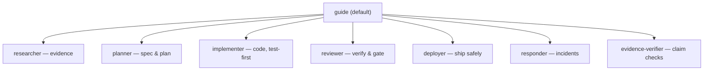

# Agents

LazyAI ships a baseline set of eight canonical agents. Each is a markdown file with
frontmatter (name, role, mode, temperature, step budget, optional skills) and a
`# System Prompt`. During `lazyai-cli compile` they are emitted to every tool whose
adapter supports custom agents — **Claude Code** (`.claude/agents/`), **OpenCode**
(`.opencode/agents/`), **GitHub Copilot** (`.github/agents/*.agent.md`), **Pi**
(`.pi/agents/`), **OMP** (`.omp/agents/`), and **Kiro** (`.kiro/agents/`) — each with
that tool's frontmatter shape. See [Tool Outputs](tool-outputs.md) for the per-tool
agent paths.

`guide` is the default front-door entry agent (for example
`.opencode/agents/guide.md`). The others are specialists it can route to. **Antigravity**
is the only supported target that does not receive custom agent files.

The authoritative source is `packages/cli/library/canonical/agents/*.md`, tracked in
`packages/cli/library/manifests/curation.yaml`.

## The baseline eight

| Agent | Role | Posture | Use for |
|---|---|---|---|
| `guide` | Front door | Conversational, low ceremony | Direct answers; routes to a specialist only when it improves the outcome |
| `researcher` | Scout | Read-only | Codebase exploration, dependency tracing, evidence with file/line citations |
| `planner` | Planning | Spec author | Executable specs/plans with acceptance + rollback criteria and TDD mode |
| `implementer` | Implementation | Test-first | Turning specs into code; preserves existing tests; follows selected TDD mode |
| `reviewer` | Verification | Read-only, adversarial | Quality gates, spec traceability, edge cases, security/perf checks |
| `deployer` | Release | Safety-first | Verify-before-deploy, rollback plans, approval on destructive operations |
| `responder` | SRE / incident | Triage-first | Detect → triage → mitigate → resolve → postmortem |
| `evidence-verifier` | Claim checking | Citation-bound | Classify claims vs source as supported / contradicted / inconclusive |

## Default routing

`guide` chooses the lightest useful move — continue directly, suggest a specialist, or
delegate — and only fans out to multiple agents when the user explicitly asks for
orchestration.



## Behavior highlights

- **guide** — answers direct questions directly; clarifies only when missing info blocks a correct action; does not decompose every task into a workflow.
- **researcher** — read before asking, search before reading; cites specific files and line numbers; flags tests that must be preserved.
- **planner** — requires the four points (WHAT / HOW / DON'T WANT / VALIDATE) before planning; specs carry testable acceptance criteria and a TDD plan; no code in the plan.
- **implementer** — writes the failing test first for behavior-affecting changes; small, greppable functions; explicit types; pauses if a change grows beyond ~3 files / 100 lines without plan coverage.
- **reviewer** — never approves without passing tests; rejects untraced changes and temporary patches; classifies unverifiable claims as unverified.
- **deployer** — verifies green tests, valid config, and no secrets in the diff before shipping; every deploy needs a rollback plan.
- **responder** — measures before fixing, preserves evidence, mitigates during the incident window and defers permanent fixes.
- **evidence-verifier** — never fabricates evidence; prefers direct quotes; flags conflicting sources.

## Creating your own

Use the `create-agent` skill and the [agent template](../canonical/agent-template.md).
After adding or editing an agent, recompile and validate:

```bash
lazyai-cli compile
lazyai-cli validate agents
```
