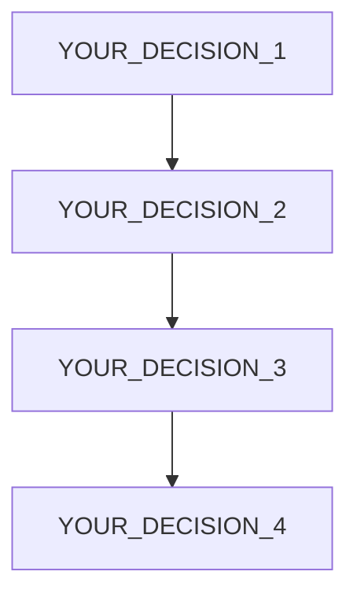

# AGENTS.md

**Project:** [YOUR_PROJECT_NAME]
**Organization:** [YOUR_ORG]
**Team:** [YOUR_TEAM]

---

## Overview

[YOUR_PROJECT_DESCRIPTION]

## Codebase Map

| Component | Responsibility | File |
|-----------|---------------|------|
| [YOUR_COMPONENT_1] | [YOUR_RESPONSIBILITY_1] | [YOUR_PATH_1] |
| [YOUR_COMPONENT_2] | [YOUR_RESPONSIBILITY_2] | [YOUR_PATH_2] |

## Decision Tree

## Conventions

- **Code Style:** [YOUR_CODE_STYLE]
- **Testing:** [YOUR_TESTING_STRATEGY]
- **Security:** [YOUR_SECURITY_GUIDELINES]
- **Process:** [YOUR_DEVELOPMENT_WORKFLOW]

## Do NOT

- [YOUR_DO_NOT_1]
- [YOUR_DO_NOT_2]

## Workflow

1. **Research:** Scout agent explores the codebase and existing patterns.
2. **Plan:** Planner agent creates a phased task list with dependencies.
3. **Implement:** Builder agent implements one task at a time, writing tests first.
4. **Review:** Reviewer agent verifies the implementation against the spec.
5. **Merge:** Human review and merge.

## Testing

- **Unit Tests:** [YOUR_UNIT_TESTING_STRATEGY]
- **Integration Tests:** [YOUR_INTEGRATION_TESTING_STRATEGY]
- **E2E Tests:** [YOUR_E2E_TESTING_STRATEGY]

## Key Commands

- `npm run dev`: [YOUR_DEV_COMMAND_DESCRIPTION]
- `npm run test`: [YOUR_TEST_COMMAND_DESCRIPTION]
- `npm run build`: [YOUR_BUILD_COMMAND_DESCRIPTION]

## Session Start Checks

- [YOUR_SESSION_START_CHECK_1]
- [YOUR_SESSION_START_CHECK_2]

## Recovery Procedures

- [YOUR_RECOVERY_PROCEDURE_1]
- [YOUR_RECOVERY_PROCEDURE_2]

## Self-Improvement Protocol

- [YOUR_SELF_IMPROVEMENT_PROTOCOL_1]
- [YOUR_SELF_IMPROVEMENT_PROTOCOL_2]
