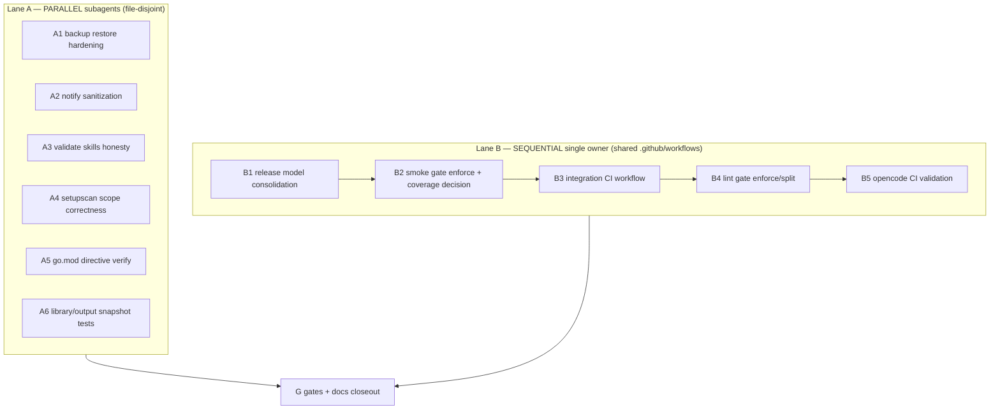

# Tasks: 027-production-readiness-hardening

**Spec:** [./spec.md](./spec.md) · **Plan:** [./plan.md](./plan.md)
**Status legend:** ☐ TODO · 🔄 IN PROGRESS · ✅ DONE · ⛔ BLOCKED
**`[P]`** = parallel-safe (file-disjoint; runnable as an independent subagent).
**Subagent rule:** each parallel task does its own focused regression test; it does NOT run repo-wide build/lint/format. The lead runs the full Go gates (`make vet test build`) once over the union of changes at the end.

---

## Execution lanes

---

## Phase 1 — Lane A: parallel code fixes (run as concurrent subagents)

- [x] **A1 [P]** — Harden `backup restore` against path traversal (FR-007, EC-001..003)
  - Files: `packages/cli/cmd/backup.go:120-155`, `packages/cli/cmd/backup_test.go` (new/extend).
  - Change: resolve each `header.Name` under the restore root via `filepath.Clean` + prefix-bound check; reject `..`, absolute paths, and symlink escape before `MkdirAll`/`os.Create`.
  - Acceptance: regression test proves a `../` and an absolute entry are rejected with no out-of-root write; valid entries still restore.

- [x] **A2 [P]** — Safe notification payload construction (FR-009, EC-004)
  - Files: `packages/cli/cmd/notify.go:115-156`, `packages/cli/cmd/notify_test.go` (new).
  - Change: stop interpolating raw title/message into `osascript`/PowerShell/`curl -d` strings; pass via argv/escaped JSON (`encoding/json` for webhook payload, AppleScript-safe quoting or a temp script for macOS).
  - Acceptance: test with quotes/metacharacters builds a correct, escaped command/payload; no shell breakage.

- [x] **A3 [P]** — Make `validate skills` honest (FR-008, SC-004)
  - Files: `packages/cli/cmd/validate.go:165-181`, `packages/cli/cmd/validate_test.go`, `README.md:180`, `docs/cli/reference.md:877-882`, `docs/getting-started/commands.md:227-229`.
  - Change (pick one, default = implement minimal real checks): implement frontmatter + Quick Reference + script-reference checks mirroring `validate agents`; OR hide the subcommand and mark unimplemented in docs. Default to implementing minimal real validation.
  - Acceptance: command no longer prints "not yet implemented" as an active capability; behavior matches docs; test covers pass + fail.

- [x] **A4 [P]** — `setupscan` scope correctness (FR-010, EC-006)
  - Files: `packages/cli/internal/setupscan/setupscan.go`, `packages/cli/internal/setupscan/setupscan_test.go`; read-only ref `packages/cli/internal/adapter/scope.go:30-34`.
  - Change: gate advertised scopes through `adapter.IsScopeSupported` so Pi/Antigravity are not listed at global scope.
  - Acceptance: test asserts unsupported `(tool, scope)` pairs are absent from scan output.

- [x] **A5 [P]** — Verify `go.mod` toolchain directive (FR-013, A-003)
  - Files: `packages/cli/go.mod:3` (only if broken).
  - Change: confirm `go 1.26.1` builds/parses on the supported toolchain; correct only if it actually fails. Record finding in the PR description.
  - Acceptance: documented verification; no change unless a real failure is reproduced.

- [x] **A6 [P]** — Snapshot tests for library assets + compiled output (FR-012, `KNOWLEDGE_MAP.md:124`)
  - Files: `packages/cli/internal/adapter/*_snapshot_test.go` (new), `packages/cli/internal/library/*_test.go` as needed.
  - Change: golden-file snapshot tests over emitted artifacts for at least the OpenCode + Claude adapters; deterministic ordering.
  - Acceptance: snapshot tests pass and fail loudly on output drift.

**Lane A validation:** each subagent runs only its own `go test ./<pkg>/... -run <Test>`; the lead runs full gates in Phase G.

---

## Phase 2 — Lane B: CI & release consolidation (single owner, sequential)

- [x] **B1** — Consolidate to one release model (FR-001, FR-002, FR-003, SC-001)
  - Files: `.github/workflows/release.yml`, `.github/workflows/release-cli.yml`, `.github/workflows/release-diffviewer.yml`, `packages/cli/.goreleaser.yaml`, `docs/wiki/Release-Process.md`.
  - Change: confirm package-scoped tag model (A-001); fix version injection to `cmd.Version`/`internal/version.Version` (reuse `Makefile:8` ldflags) or delete the broken root `release.yml`; reconcile asset names between goreleaser and docs.
  - Acceptance: a staged/dry release injects the tag version into `--version`; docs and automation agree on tags + asset names.

- [x] **B2** — Enforce smoke gate + decide coverage policy (FR-004, FR-011, SC-002)
  - Files: `.github/workflows/test.yml:35-39,56-60`.
  - Change: remove `continue-on-error: true` from smoke; make coverage upload failure a deliberate documented choice.
  - Acceptance: a failing smoke test fails the PR check.

- [x] **B3** — Add enforcing integration CI (FR-005, EC-005)
  - Files: `.github/workflows/ci-integration.yml` (new); read-only ref `tests/integration/*.sh`, `tests/scripts/*.sh`.
  - Change: new workflow that provisions deps (`sqlite3`, `git`, `jq`, `bash`) and runs each integration script with fail-on-error.
  - Acceptance: integration scripts run in CI; an injected failure fails the pipeline.

- [x] **B4** — Enforce or split lint gates (FR-006)
  - Files: `.github/workflows/lint.yml`, optionally root `Makefile:44`.
  - Change: make `staticcheck`/`yamllint` enforcing, or move them into a clearly named advisory job separated from required gates; align `make lint` to include them.
  - Acceptance: a lint violation fails the required pipeline (or is explicitly advisory by design).

- [x] **B5** — CI-side `opencode` validation (FR-012, `KNOWLEDGE_MAP.md:127`)
  - Files: `.github/workflows/ci-integration.yml` (extend) or new job; read-only ref `packages/cli/internal/adapter/opencode_validate.go`.
  - Change: install the `opencode` binary in CI and run post-install validation against a generated setup, OR record an accepted exception in `KNOWLEDGE_MAP.md` with rationale.
  - Acceptance: opencode validation runs in CI, or the deferral is formally accepted.

---

## Phase 3 — Deferred coverage closeout

- [x] **C1** — Reconcile `KNOWLEDGE_MAP.md:124,127` (FR-012, SC-005)
  - Files: `specs/KNOWLEDGE_MAP.md`.
  - Change: check off items delivered by A6/B5, or record accepted exceptions with rationale.
  - Acceptance: no unchecked readiness item lacks an accepted-exception note.

---

## Phase G — Gates & docs closeout (lead only, after Lanes A+B merge)

- [x] **G1** — Full Go gates over union of changes: `make vet test build` (and `make snapshot` if release touched).
- [x] **G2** — `mkdocs build --strict` green.
- [x] **G3** — Update `CHANGELOG.md` (Unreleased) and this `tasks.md` statuses.
- [x] **G4** — Final readiness re-check against `spec.md` success criteria SC-001..SC-005.

---

## Parallelization summary

| Can run concurrently now (subagents) | Must be sequential (one owner) |
|---|---|
| A1, A2, A3, A4, A5, A6 | B1 → B2 → B3 → B4 → B5 |

- Lane A tasks touch disjoint files (`backup.go`, `notify.go`, `validate.go`, `setupscan.go`, `go.mod`, new snapshot tests) → safe to fan out.
- Lane B tasks share `.github/workflows/*` and release/docs surfaces → single owner, ordered.
- A6 feeds C1; B5 feeds C1. Phase G runs last over the union.

## Dependency order

1. Phase 1 Lane A (A1–A6 parallel) and Phase 2 Lane B (B1→B5 sequential) proceed independently in parallel lanes.
2. C1 depends on A6 + B5.
3. Phase G depends on all of Phase 1, Phase 2, and C1.

---

## Suggested subagent batch (Lane A)

One `task` batch, file-disjoint, each with its own acceptance test, none running repo-wide gates:
`A1 backup.go`, `A2 notify.go`, `A3 validate.go`, `A4 setupscan.go`, `A6 snapshot tests`. (`A5` is a quick verification; fold into the lead or A1's owner.)
