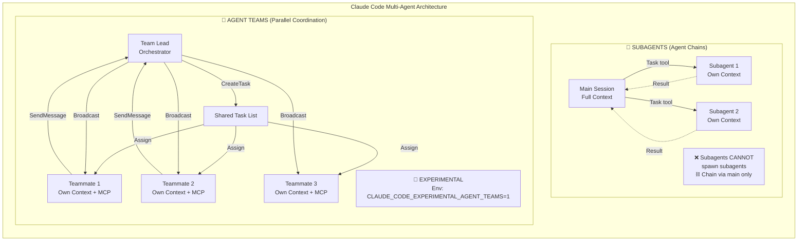
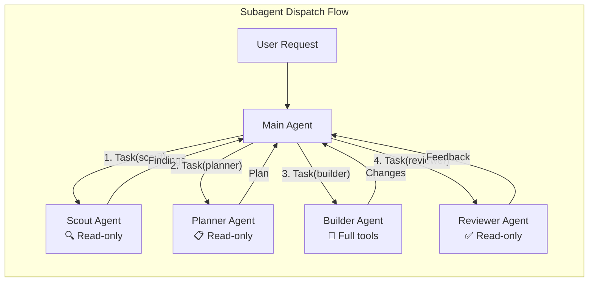
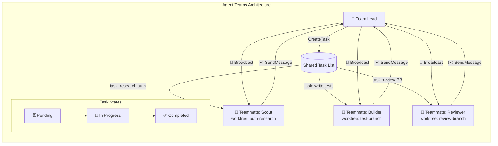
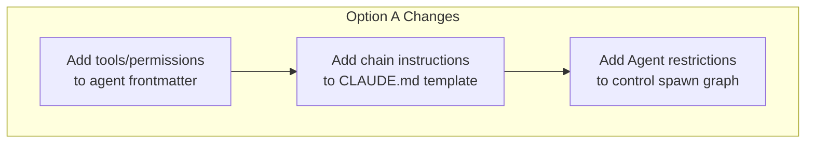
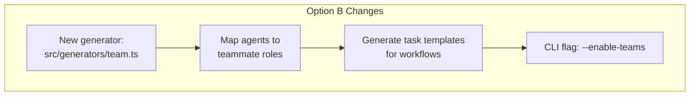
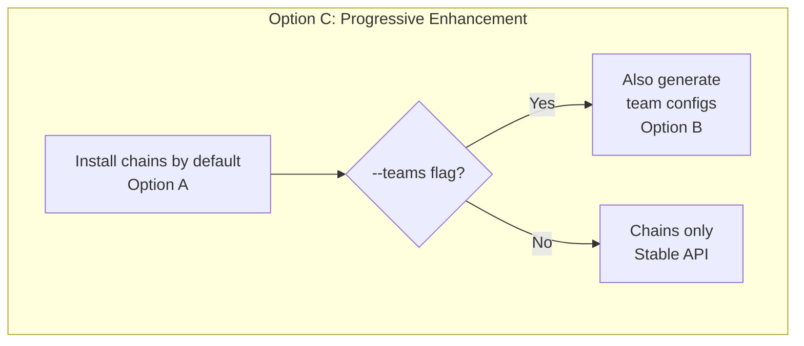

# Research: Claude Code — Agent Teams & Agent Chains

**Status:** ✅ Complete  
**Date:** 2026-04-08  
**Tool:** `claude-code`  
**Adapter:** `src/adapters/claude-code.ts`

---

## Executive Summary

Claude Code has the **richest native multi-agent support** of any tool we support, with TWO distinct mechanisms:

1. **Subagents** (Agent Chains) — sequential dispatch via `Task` tool, stable API
2. **Agent Teams** (Parallel Coordination) — experimental, multi-instance coordination

---

## Architecture Overview



---

## 1. Subagents (Agent Chains)

### How It Works



### Configuration

Subagents are defined as `.md` files with YAML frontmatter in `.claude/agents/`:

```yaml
---
name: scout
description: "Read-only codebase researcher"
model: sonnet
tools:
  - Read
  - Grep
  - Glob
  - Bash(read-only)
  - ListFiles
disallowedTools:
  - Write
  - Edit
  - MultiEdit
permissionMode: plan
maxTurns: 50
skills:
  - explore
  - code-standards
isolation: worktree  # optional: run in git worktree
background: false
---

# Scout Agent

Your identity and instructions here...
```

### Scopes Priority (highest → lowest)

1. Managed settings (organization)
2. CLI `--agents` flag
3. Project `.claude/agents/`
4. User `~/.claude/agents/`
5. Plugin agents

### Key Frontmatter Fields

| Field | Purpose | Type |
|-------|---------|------|
| `name` | Display name | string |
| `description` | When to use this agent | string |
| `tools` | Allowed tools | string[] |
| `disallowedTools` | Blocked tools | string[] |
| `model` | Model to use | string |
| `permissionMode` | plan/auto/manual | string |
| `maxTurns` | Max conversation turns | number |
| `skills` | Auto-loaded skills | string[] |
| `mcpServers` | Agent-specific MCP servers | string[] |
| `hooks` | Lifecycle hooks | object |
| `memory` | Memory types (user/project/local) | object |
| `background` | Run in background | boolean |
| `effort` | Reasoning effort level | string |
| `isolation` | worktree isolation | string |
| `color` | Terminal color | string |
| `initialPrompt` | Auto-start prompt | string |

### Critical Constraints

- ❌ **Subagents CANNOT spawn other subagents** — chain must always go through main agent
- ✅ **Chaining via prompt instruction** — "Use scout first, then planner with findings"
- ✅ **SendMessage** can resume a subagent by ID (requires agent teams enabled)
- 🔄 **Auto-compaction** at ~95% context capacity

### Spawn Restriction

Control which subagents the main agent can dispatch:

```yaml
tools:
  - Agent(scout, planner, builder, reviewer, red-team, documenter)
```

---

## 2. Agent Teams (Parallel Coordination)

### How It Works



### Requirements

- **Environment variable:** `CLAUDE_CODE_EXPERIMENTAL_AGENT_TEAMS=1`
- **Display:** in-process (Shift+Down) or split-panes (tmux/iTerm2)

### Features

| Feature | Description |
|---------|-------------|
| Task dependencies | Tasks can depend on other tasks |
| Plan approval mode | Teammate works read-only until lead approves |
| Communication | message (one) or broadcast (all) |
| Hooks | TeammateIdle, TaskCreated, TaskCompleted |
| Context isolation | Each teammate gets own context window |
| Project context | Teammates load CLAUDE.md, MCP, skills automatically |

### Storage

```
~/.claude/teams/{name}/config.json   # Team definition
~/.claude/tasks/{name}/              # Task persistence
```

### Best Practices

- 3-5 teammates per team
- 5-6 tasks per teammate
- Avoid same-file edits across teammates
- Use worktree isolation to prevent conflicts

### Limitations

- No session resumption for in-process mode
- One team per session
- No nested teams
- Team lead is fixed (cannot change)
- Permissions set at spawn (cannot change mid-session)
- Split-pane mode requires tmux or iTerm2

---

## 3. What We Install Today

### Current Adapter Behavior (`src/adapters/claude-code.ts`)

```
.claude/
├── agents/
│   ├── builder.md       # frontmatter preserved as-is
│   ├── documenter.md
│   ├── planner.md
│   ├── red-team.md
│   ├── reviewer.md
│   └── scout.md
├── skills/
│   └── <name>/SKILL.md
└── CLAUDE.md             # from CLAUDE.template.md
```

### What's Missing

| Feature | Status | Impact |
|---------|--------|--------|
| `tools` frontmatter | ❌ Not set | All agents get all tools |
| `disallowedTools` | ❌ Not set | No tool restrictions |
| `permissionMode` | ❌ Not set | Default permissions |
| `isolation: worktree` | ❌ Not set | No worktree isolation |
| `skills` frontmatter | ❌ Not set | Skills not auto-loaded |
| `mcpServers` per agent | ❌ Not set | All agents share MCP |
| `hooks` | ❌ Not set | No lifecycle hooks |
| `Agent()` restrictions | ❌ Not set | Can spawn any agent |
| `background` mode | ❌ Not set | No background agents |
| `initialPrompt` | ❌ Not set | No auto-start |
| Agent Teams config | ❌ Not generated | No team support |
| Team task templates | ❌ Not generated | No workflow templates |

---

## 4. Implementation Alternatives

### Option A: Enhanced Subagent Chains ⭐ RECOMMENDED FIRST STEP



**Changes Required:**

1. **Enrich agent frontmatter** with `tools`, `disallowedTools`, `permissionMode`
2. **Add chain protocol** to CLAUDE.md template
3. **Add `Agent()` restrictions** to main agent

**Effort:** Low — mostly template changes  
**Risk:** Low — uses stable API, backward compatible

### Option B: Agent Teams Config Generation



**Changes Required:**

1. New `src/generators/team.ts` for `config.json`
2. Agent-to-teammate role mapping
3. Task templates for feature/bugfix/review workflows
4. CLI flag `--enable-teams`

**Effort:** Medium — new code paths, new file format  
**Risk:** Medium — experimental API may change

### Option C: Hybrid Approach (Best Coverage)



```bash
ai-setup install claude-code              # chains only (Option A)
ai-setup install claude-code --teams      # chains + teams (Option A+B)
```

---

## 5. Constraints & Gotchas

| Constraint | Impact |
|-----------|--------|
| Subagents cannot spawn subagents | Chain must go through main agent |
| One team per session | Cannot have competing teams |
| No nested teams | Team lead cannot create sub-teams |
| Experimental flag required | Users must opt in |
| Split-pane needs tmux/iTerm2 | Not all terminals supported |
| 3-5 teammates recommended | Don't create 6 teammates for 6 agents |
| No session resumption (in-process) | Teams are ephemeral |

---

## References

- [Claude Code Subagents Docs](https://docs.anthropic.com/en/docs/claude-code/sub-agents)
- [Claude Code Agent Teams Docs](https://docs.anthropic.com/en/docs/claude-code/agent-teams)
- Adapter: `src/adapters/claude-code.ts`
- Template: `library/root/CLAUDE.template.md`
- Agent definitions: `library/agents/*.md`
